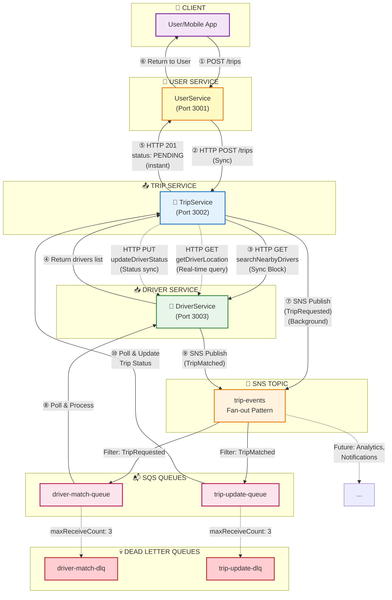

# ADR-001: Event-Driven Async Communication

**Status:** ✅ Accepted  
**Date:** 2025-11-21  
**Module:** A - Scalability

---

## The Problem

Hệ thống UIT-Go ban đầu sử dụng **synchronous HTTP calls** cho **toàn bộ** giao tiếp giữa TripService và DriverService, bao gồm **2 blocking calls liên tiếp**:

```
① TripService --[HTTP GET /drivers/search]--> DriverService (blocked 200ms)
② TripService --[HTTP POST /trips/notify]--> DriverService (blocked thêm vài giây)
```

**Core Problem:**
- TripService **blocked 2 lần** chờ DriverService response trong cùng 1 request
- Lần 1: Tìm available drivers
- Lần 2: Gửi trip notification cho drivers để accept
- **Total blocking time: 3-7 seconds** → Poor UX

**Symptoms:**
- **P95 latency: 8-12 seconds** cho trip creation (user chờ quá lâu)
- **Error rate: 35%** tại peak hours do cascading failures
- **Thread exhaustion:** TripService threads bị block → không handle được concurrent requests
- **Cascading failures:** DriverService slow/down → TripService timeout → UserService 504 → Toàn bộ users bị ảnh hưởng
- **No burst handling:** 100 concurrent users → 70% request failure rate

**Scale Gap:**
- **Concurrent users:** Cần hỗ trợ số lượng lớn hơn đáng kể so với hiện tại
- **Throughput:** Cần tăng khả năng xử lý trips/phút lên nhiều lần

---

## Options Considered

### Option 1: Keep Synchronous + Circuit Breakers

**Mô tả:** Giữ nguyên HTTP sync calls, thêm Circuit Breaker pattern (Hystrix/Resilience4j) để fail-fast khi downstream service slow.

| Pros | Cons |
|------|------|
| ✅ Simple - không cần học thêm | ❌ Vẫn block threads → throughput thấp |
| ✅ Không cần infrastructure mới | ❌ Không giải quyết root cause (coupling) |
| ✅ Team đã familiar với pattern | ❌ User vẫn phải chờ lâu |

**Verdict:** ❌ Circuit breaker chỉ giúp fail-fast, không tăng throughput. Vấn đề cốt lõi là blocking I/O.

---

### Option 2: Direct SQS (Không có SNS)

**Mô tả:** TripService push message trực tiếp vào SQS queue, DriverService poll từ queue.

| Pros | Cons |
|------|------|
| ✅ Đơn giản hơn SNS+SQS | ❌ Không fan-out được (1 queue = 1 consumer type) |
| ✅ Ít components hơn | ❌ Tight coupling - TripService phải biết queue names |
| ✅ Latency thấp hơn một chút | ❌ Thêm Analytics/Notification service = sửa code |

**Verdict:** ❌ Không extensible. Khi cần thêm consumers mới (Analytics, Push Notification), phải modify TripService code.

---

### Option 3: Apache Kafka (MSK) ⭐ Ideal nhưng không khả thi

**Mô tả:** Sử dụng AWS Managed Streaming for Apache Kafka - industry standard cho event streaming.

| Pros | Cons |
|------|------|
| ✅ **Throughput cực cao** - scale vô hạn | ❌ **Chi phí cao** (managed service đắt hơn nhiều) |
| ✅ Strong ordering guarantees | ❌ Team **không có Kafka experience** |
| ✅ Event replay (reprocess từ offset) | ❌ Operational complexity (partitions, consumer groups) |
| ✅ Event sourcing ready | ❌ Overkill cho quy mô hiện tại |

**Tại sao vẫn muốn Kafka?**
- Event replay rất hữu ích cho debugging và analytics
- Strong ordering tránh race conditions
- Industry standard, dễ hire developers

**Tại sao không chọn?**
- **Budget constraint:** Chi phí vượt ngân sách cho course project
- **Team skill gap:** Cần thời gian đáng kể học Kafka concepts
- **Over-engineering:** Quy mô hiện tại không cần throughput cực cao của Kafka

**Khi nào sẽ migrate sang Kafka?**
- Khi throughput vượt xa capacity của SNS/SQS
- Khi cần event replay/sourcing
- Khi team có Kafka expertise

---

### Option 4: RabbitMQ (Self-hosted)

**Mô tả:** Deploy RabbitMQ cluster trên EC2/ECS, tự quản lý.

| Pros | Cons |
|------|------|
| ✅ Flexible routing (exchanges, bindings) | ❌ **Operational burden** (patching, monitoring, HA) |
| ✅ Rẻ hơn managed services | ❌ Team không có RabbitMQ expertise |
| ✅ Rich features (priority queues, TTL) | ❌ Single point of failure nếu setup sai |

**Verdict:** ❌ Prefer managed service để focus vào business logic, không muốn maintain message broker infrastructure.

---

### Option 5: SNS/SQS + LocalStack ✅ CHOSEN

**Mô tả:** AWS SNS (pub/sub) + SQS (queue) pattern, emulate bằng LocalStack cho development.

| Pros | Cons |
|------|------|
| ✅ **Fan-out pattern** - SNS broadcast to multiple SQS | ❌ **Eventual consistency** - có delay nhỏ |
| ✅ **Managed by AWS** - zero ops | ❌ Debugging khó hơn (async flow) |
| ✅ **DLQ built-in** - no message loss | ❌ LocalStack ≠ AWS 100% (polling delay) |
| ✅ **$0 development cost** (LocalStack) | ❌ Team cần học async patterns |
| ✅ **Chi phí production thấp** | |
| ✅ **High availability** từ AWS | |

---

## Why SNS/SQS? Decision Matrix

| Criteria | Weight | Sync+CB | Direct SQS | Kafka | RabbitMQ | SNS/SQS |
|----------|--------|---------|------------|-------|----------|---------|
| **Throughput** | 30% | 1 | 3 | 5 | 4 | 4 |
| **Cost (dev)** | 25% | 5 | 4 | 1 | 3 | 5 |
| **Team expertise** | 20% | 5 | 4 | 1 | 2 | 3 |
| **Extensibility** | 15% | 2 | 2 | 5 | 4 | 4 |
| **Operational effort** | 10% | 5 | 4 | 2 | 1 | 5 |
| **TOTAL** | 100% | **3.1** | **3.3** | **2.6** | **2.8** | **4.1** |

**Kết luận:** SNS/SQS wins với score 4.1/5, cân bằng giữa features và constraints hiện tại.

---

## Chosen Solution

**Hybrid Architecture: SNS/SQS Events + Sync HTTP (emulated via LocalStack for $0 development cost)**



**Message Flow (Chi tiết từng bước):**

### 🔄 Phase 1: Sync Request Flow (User nhận response ngay)

**① User → UserService: POST /trips**
- User gửi request tạo chuyến đi
- Payload: pickup location, destination, payment method
- UserService validate user authentication

**② UserService → TripService: HTTP POST /trips (Sync)**
- UserService forward request đến TripService
- Thêm userId vào request
- **Blocking call** - UserService chờ TripService response

**③ TripService → DriverService: HTTP GET searchNearbyDrivers (Sync Block)**
- TripService cần tìm drivers xung quanh pickup location
- Query: `GET /drivers/search?latitude=...&longitude=...&radius=5km`
- **CRITICAL:** Đây là sync blocking call - TripService thread bị block chờ DriverService
- Timeout: 5 seconds, retry: 3 lần
- **Tại sao sync?** Cần biết có drivers available trước khi accept trip

**④ DriverService → TripService: Return drivers list**
- DriverService query Redis geospatial index
- Trả về list drivers trong bán kính 5km
- Response time: ~100-200ms (nhanh vì query Redis)

**⑤ TripService → UserService: HTTP 201 PENDING**
- TripService tạo trip record trong DB với status `PENDING`
- Trả về tripId, status, estimatedPrice
- Response time: <500ms (bao gồm cả bước ③④)

**⑥ UserService → User: Return to User**
- User nhận thông báo "Đang tìm tài xế..." với status PENDING
- Frontend bắt đầu poll `/trips/{tripId}` để cập nhật status
- **End of sync flow** - User không bị block thêm

---

### ⚡ Phase 2: Async Background Processing (Driver matching)

**⑦ TripService → SNS: Publish TripRequested event (Background)**
- **Non-blocking** - xảy ra sau khi đã trả response cho user
- Event payload: `{ tripId, pickupLocation, destination, userId }`
- SNS publish time: ~10ms
- Event được broadcast đến tất cả subscribers

**SNS → SQS: Fan-out to multiple queues**
- `driver-match-queue`: DriverService subscribe để match driver
- `trip-update-queue`: TripService subscribe để nhận updates
- Future: Analytics queue, Notification queue, etc.

**⑧ DriverService: Poll & Process TripRequested**
- DriverService long-polling SQS queue (wait time: 20s)
- Nhận event TripRequested
- Logic: Tìm driver phù hợp, send push notification đến drivers
- Driver accept qua mobile app

**⑨ DriverService → SNS: Publish TripMatched event**
- Khi driver accept, DriverService publish event mới
- Event payload: `{ tripId, driverId, estimatedArrival }`
- SNS fan-out đến subscribers

**⑩ TripService: Poll & Update Trip Status**
- TripService nhận event TripMatched từ SQS queue
- Update trip status: `PENDING` → `MATCHED`
- User frontend poll thấy status mới → hiển thị driver info

---

### 🔧 Additional Sync HTTP Calls (Không trong main flow)

**HTTP GET getDriverLocation (Real-time query)**
- **Khi nào:** User/Driver xem vị trí real-time trong trip
- **Endpoint:** `GET /drivers/{driverId}/location`
- **Tại sao sync:** Real-time data, cần response ngay
- **Frequency:** Polling mỗi 5 giây

**HTTP PUT updateDriverStatus (Status sync)**
- **Khi nào:** Driver accept trip, cần cập nhật status thành `on_trip`
- **Endpoint:** `PUT /drivers/{driverId}/status`
- **Graceful failure:** Nếu call fail, không làm fail transaction
- **Retry:** 3 lần với exponential backoff

---

### 📊 Summary: Sync vs Async

| Bước | Type | Blocking? | Tại sao? |
|------|------|-----------|----------|
| ①②③④⑤⑥ | **Sync** | ✅ Yes | User cần response ngay, biết trip created |
| ⑦⑧⑨⑩ | **Async** | ❌ No | Driver matching mất thời gian, không cần block user |
| getDriverLocation | **Sync** | ✅ Yes | Real-time data, cần ngay |
| updateDriverStatus | **Sync** | ✅ Yes (soft) | Cập nhật status, nhưng có graceful failure |

**Key Insight:** 
- ✅ **Hybrid approach** - Sync cho immediate feedback, Async cho background processing
- ⚠️ **Sync HTTP exists** - searchNearbyDrivers (bước ③) là blocking call quan trọng
- 🎯 **Trade-off:** Chấp nhận blocking 100-200ms để biết có drivers available trước khi accept trip

**Key Components:**
| Component | Purpose | Config |
|-----------|---------|--------|
| SNS Topic `trip-events` | Publish events, enable fan-out | Standard topic |
| SQS `driver-match-queue` | Driver matching consumer | Standard, high throughput |
| SQS `trip-update-queue` | Trip status updates | Standard |
| DLQ (Dead Letter Queue) | Failed messages after 3 retries | maxReceiveCount: 3 |
| LocalStack | AWS emulation for local dev | Port 4566, **free** |

---

## Trade-offs của Solution Đã Chọn (SNS/SQS)

> **Nguyên tắc:** Mọi architectural decision đều có trade-offs. Section này phân tích những gì chúng ta **được** và **mất** khi chọn SNS/SQS.

### Trade-off 1: 🚀 Throughput vs 🎯 Latency

```
┌─────────────────────────────────────────────────────────────┐
│  SYNC (Before)          │  ASYNC (After)                   │
├─────────────────────────┼───────────────────────────────────┤
│  User waits several     │  User sees "Finding..." instantly│
│  seconds for result     │  But must poll for final status  │
│  Throughput: thấp       │  Throughput: cao hơn nhiều       │
└─────────────────────────┴───────────────────────────────────┘
```

| Metric | Sync | Async | Verdict |
|--------|------|-------|---------|
| User-facing response | Vài giây (blocking) | Tức thì | ✅ Async wins |
| End-to-end completion | Vài giây | Tương tự (background) | ≈ Similar |
| Throughput | Thấp | Cao hơn nhiều | ✅ Async wins |
| User experience | Spinner lâu | "Finding driver..." instant | ✅ Async wins |

**What we gain:** Throughput cao hơn đáng kể, instant feedback cho user
**What we lose:** User không có immediate final result (phải poll status)
**Why acceptable:** Ride-hailing UX pattern đã chuẩn - user expect "Finding driver" animation

---

### Trade-off 2: 🔄 Consistency vs 💪 Availability

```
┌─────────────────────────────────────────────────────────────┐
│  SYNC: Strong Consistency    │  ASYNC: Eventual Consistency │
├──────────────────────────────┼──────────────────────────────┤
│  DriverService down?         │  DriverService down?         │
│  → TripService also fails    │  → Messages queue up         │
│  → User gets error           │  → User request succeeds     │
│  → Cascading failure         │  → Process when back online  │
└──────────────────────────────┴──────────────────────────────┘
```

| Aspect | Sync | Async | Verdict |
|--------|------|-------|---------|
| Data consistency | Strong (immediate) | Eventual (có delay nhỏ) | Sync better |
| Service isolation | Cascading failures | Isolated failures | ✅ Async wins |
| Failure handling | User sees error | Message queued, retry | ✅ Async wins |
| Data integrity | All-or-nothing | Need idempotent handlers | Sync simpler |

**What we gain:** Service isolation, no cascading failures, graceful degradation
**What we lose:** Strong consistency - có thể có race conditions
**Why acceptable:** 
- Trip matching không cần microsecond precision
- DLQ đảm bảo **no message loss** (retry 3 lần)
- Idempotent handlers giải quyết duplicate messages

---

### Trade-off 3: 💰 Cost vs 🏢 Reliability

| Environment | Cost | Reliability | Use Case |
|-------------|------|-------------|----------|
| **LocalStack (Dev)** | Free | Phụ thuộc Docker | Development, testing |
| **AWS SNS/SQS (Prod)** | Thấp | Rất cao (AWS SLA) | Production |
| **Kafka MSK** | Cao | Rất cao | Enterprise (overkill) |

**What we gain:** Free development cost với LocalStack, dễ dàng migrate lên AWS
**What we lose:** LocalStack không 100% giống AWS (polling delay cao hơn)
**Why acceptable:** 
- Development không cần production reliability
- Patterns validated locally → minimal changes khi deploy AWS

---

### Trade-off 4: 📚 Simplicity vs 🔧 Debuggability

| Aspect | Sync | Async |
|--------|------|-------|
| Code complexity | 1 HTTP call | Pub/Sub + handlers + DLQ |
| Debugging | Request → Response trace | Event correlation across services |
| Testing | Unit tests đủ | Cần integration tests |
| Onboarding | Immediate | Team cần học patterns |

**What we gain:** Decoupled architecture, independent scaling, extensibility
**What we lose:** Simple request-response flow, easy debugging
**Mitigation:**
- Document patterns kỹ trong ADRs
- Add correlation IDs cho event tracing
- Integration tests cho happy path + failure scenarios

---

## Khi nào nên migrate sang solution khác?

| Trigger | Current (SNS/SQS) | Migrate To | Reason |
|---------|-------------------|------------|--------|
| Throughput vượt capacity | ✅ Đủ cho hiện tại | Kafka MSK | SNS/SQS có giới hạn |
| Need event replay | ❌ No replay | Kafka MSK | Debug, analytics |
| Strong ordering required | ❌ Standard queues | SQS FIFO | Exactly-once processing |
| Multi-region | ✅ Works | Kafka MSK | Better replication |

---

## Expected Benefits

**Performance Improvements:**
- **Response time:** User nhận phản hồi ngay lập tức thay vì chờ full processing
- **Throughput:** Hệ thống xử lý được nhiều requests đồng thời hơn nhờ non-blocking
- **Error rate:** Giảm đáng kể nhờ decoupling và retry mechanism
- **Scalability:** Hỗ trợ scale horizontally dễ dàng hơn

**Operational Benefits:**
- Auto-scaling có thể trigger dựa trên queue depth
- Services scale independently theo workload

---

## Failure Modes

| Failure | Impact | Mitigation | Recovery |
|---------|--------|------------|----------|
| **SNS unavailable** | Cannot publish events | Circuit breaker → fallback sync HTTP | Auto-recover when SNS back |
| **SQS unavailable** | Cannot consume messages | Messages queued in SNS (buffered) | Process backlog when back |
| **Message processing fails** | Trip stuck PENDING | DLQ after 3 retries | Manual review dashboard |
| **Duplicate messages** | Driver matched twice | Idempotent handler (check trip.status before update) | No duplicate trips |
| **Message ordering** | Race conditions possible | Not critical for matching; use FIFO if needed | N/A |
| **LocalStack crash (dev)** | Dev env down | `docker restart localstack` | No prod impact |

**Monitoring Alerts:**
```
CloudWatch Alarm: DLQ messages > 0 → PagerDuty
CloudWatch Alarm: Queue depth cao → Trigger auto-scale
```

---

## Limitations & Future Work

### Current Limitations:
1. **LocalStack ≠ AWS exactly** - Polling delay cao hơn AWS production
2. **No distributed tracing** - Hard to debug cross-service message flows
3. **Manual DLQ processing** - No automated retry/dashboard yet
4. **Standard queues** - At-least-once delivery, need idempotent handlers

### Future Improvements:
| Priority | Task | Effort | Value |
|----------|------|--------|-------|
| 🔴 High | Migrate to real AWS SNS/SQS | Medium | Production reliability |
| 🟡 Medium | Add X-Ray/Jaeger tracing | Low | Debug visibility |
| 🟡 Medium | DLQ processing dashboard | Low | Ops efficiency |
| 🟢 Low | FIFO queues for strict ordering | Low | If needed later |


