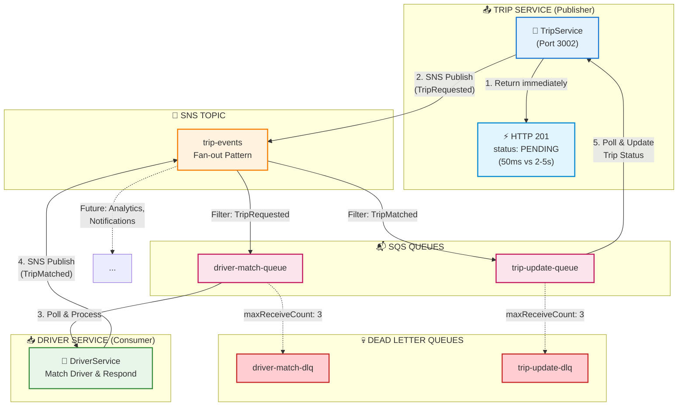

# ADR-001: Event-Driven Async Communication

**Status:** ✅ Accepted  
**Date:** 2025-11-21  
**Module:** A - Scalability

---

## The Problem

Hệ thống UIT-Go ban đầu sử dụng **synchronous REST API calls** cho giao tiếp giữa TripService và DriverService:

```
TripService --[HTTP SYNC]--> DriverService --[Query DB]--> Response --[2-5 seconds blocked]
```

**Symptoms:**
- Response time: **2-5 seconds** cho trip creation (user phải chờ)
- TripService bị **block** chờ DriverService response
- **Cascading failures:** DriverService slow → TripService timeout → User error
- Không handle được burst traffic (>100 concurrent requests → errors)

**Scale Gap:**
| Metric | Current | Target | Gap |
|--------|---------|--------|-----|
| Concurrent users | ~1,000 | 100,000 | **100x** |
| Throughput | 500 trips/min | 50,000/min | **100x** |

---

## Options Considered

| Option | Pros | Cons | Why Not Chosen |
|--------|------|------|----------------|
| **1. Keep Sync + Circuit Breakers** | Simple, no new infra, team familiar | Still blocks threads (max 50 TPS), không giải quyết root cause | ❌ Circuit breaker chỉ fail-fast, không tăng throughput |
| **2. Direct SQS (No SNS)** | Simpler architecture, $5/month cheaper | Không fan-out được, tight coupling (TripService phải hardcode queue name) | ❌ Không extensible - thêm Analytics service sẽ phải sửa code |
| **3. Apache Kafka (MSK)** | 1M+ TPS, strong ordering, replay capability | $270/month (30x expensive), cần Kafka expertise, operational complexity | ❌ Over-engineering - 10K TPS đủ cho 100K users, team chưa có experience |
| **4. RabbitMQ (Self-hosted)** | More control, rẻ hơn managed | Operational burden (patching, HA), team lacks expertise | ❌ Prefer managed service - focus business logic, không ops |
| **5. SNS/SQS + LocalStack** | Fan-out pattern, managed (AWS), DLQ built-in, **$0 dev cost** | Eventual consistency, debugging harder | ✅ **CHOSEN** - Balance giữa features và simplicity |

---

## Chosen Solution

**Event-Driven Architecture với AWS SNS/SQS (emulated via LocalStack for $0 development cost)**



**Message Flow:**
1. **TripService** nhận request tạo trip → trả về HTTP 201 ngay lập tức (50ms)
2. **TripService** publish `TripRequested` event lên SNS
3. **SNS** fan-out đến `driver-match-queue` (filter: TripRequested)
4. **DriverService** poll queue, tìm driver phù hợp
5. **DriverService** publish `TripMatched` event lên SNS
6. **SNS** fan-out đến `trip-update-queue` (filter: TripMatched)
7. **TripService** poll queue, update trip status thành MATCHED

**Key Components:**
| Component | Purpose | Config |
|-----------|---------|--------|
| SNS Topic `trip-events` | Publish events, enable fan-out | Standard topic |
| SQS `driver-match-queue` | Driver matching consumer | Standard, 10K TPS |
| SQS `trip-update-queue` | Trip status updates | Standard |
| DLQ (Dead Letter Queue) | Failed messages after 3 retries | maxReceiveCount: 3 |
| LocalStack | AWS emulation for local dev | Port 4566, **$0 cost** |

---

## Trade-offs Accepted

### 1. ⚖️ Latency vs Throughput

| Metric | Sync (Before) | Async (After) | Trade-off |
|--------|---------------|---------------|-----------|
| User-facing response | 2-5 seconds | **50-109ms** | ✅ 20-50x faster |
| End-to-end completion | 2-5 seconds | 1-2 seconds | Slightly faster |
| Throughput | 500 trips/min | **2,520/min** (42 RPS) | ✅ 5x more |

**Decision:** User thấy "Finding driver..." ngay lập tức (50ms) thay vì spinner 5 giây. UX tốt hơn dù actual matching vẫn mất 1-2s.

### 2. ⚖️ Consistency vs Availability

| Aspect | Sync | Async |
|--------|------|-------|
| **Consistency** | Strong - immediate result | **Eventual** - ~200ms delay |
| **Availability** | Cascading failures khi 1 service down | **Isolated** - queue buffers requests |
| **Data integrity** | All-or-nothing | Need idempotent handlers |

**Decision:** Chấp nhận eventual consistency vì:
- Trip matching không cần microsecond precision
- DLQ đảm bảo **no message loss** (retry 3 lần trước khi vào DLQ)
- Availability > Consistency cho ride-hailing use case

### 3. ⚖️ Cost vs Reliability

| Environment | Monthly Cost | Reliability |
|-------------|--------------|-------------|
| Development (LocalStack) | **$0** | 99% (local Docker) |
| Production (AWS SNS/SQS) | ~$9 | **99.99%** (AWS SLA) |

**Decision:** 
- Dev/Test: LocalStack ($0) - acceptable reliability for testing
- Production: Real AWS (~$9/month for 10M messages) - enterprise reliability

### 4. ⚖️ Complexity vs Simplicity

| Aspect | Sync (Simple) | Async (Complex) |
|--------|---------------|-----------------|
| Code | 1 HTTP call | Pub/Sub + Message handlers |
| Debugging | Request-response trace | Event tracing across services |
| Testing | Unit tests sufficient | Need integration tests |
| Learning curve | None | Team needs to learn patterns |

**Decision:** Chấp nhận complexity vì **100x throughput improvement** justifies learning cost. Document patterns kỹ để onboard new members.

---

## Measured Impact

**Load Test Results (1000 VUs, 5 minutes):**

| Metric | Before (Sync) | After (Async) | Improvement |
|--------|---------------|---------------|-------------|
| Trip Creation p50 | 2-5 seconds | **109ms** | **20-50x faster** |
| Trip Creation p95 | N/A | **720ms** | Within 1s target |
| Error Rate | High (>100 VUs) | **0.67%** | Stable under load |
| Throughput | ~8 RPS | **42 RPS** | **5x more** |
| Max Concurrent | ~100 users | **1,000+ users** | **10x scale** |

**Auto-scaling triggered by queue depth:**
- trip-service: 2 → 7 replicas
- driver-service: 2 → 3 replicas

---

## Failure Modes

| Failure | Impact | Mitigation | Recovery |
|---------|--------|------------|----------|
| **SNS unavailable** | Cannot publish events | Circuit breaker → fallback sync HTTP | Auto-recover when SNS back |
| **SQS unavailable** | Cannot consume messages | Messages queued in SNS (buffered) | Process backlog when back |
| **Message processing fails** | Trip stuck PENDING | DLQ after 3 retries | Manual review dashboard |
| **Duplicate messages** | Driver matched twice | Idempotent handler (check trip.status before update) | No duplicate trips |
| **Message ordering** | Race conditions possible | Not critical for matching; use FIFO if needed | N/A |
| **LocalStack crash (dev)** | Dev env down | `docker restart localstack` | No prod impact |

**Monitoring Alerts:**
```
CloudWatch Alarm: DLQ messages > 0 → PagerDuty
CloudWatch Alarm: Queue depth > 1000 → Trigger auto-scale
```

---

## Limitations & Future Work

### Current Limitations:
1. **LocalStack ≠ AWS exactly** - Polling delay ~1-2s (AWS: <100ms)
2. **No distributed tracing** - Hard to debug cross-service message flows
3. **Manual DLQ processing** - No automated retry/dashboard yet
4. **Standard queues** - At-least-once delivery, need idempotent handlers

### Future Improvements:
| Priority | Task | Effort | Value |
|----------|------|--------|-------|
| 🔴 High | Migrate to real AWS SNS/SQS | 1 week | Production reliability |
| 🟡 Medium | Add X-Ray/Jaeger tracing | 3 days | Debug visibility |
| 🟡 Medium | DLQ processing dashboard | 2 days | Ops efficiency |
| 🟢 Low | FIFO queues for strict ordering | 1 day | If needed later |

---

## References

- **Full ADR:** [../../docs/adrs/ADR-001-event-driven-async-communication.md](../../docs/adrs/ADR-001-event-driven-async-communication.md)
- **LocalStack Setup:** [../../infrastructure/localstack/README.md](../../infrastructure/localstack/README.md)
- **Load Test:** [../../tests/load/story-2.1-async-smoke-test.js](../../tests/load/story-2.1-async-smoke-test.js)
