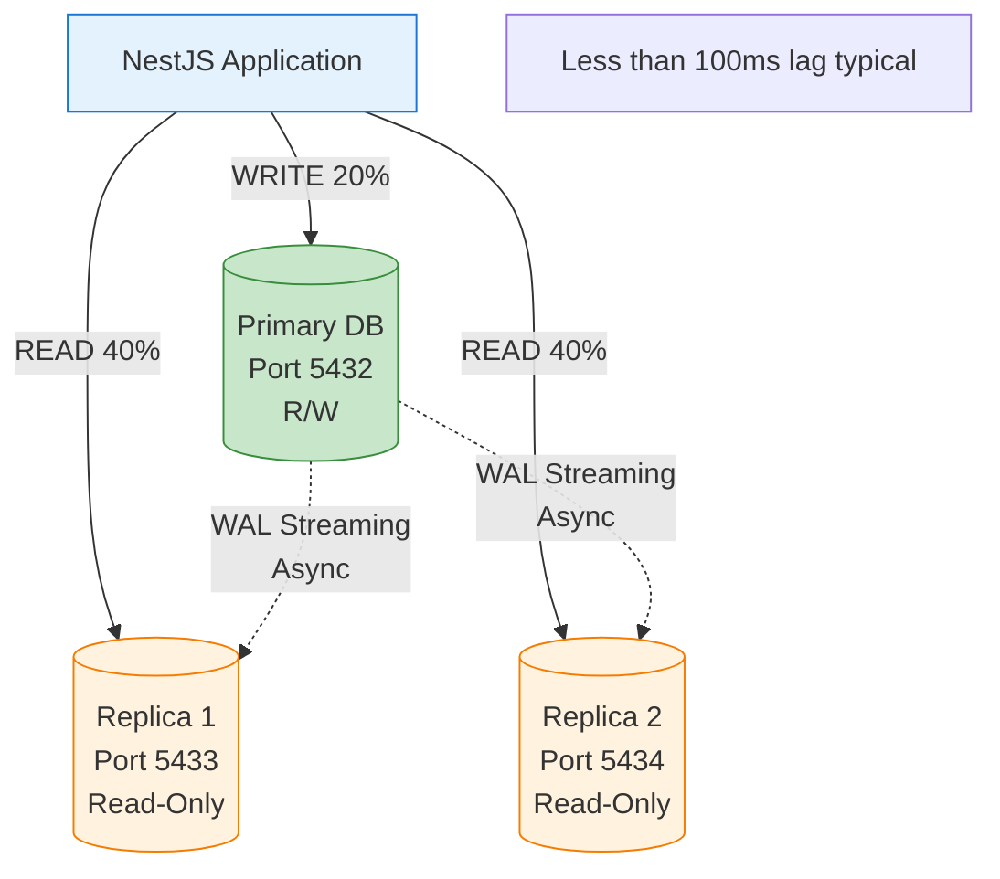

# ADR-002: Database Read Scaling with Read Replicas

**Status:** ✅ Accepted  
**Date:** 2025-11-21  
**Module:** A - Scalability

---

## The Problem

Hệ thống sử dụng **single PostgreSQL instance** cho tất cả operations. Workload pattern: **80% reads, 20% writes**.

**Symptoms:**
- **CPU:** 75% utilization during peak → approaching limit
- **Query latency:** 200ms (normal) → **800ms** (under load) → degraded UX
- Database là **single point of failure** (99.5% uptime = 3.6 hours downtime/month)

**Scale Gap:**
| Metric | Current | Target | Gap |
|--------|---------|--------|-----|
| Read TPS | 4,000 | 40,000 | **10x** |
| Write TPS | 1,000 | 1,000 | Same |
| Availability | 99.5% | 99.95% | **10x less downtime** |

**Root Cause:** Single instance handles cả reads và writes → CPU contention.

---

## Options Considered

| Option | Pros | Cons | Why Not Chosen |
|--------|------|------|----------------|
| **1. Vertical Scaling** (db.r5.4xlarge) | Simple, no replication lag, immediate | $1,401/month (68% more), still SPOF, max 4x capacity | ❌ More expensive AND still single point of failure |
| **2. Horizontal Sharding** | 200k+ TPS, linear scaling | Extreme complexity, cross-shard JOINs impossible, rebalancing pain | ❌ Over-engineering - team chưa cần 200k TPS |
| **3. NoSQL (DynamoDB)** | Unlimited scale, managed | Complete rewrite, loss of ACID, 6-month migration | ❌ Too risky - team expertise là PostgreSQL |
| **4. Aurora PostgreSQL** | 15 replicas, faster failover | Vendor lock-in, unpredictable costs | 🤔 Consider for production later |
| **5. PostgreSQL Streaming Replication** | 3x read capacity, HA, team knows PostgreSQL | Replication lag, routing complexity | ✅ **CHOSEN** - balance capacity vs complexity |

---

## Chosen Solution

**PostgreSQL Streaming Replication: 1 Primary + 2 Read Replicas**



**Routing Logic:**
| Operation | Route To | Reason |
|-----------|----------|--------|
| All WRITEs | Primary | Only primary accepts writes |
| Read-after-write (< 2s) | Primary | Avoid stale data |
| Historical reads | Replicas (round-robin) | Load distribution |
| Trip status check (new trip) | Primary | Avoid 404 from lag |

---

## Trade-offs Accepted

### 1. ⚖️ Consistency vs Read Capacity

| Aspect | Single DB | With Replicas |
|--------|-----------|---------------|
| **Read consistency** | Always latest | **Eventual** (~100ms lag) |
| **Read capacity** | 4,000 TPS | **12,000 TPS** (3x) |
| **Failure impact** | Total outage | Replicas still serve reads |

**Decision:** Accept eventual consistency for **non-critical reads** (trip history, driver profiles). Route **critical reads** (read-after-write) to Primary.

**Real Issue Encountered:**
```
❌ Problem: User creates trip → immediately check status → 404 (replica hasn't replicated yet)
✅ Solution: Route trip status checks to Primary for 2 seconds after creation
```

### 2. ⚖️ Cost vs Availability

| Config | Monthly Cost | Availability | Recovery Time |
|--------|--------------|--------------|---------------|
| Single instance | $72 | 99.5% (43h/year) | Manual (30min) |
| 1 Primary + 2 Replicas | **$250** | **99.95%** (4h/year) | Auto (<2min) |

**Decision:** 3.5x cost increase justified by:
- 10x less downtime
- Auto-failover (Primary dies → promote Replica)
- Read capacity scales with business

### 3. ⚖️ Complexity vs Simplicity

| Aspect | Single DB | With Replicas |
|--------|-----------|---------------|
| Code | Simple connection | Read/Write routing logic |
| Config | 1 connection string | 3 connection strings |
| Debugging | Straightforward | "Which DB did this query go to?" |
| Deployment | 1 container | 3 containers + replication setup |

**Decision:** Accept complexity. Mitigation:
- Centralized routing function (không scatter logic)
- Logging which DB handled each query
- Docker Compose abstracts replication setup

---

## Measured Impact

**Load Test Results (1000 VUs):**

| Metric | Single DB | With Replicas | Improvement |
|--------|-----------|---------------|-------------|
| Profile Lookup p50 | 150ms | **7ms** | **21x faster** |
| Profile Lookup p95 | 500ms | **25ms** | **20x faster** |
| Driver Search p50 | 200ms | **8ms** | **25x faster** |
| Driver Search p95 | 800ms | **36ms** | **22x faster** |
| Error Rate | >5% at 500 VUs | **0.67%** at 1000 VUs | Stable |

**Database CPU:**
- Before: 75% (single instance under load)
- After: ~40% Primary, ~50% each Replica (load distributed)

---

## Failure Modes

| Failure | Impact | Mitigation | Recovery |
|---------|--------|------------|----------|
| **Primary down** | No writes, stale reads | Promote replica to primary | Auto-failover <2min (RDS Multi-AZ) |
| **One replica down** | 50% read capacity | Other replica + Primary handle reads | Auto-restart container |
| **Replication lag >5s** | Stale data visible | CloudWatch alarm → investigate | Usually network/load issue |
| **Read-after-write stale** | User sees old data | Route to Primary for 2s after write | Code pattern |
| **Connection exhaustion** | New requests fail | Connection pooling (PgBouncer) | Pool size tuning |

**Monitoring:**
```
CloudWatch: ReplicaLag > 1000ms → Alert
CloudWatch: DatabaseConnections > 80% → Alert
```

---

## Limitations & Future Work

### Current Limitations:
1. **Replication lag can spike** under heavy write load
2. **Manual replica promotion** in local Docker (vs auto in RDS)
3. **No connection pooling** yet (PgBouncer planned)
4. **Routing logic in app code** (vs transparent proxy)

### Future Improvements:
| Priority | Task | Effort | Value |
|----------|------|--------|-------|
| 🔴 High | Add PgBouncer connection pool | 2 days | Handle 10x more connections |
| 🔴 High | Migrate to RDS Multi-AZ | 1 week | Auto-failover, managed |
| 🟡 Medium | Add ProxySQL for transparent routing | 3 days | Simplify app code |
| 🟢 Low | Add 3rd replica | 1 day | More read capacity |

---

## References

- **Full ADR:** [../../docs/adrs/ADR-002-database-read-scaling-rds-replicas.md](../../docs/adrs/ADR-002-database-read-scaling-rds-replicas.md)
- **Load Test:** [../../tests/load/story-2.2-read-scaling-test.js](../../tests/load/story-2.2-read-scaling-test.js)
- **Docker Config:** [../../docker-compose.replicas.yml](../../docker-compose.replicas.yml)
