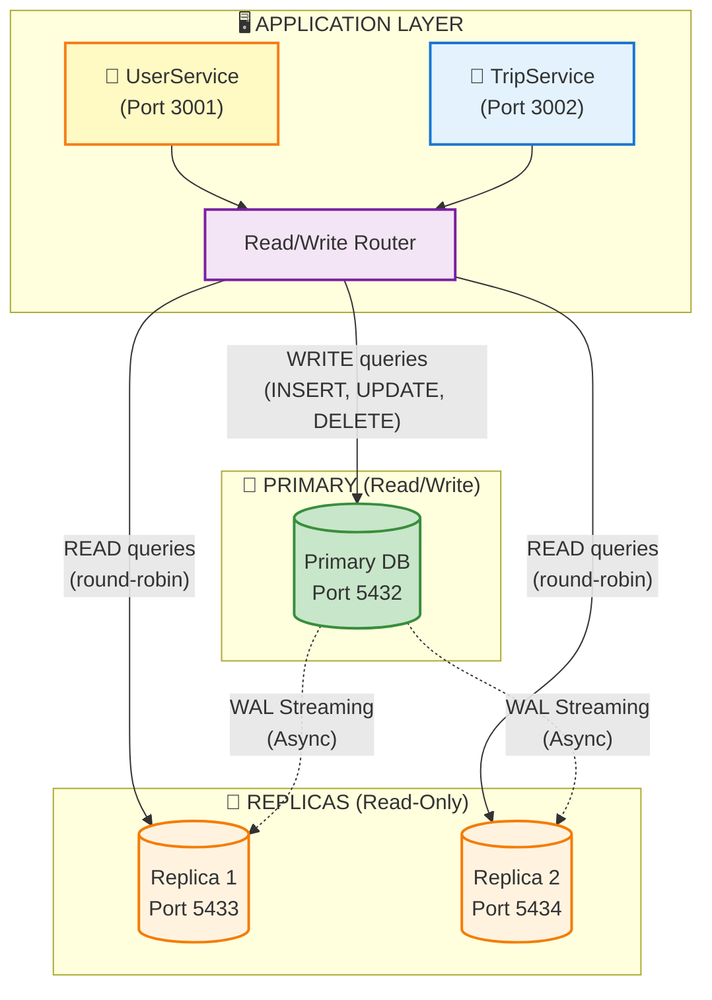

# ADR-002: Database Read Scaling with Read Replicas

**Status:** ✅ Accepted  
**Date:** 2025-11-21  
**Module:** A - Scalability

---

## The Problem

Hệ thống sử dụng **single PostgreSQL instance** cho tất cả operations. Workload pattern: **80% reads, 20% writes** - read-heavy workload nhưng tất cả queries đều hit cùng 1 instance.

```
[All READ queries] ──┐
[All READ queries] ──┼──→ [Single PostgreSQL Primary] ←── [All WRITE queries]
[All READ queries] ──┘           ↓
                            CPU Contention
                     (Reads và Writes compete resources)
```

**Core Problem:**
- **Single database instance** xử lý cả reads và writes → CPU bottleneck
- **No read scaling** - không thể phân tán read load
- **Single Point of Failure** - primary down → toàn bộ hệ thống down

**Symptoms:**
- **Database CPU saturation:** CPU usage 85-95% tại peak hours → gần giới hạn
- **Query latency tăng cao:** Slow queries khi có nhiều concurrent reads → degraded UX
- **Connection exhaustion:** Connection pool đầy → requests queued/failed
- **No failover capability:** Primary down → toàn bộ application down, mất data từ last backup

**Scale Gap:**
- **Read capacity:** Cần tăng khả năng xử lý read queries lên nhiều lần
- **Write capacity:** Giữ nguyên (không phải bottleneck chính)
- **Availability:** Cần giảm downtime đáng kể để đạt high availability

**Root Cause:** Single instance handles cả reads và writes → CPU contention.

---

## Options Considered

### Option 1: Vertical Scaling (Upgrade Instance)

**Mô tả:** Nâng cấp instance lên size lớn hơn (vd: db.r5.4xlarge).

| Pros | Cons |
|------|------|
| ✅ Simple - không thay đổi architecture | ❌ **Chi phí tăng đáng kể** |
| ✅ No replication lag | ❌ Vẫn là **Single Point of Failure** |
| ✅ Immediate improvement | ❌ Capacity có giới hạn (không scale vô hạn) |

**Verdict:** ❌ Đắt hơn mà vẫn SPOF. Không giải quyết được availability issue.

---

### Option 2: Horizontal Sharding

**Mô tả:** Phân chia data theo key (user_id, region) ra nhiều database instances.

| Pros | Cons |
|------|------|
| ✅ Throughput cực cao, scale gần như vô hạn | ❌ **Complexity cực kỳ cao** |
| ✅ Linear scaling với số shards | ❌ Cross-shard JOINs impossible |
| | ❌ Rebalancing data rất phức tạp |
| | ❌ Team chưa có expertise |

**Tại sao vẫn muốn Sharding?**
- Scaling potential gần như không giới hạn
- Phù hợp với data có natural partition key

**Tại sao không chọn?**
- **Over-engineering** cho quy mô hiện tại
- Team cần học thêm rất nhiều
- Application code phải rewrite extensively

**Khi nào sẽ migrate sang Sharding?**
- Khi throughput vượt xa capacity của read replicas
- Khi có clear partition key (vd: by region)

---

### Option 3: NoSQL (DynamoDB)

**Mô tả:** Chuyển sang DynamoDB - fully managed NoSQL với unlimited scale.

| Pros | Cons |
|------|------|
| ✅ Unlimited scale | ❌ **Complete application rewrite** |
| ✅ Fully managed by AWS | ❌ **Loss of ACID transactions** |
| ✅ Single-digit millisecond latency | ❌ Team expertise là PostgreSQL |
| | ❌ Migration effort rất lớn |

**Verdict:** ❌ Quá risky. Đánh đổi ACID và SQL capabilities không xứng đáng với benefits.

---

### Option 4: Aurora PostgreSQL ⭐ Ideal nhưng chưa phù hợp

**Mô tả:** AWS Aurora PostgreSQL - managed với up to 15 read replicas, faster failover.

| Pros | Cons |
|------|------|
| ✅ Up to 15 read replicas | ❌ **Vendor lock-in** (AWS only) |
| ✅ Faster failover | ❌ **Chi phí không dự đoán được** |
| ✅ Storage auto-scaling | ❌ Không chạy được local (khó dev/test) |
| ✅ Better HA than standard RDS | |

**Tại sao vẫn muốn Aurora?**
- Managed service, ít ops burden
- Better performance than standard PostgreSQL

**Tại sao không chọn?**
- **Budget concern:** Pricing model phức tạp
- **Không thể test locally:** Cần Aurora-compatible LocalStack (trả phí)
- **Course project constraint:** Standard PostgreSQL đủ để demo concepts

**Khi nào sẽ migrate sang Aurora?**
- Production deployment với budget đủ
- Cần hơn 2 replicas
- Cần sub-minute failover

---

### Option 5: PostgreSQL Streaming Replication ✅ CHOSEN

**Mô tả:** Setup 1 Primary + 2 Read Replicas với PostgreSQL native streaming replication.

| Pros | Cons |
|------|------|
| ✅ **Tăng read capacity nhiều lần** | ❌ **Replication lag** (eventual consistency) |
| ✅ **High Availability** - replicas làm backup | ❌ **Routing complexity** trong application |
| ✅ **Team familiar** với PostgreSQL | ❌ Cần manage nhiều DB instances |
| ✅ **Chạy được local** (Docker Compose) | |
| ✅ **Chi phí hợp lý** | |

---

## Why PostgreSQL Streaming Replication? Decision Matrix

| Criteria | Weight | Vertical | Sharding | DynamoDB | Aurora | Streaming |
|----------|--------|----------|----------|----------|--------|-----------|
| **Read Capacity** | 25% | 2 | 5 | 5 | 5 | 4 |
| **Cost** | 25% | 2 | 3 | 3 | 2 | 4 |
| **Team expertise** | 20% | 5 | 1 | 2 | 4 | 5 |
| **Local dev support** | 15% | 5 | 2 | 1 | 1 | 5 |
| **Complexity** | 15% | 5 | 1 | 2 | 4 | 3 |
| **TOTAL** | 100% | **3.3** | **2.4** | **2.7** | **3.1** | **4.2** |

**Kết luận:** PostgreSQL Streaming Replication wins với score 4.2/5, cân bằng giữa capacity increase và constraints hiện tại.

---

## Chosen Solution

**PostgreSQL Streaming Replication: 1 Primary + 2 Read Replicas**



**Routing Logic:**
| Operation | Route To | Reason |
|-----------|----------|--------|
| All WRITEs | Primary | Only primary accepts writes |
| Read-after-write (recent) | Primary | Avoid stale data from lag |
| Historical reads | Replicas (round-robin) | Load distribution |
| Trip status check (new trip) | Primary | Avoid 404 from lag |

**Key Components:**
| Component | Purpose | Config |
|-----------|---------|--------|
| Primary DB | Handle all writes + critical reads | Port 5432, Read/Write |
| Replica 1 | Handle read queries | Port 5433, Read-Only |
| Replica 2 | Handle read queries + failover candidate | Port 5434, Read-Only |
| WAL Streaming | Async replication | Continuous archiving |

---

## Trade-offs của Solution Đã Chọn

> **Nguyên tắc:** Mọi architectural decision đều có trade-offs. Section này phân tích những gì chúng ta **được** và **mất** khi chọn Read Replicas.

### Trade-off 1: 🔄 Consistency vs 📈 Read Capacity

```
┌─────────────────────────────────────────────────────────────┐
│  SINGLE DB (Before)       │  WITH REPLICAS (After)         │
├───────────────────────────┼─────────────────────────────────┤
│  Every read = latest data │  Read có thể slightly stale    │
│  But limited throughput   │  But throughput cao hơn nhiều  │
│  All queries → 1 instance │  Queries distributed → 3 nodes │
└───────────────────────────┴─────────────────────────────────┘
```

| Aspect | Single DB | With Replicas | Verdict |
|--------|-----------|---------------|---------|
| **Read consistency** | Always latest | **Eventual** (có lag nhỏ) | Single better |
| **Read capacity** | Giới hạn | **Cao hơn nhiều lần** | ✅ Replicas wins |
| **Failure impact** | Total outage | Replicas vẫn serve reads | ✅ Replicas wins |

**What we gain:** Read capacity tăng đáng kể, fault tolerance
**What we lose:** Strong consistency - có thể đọc data cũ
**Why acceptable:** 
- Đa số reads không cần microsecond freshness (trip history, driver profiles)
- Critical reads (read-after-write) vẫn route đến Primary

**Real Issue Encountered:**
```
❌ Problem: User creates trip → immediately check status → 404 (replica chưa replicate)
✅ Solution: Route recent trip status checks to Primary
```

---

### Trade-off 2: 💰 Cost vs 🛡️ Availability

```
┌─────────────────────────────────────────────────────────────┐
│  SINGLE INSTANCE          │  1 PRIMARY + 2 REPLICAS        │
├───────────────────────────┼─────────────────────────────────┤
│  Chi phí thấp             │  Chi phí cao hơn               │
│  Single point of failure  │  High availability             │
│  Downtime = total outage  │  Partial service during fail   │
│  Recovery = restore backup│  Recovery = promote replica    │
│  (mất data từ last backup)│  (gần như không mất data)      │
└───────────────────────────┴─────────────────────────────────┘
```

| Aspect | Single Instance | With Replicas | Verdict |
|--------|-----------------|---------------|---------|
| **Cost** | Thấp | Cao hơn đáng kể | Single cheaper |
| **Availability** | Thấp (SPOF) | **Cao hơn nhiều** | ✅ Replicas wins |
| **Recovery time** | Chậm (restore backup) | Nhanh hơn (promote replica) | ✅ Replicas wins |
| **Data loss** | Mất data từ last backup | Gần như không mất | ✅ Replicas wins |

**What we gain:** High availability, replicas sẵn sàng để promote thành primary
**What we lose:** Chi phí tăng
**Why acceptable:** 
- Downtime ảnh hưởng user experience và business
- Course project cũng cần demonstrate HA concepts
- Chi phí Docker Compose = $0 cho local development

> **Lưu ý:** Failover hiện tại là **manual** (Docker). Auto-failover có khi migrate lên RDS Multi-AZ.

---

### Trade-off 3: 🎯 Simplicity vs 🔧 Scalability

| Aspect | Single DB | With Replicas |
|--------|-----------|---------------|
| Code | Simple connection | Read/Write routing logic |
| Config | 1 connection string | 3 connection strings |
| Debugging | Straightforward | "Which DB did this query go to?" |
| Deployment | 1 container | 3 containers + replication setup |
| Mental model | Easy | Need understanding of replication |

**What we gain:** Horizontal scalability, thêm replicas khi cần
**What we lose:** Simple mental model, debugging complexity
**Mitigation:**
- Centralized routing function (không scatter logic)
- Logging which DB handled each query
- Docker Compose abstracts replication setup

---

### Trade-off 4: 🏠 Local Dev vs ☁️ Production Parity

| Aspect | Local (Docker) | Production (RDS) |
|--------|----------------|------------------|
| Failover | Manual replica promotion | Auto-failover |
| Monitoring | Basic Docker logs | CloudWatch full metrics |
| Replication | Same PostgreSQL streaming | Same concept, managed |

**What we gain:** Có thể test replication concepts locally
**What we lose:** 100% production parity (auto-failover behavior khác)
**Why acceptable:**
- Core concept (read/write routing) identical
- Production differences là managed features, không ảnh hưởng logic

---

## Khi nào nên migrate sang solution khác?

| Trigger | Current (Streaming) | Migrate To | Reason |
|---------|---------------------|------------|--------|
| Cần hơn 2 replicas | ✅ 2 replicas | Aurora PostgreSQL | Up to 15 replicas |
| Cần sub-minute failover | Manual promotion | RDS Multi-AZ | Auto-failover nhanh |
| Throughput vượt capacity | ✅ Đủ hiện tại | Sharding | Linear scaling |
| Cần global distribution | Single region | Aurora Global | Multi-region replicas |

---

## Expected Benefits

**Performance Improvements:**
- **Read latency:** Giảm đáng kể nhờ phân tải queries sang replicas
- **Throughput:** Tăng gấp nhiều lần nhờ parallel read processing
- **Error rate:** Ổn định hơn dưới high load nhờ distributed queries

**Resource Utilization:**
- Database CPU được phân bổ đều giữa Primary và Replicas
- Primary có headroom để xử lý writes mà không bị contention từ reads

---

## Failure Modes

| Failure | Impact | Mitigation | Recovery |
|---------|--------|------------|----------|
| **Primary down** | No writes, stale reads | Promote replica to primary | Auto-failover (RDS Multi-AZ) |
| **One replica down** | Reduced read capacity | Other replica + Primary handle reads | Auto-restart container |
| **Replication lag spike** | Stale data visible longer | CloudWatch alarm → investigate | Usually network/load issue |
| **Read-after-write stale** | User sees old data | Route to Primary for recent writes | Code pattern |
| **Connection exhaustion** | New requests fail | Connection pooling (PgBouncer) | Pool size tuning |

**Monitoring Alerts:**
```
CloudWatch: ReplicaLag quá cao → Alert
CloudWatch: DatabaseConnections > threshold → Alert
```

---

## Limitations & Future Work

### Current Limitations:
1. **Replication lag can spike** under heavy write load
2. **Manual replica promotion** in local Docker (vs auto in RDS)
3. **No connection pooling** yet (PgBouncer planned)
4. **Routing logic in app code** (vs transparent proxy)

### Future Improvements:
| Priority | Task | Effort | Value |
|----------|------|--------|-------|
| 🔴 High | Add PgBouncer connection pool | Low | Handle nhiều connections hơn |
| 🔴 High | Migrate to RDS Multi-AZ | Medium | Auto-failover, managed |
| 🟡 Medium | Add ProxySQL for transparent routing | Low | Simplify app code |
| 🟢 Low | Add 3rd replica | Low | More read capacity |


