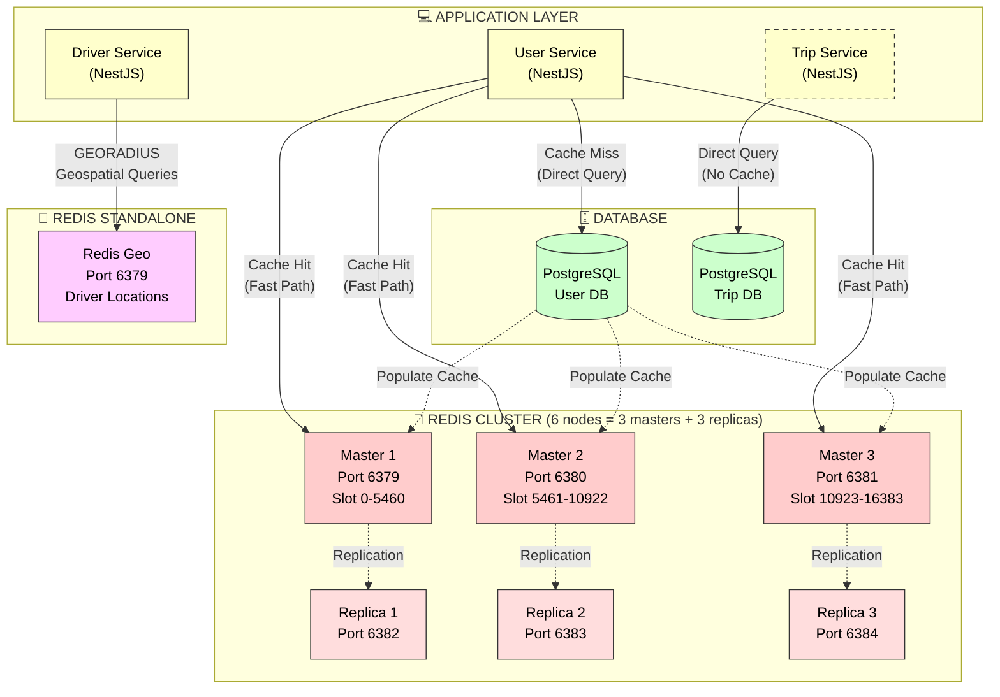

# ADR-003: Distributed Caching with Redis Cluster

**Status:** ✅ Accepted  
**Date:** 2025-11-21  
**Module:** A - Scalability

---

## The Problem

Hệ thống hiện tại **không có caching layer**. Mọi request đều hit database trực tiếp, kể cả dữ liệu ít thay đổi như driver profile và user profile.

```
┌─────────────────────────────────────────────────────────────┐
│  Without Caching Layer                                      │
├─────────────────────────────────────────────────────────────┤
│  [Request]───┐                                              │
│  [Request]───┼──→ [PostgreSQL] ← All queries hit database  │
│  [Request]───┘        ↑                                     │
│                       │                                     │
│           80% of queries are cacheable reads                │
│           (profiles, pricing, static data)                  │
└─────────────────────────────────────────────────────────────┘
```

**Symptoms:**
- **Profile Queries:** Latency cao do mỗi request đều hit database
- **Database Load:** Phần lớn queries là cacheable reads
- **PostgreSQL CPU:** Utilization cao, gần tới giới hạn
- **Scalability:** Database là bottleneck cho read-heavy workload

**Scale Gap:**
- **Read capacity:** Cần tăng capacity lên nhiều lần để hỗ trợ growth
- **Response time:** Profile lookups cần sub-millisecond latency
- **Cost efficiency:** Database resources đắt hơn memory

**Root Cause:** Không có cache layer → tất cả reads hit disk I/O thay vì memory.

---

## Options Considered

### Option 1: In-Memory Cache (Node.js LRU)

**Mô tả:** Sử dụng in-process LRU cache trong mỗi Node.js instance.

| Pros | Cons |
|------|------|
| ✅ Zero cost - không cần infrastructure | ❌ **No shared state** giữa instances |
| ✅ Fastest latency (in-process) | ❌ **Cache inconsistency** khi có multiple replicas |
| ✅ Simplest implementation | ❌ Memory duplicated across instances |

**Verdict:** ❌ Không viable cho distributed system. Khi có 3 service replicas, cùng 1 driver profile sẽ có 3 bản copy khác nhau → data inconsistency.

---

### Option 2: Redis Self-Hosted (EC2)

**Mô tả:** Deploy Redis trên EC2 instance, tự quản lý.

| Pros | Cons |
|------|------|
| ✅ Rẻ hơn managed service | ❌ **Operational burden** (patching, monitoring, backup) |
| ✅ Full control | ❌ Tự manage HA/failover |
| ✅ No vendor lock-in | ❌ Team resources tốt hơn dành cho features |

**Verdict:** ❌ Prefer managed service hoặc Docker cho local. Không muốn maintain Redis infrastructure manually.

---

### Option 3: Memcached

**Mô tả:** Sử dụng Memcached - simple key-value cache.

| Pros | Cons |
|------|------|
| ✅ Rẻ hơn Redis một chút | ❌ **No persistence** |
| ✅ Simpler protocol | ❌ **No pub/sub** (cần cho invalidation) |
| ✅ Multi-threaded | ❌ **No data structures** (sorted sets, lists) |

**Tại sao vẫn muốn Memcached?**
- Cheaper nếu chỉ cần simple caching
- Simpler architecture

**Tại sao không chọn?**
- Cần Redis features: **Geospatial** cho driver search, **Sorted Sets** cho leaderboard potential
- **Pub/Sub** hữu ích cho cache invalidation broadcasts
- Redis community và ecosystem rộng hơn

---

### Option 4: DynamoDB DAX ⭐ Ideal nhưng không compatible

**Mô tả:** DynamoDB Accelerator - in-memory cache cho DynamoDB.

| Pros | Cons |
|------|------|
| ✅ Microsecond latency | ❌ **Only works with DynamoDB** |
| ✅ Fully managed | ❌ Chúng ta dùng PostgreSQL |
| ✅ Write-through automatic | ❌ Would require database migration |

**Verdict:** ❌ Architectural incompatibility - không thể dùng với PostgreSQL.

---

### Option 5: Redis Cluster (Docker) ✅ CHOSEN

**Mô tả:** 6-node Redis Cluster (3 masters + 3 replicas) chạy local với Docker.

| Pros | Cons |
|------|------|
| ✅ **Shared cache** across all service instances | ❌ Memory overhead |
| ✅ **High Availability** - auto-failover | ❌ Cache invalidation complexity |
| ✅ **Rich data structures** (geospatial, sorted sets) | ❌ Thêm infrastructure components |
| ✅ **$0 for local development** | |
| ✅ **Production-ready** - migrate to ElastiCache dễ dàng | |

---

## Why Redis Cluster? Decision Matrix

| Criteria | Weight | In-Memory | Self-Host | Memcached | DAX | Redis Cluster |
|----------|--------|-----------|-----------|-----------|-----|---------------|
| **Distributed Support** | 25% | 1 | 4 | 4 | 5 | 5 |
| **Features (geo, pub/sub)** | 25% | 1 | 5 | 2 | 3 | 5 |
| **Operational Effort** | 20% | 5 | 2 | 3 | 5 | 4 |
| **Cost (local dev)** | 15% | 5 | 3 | 4 | 1 | 5 |
| **Team Familiarity** | 15% | 5 | 4 | 3 | 2 | 4 |
| **TOTAL** | 100% | **2.6** | **3.6** | **3.1** | **3.2** | **4.6** |

**Kết luận:** Redis Cluster wins với score 4.6/5, cung cấp features đầy đủ nhất cho requirements hiện tại.

---

## Chosen Solution

**Redis Cluster (6-node) với Cache-Aside Pattern**



**Actual Implementation Details:**

- ✅ **User Service**: Sử dụng Redis Cluster (6 nodes) với cache-aside pattern cho user profiles
- ⚠️ **Trip Service**: KHÔNG có caching được implement (chỉ query PostgreSQL trực tiếp)
- ✅ **Driver Service**: Sử dụng standalone Redis cho geospatial queries (GEORADIUS)
- **Redis Cluster**: 3 masters xử lý data (CRC16 hash slot routing) + 3 replicas cho HA
- **Cache Pattern**: Cache-aside với write-through invalidation (chỉ User Service)

**Cache-Aside Pattern Flow:**
```
1. Application receives request
2. Check Redis cache first
   ├── Cache HIT → Return immediately (fast)
   └── Cache MISS → Query PostgreSQL → Store in Redis → Return (slower)
3. On data update → Invalidate cache entry
```

**Key Components:**
| Component | Purpose | Config |
|-----------|---------|--------|
| Redis Masters (3) | Handle read/write operations | Ports 6379-6381 |
| Redis Replicas (3) | Failover candidates, read scaling | Ports 6382-6384 |
| Eviction Policy | Remove cold data when memory full | allkeys-lru |
| Cluster Mode | Data sharding across masters | Enabled |

**TTL Strategy:**
| Data Type | TTL | Reason | Status |
|-----------|-----|--------|--------|
| User Profile | 1 hour | Rarely changes, high read frequency | ✅ Implemented |
| Driver Location | Real-time | Overwritten on each GPS update | ✅ Implemented (Redis Geo) |
| Driver Profile | 1 hour | Rarely changes | ✅ Implemented |

---

## Trade-offs của Solution Đã Chọn

> **Nguyên tắc:** Mọi architectural decision đều có trade-offs. Section này phân tích những gì chúng ta **được** và **mất** khi chọn Redis Cluster.

### Trade-off 1: 💾 Memory Cost vs 🔋 Database Load

```
┌─────────────────────────────────────────────────────────────┐
│  WITHOUT CACHE            │  WITH REDIS CLUSTER            │
├───────────────────────────┼─────────────────────────────────┤
│  All queries hit DB       │  Most queries hit cache        │
│  DB CPU: High             │  DB CPU: Much lower            │
│  Memory: 0                │  Memory: ~few hundred MB       │
│  Response: Slower         │  Response: Much faster         │
└───────────────────────────┴─────────────────────────────────┘
```

| Metric | Without Cache | With Cache | Verdict |
|--------|---------------|------------|---------|
| Database CPU | Cao | Thấp hơn nhiều | ✅ Cache wins |
| Memory Cost | Không có | Có thêm chi phí | Cache costs more |
| Response Time | Chậm (disk I/O) | Nhanh (memory) | ✅ Cache wins |
| Throughput | Giới hạn bởi DB | Cao hơn đáng kể | ✅ Cache wins |

**What we gain:** Database load giảm đáng kể, response time cải thiện rõ rệt
**What we lose:** Memory cost cho Redis cluster
**Why acceptable:** 
- Memory rẻ hơn nhiều so với scaling database
- Redis cluster nhỏ có thể handle rất nhiều requests
- ROI rất cao: chi phí thấp, benefit lớn

---

### Trade-off 2: 🔄 Consistency vs ⚡ Performance

```
┌─────────────────────────────────────────────────────────────┐
│  STRONG (No Cache)        │  EVENTUAL (With Cache)         │
├───────────────────────────┼─────────────────────────────────┤
│  Every read = latest data │  Read có thể slightly stale    │
│  But slower response      │  But much faster response      │
│  DB handles all load      │  Cache handles most load       │
└───────────────────────────┴─────────────────────────────────┘
```

| Aspect | Strong (No Cache) | Eventual (With Cache) | Verdict |
|--------|-------------------|----------------------|---------|
| **Freshness** | Real-time | TTL-based (có delay) | Strong better |
| **Response** | Chậm hơn | Nhanh hơn nhiều | ✅ Eventual wins |
| **Throughput** | Giới hạn bởi DB | Cao hơn đáng kể | ✅ Eventual wins |

**What we gain:** Response time giảm đáng kể, throughput tăng nhiều lần
**What we lose:** Strong consistency - có thể đọc stale data
**Why acceptable:**
- **Profile data tolerance:** User/Driver profiles có thể stale mà không ảnh hưởng business
- **Active trip exception:** TTL ngắn đủ fresh cho real-time tracking
- **Write-through invalidation:** Critical updates bypass cache ngay lập tức
- Ride-hailing không cần microsecond consistency cho profile data

---

### Trade-off 3: 🎯 Simplicity vs 📈 Scalability

| Aspect | No Cache (Simple) | Redis Cluster (Complex) |
|--------|-------------------|------------------------|
| Components | Ít (chỉ Database) | Nhiều hơn (DB + Redis nodes) |
| Failure points | Ít | Nhiều hơn |
| Capacity | Giới hạn | Cao hơn nhiều |
| Operations | Thấp | Cao hơn (cache invalidation) |
| Mental model | Easy | Need caching patterns knowledge |

**What we gain:** Horizontal scalability, capacity tăng đáng kể
**What we lose:** Simple architecture, thêm failure points
**Mitigation:**
- Redis Cluster **self-healing** (auto-failover khi node down)
- Complexity **contained in infrastructure** (không leak vào business logic)
- Cache-aside pattern đơn giản và well-understood
- Team đã familiar với Redis

---

### Trade-off 4: ❄️ Cold Start vs 🔥 Hot Path

```
┌─────────────────────────────────────────────────────────────┐
│  COLD START (Cache Miss)  │  HOT PATH (Cache Hit)          │
├───────────────────────────┼─────────────────────────────────┤
│  First request hits DB    │  Subsequent requests fast      │
│  Slightly slower          │  Sub-millisecond response      │
│  Populates cache          │  No DB load                    │
└───────────────────────────┴─────────────────────────────────┘
```

| Scenario | Cache Miss (Cold) | Cache Hit (Hot) |
|----------|-------------------|------------------|
| Latency | Chậm hơn (hit DB) | Rất nhanh |
| DB Load | Tăng thêm query | Không tăng |
| Expected ratio | Thấp | Cao (phần lớn requests) |

**What we gain:** Phần lớn requests served from memory (fast)
**What we lose:** First request cho mỗi key chậm hơn
**Why acceptable:**
- Sau warm-up, cache hit rate rất cao
- First request chậm hơn là acceptable trade-off
- Cache warming script có thể pre-populate hot keys
- **allkeys-lru** eviction đảm bảo hot data stays in memory

---

## Khi nào nên migrate sang solution khác?

| Trigger | Current (Redis Cluster) | Migrate To | Reason |
|---------|-------------------------|------------|--------|
| Memory vượt capacity | ✅ Đủ hiện tại | ElastiCache (larger) | Managed, more memory |
| Need global distribution | Single region | ElastiCache Global | Multi-region caching |
| Serverless workload | Fixed cluster | ElastiCache Serverless | Pay-per-use |
| Cost optimization | Docker local | ElastiCache Reserved | Production discount |

---

## Expected Benefits

**Performance Improvements:**
- **Database load:** Giảm đáng kể số queries đến database nhờ cache hits
- **Response time:** Cải thiện rõ rệt cho cached data (memory vs disk I/O)
- **Database CPU:** Có nhiều headroom hơn cho write operations
- **Driver Search:** Trở thành endpoint nhanh nhờ Redis geospatial caching

**Operational Benefits:**
- Cache hit rate cao cho frequently accessed data
- Database có thể handle nhiều concurrent users hơn
- Auto-failover trong cluster ensures availability

---

## Failure Modes

| Failure | Impact | Mitigation | Recovery |
|---------|--------|------------|----------|
| **Redis Node Down** | Degraded (5 nodes remaining) | Cluster auto-failover, replica promotes | Automatic |
| **Full Cluster Down** | Fallback to database (slower) | Circuit breaker, graceful degradation | Restart cluster |
| **Cache Stampede** | All miss at once, DB overwhelm | TTL jitter (±10%), cache warming | Auto-resolve |
| **Memory Exhaustion** | LRU evictions, hit rate drops | Monitor, allkeys-lru policy | Add memory |
| **Network Partition** | Split-brain cluster | Redis Cluster quorum (4 of 6) | Network fix |
| **Stale Data Served** | User sees old profile | TTL expires, write-through for critical | By design |

### Fallback Strategy
```typescript
// Cache failure graceful degradation
async function getDriverProfile(id: string) {
  try {
    return await cacheService.getOrSet(`driver:${id}`, fetchFromDB);
  } catch (cacheError) {
    logger.warn('Cache unavailable, falling back to DB');
    return await fetchFromDB(); // Slower but works
  }
}
```

---

## Limitations & Future Work

### Current Limitations:
1. **No Cache Warming Script:** Cold start after deployment hits DB hard
2. **Fixed TTL Strategy:** Not adaptive to access patterns
3. **No Distributed Tracing:** Hard to debug cache misses
4. **Local Docker only:** Not production ElastiCache yet

### Future Improvements:
| Priority | Task | Effort | Value |
|----------|------|--------|-------|
| 🔴 High | Cache warming on startup | Low | Eliminate cold start penalty |
| 🔴 High | Migrate to ElastiCache | Medium | Production reliability |
| 🟡 Medium | Adaptive TTL based on access | Medium | Optimize memory usage |
| 🟡 Medium | Add cache metrics to monitoring | Low | Visibility into hit/miss rates |
| 🟢 Low | Redis Sentinel for managed failover | Medium | Better HA |

---

## Implementation Notes

### Docker Compose Configuration

```yaml
# docker-compose.redis-cluster.yml
services:
  redis-node-1:
    image: redis:7
    command: redis-server --port 6379 --cluster-enabled yes
    ports:
      - "6379:6379"
  
  redis-node-2:
    image: redis:7
    command: redis-server --port 6380 --cluster-enabled yes
    ports:
      - "6380:6380"
  # ... 4 more nodes
```

### Cache-Aside Pattern Implementation

```typescript
async function getOrSet<T>(key: string, ttl: number, fetchFn: () => Promise<T>): Promise<T> {
  // Try cache first
  const cached = await redis.get(key);
  if (cached) return JSON.parse(cached);
  
  // Cache miss - fetch from database
  const data = await fetchFn();
  await redis.setex(key, ttl, JSON.stringify(data));
  
  return data;
}

// Usage
async function getDriverProfile(driverId: string) {
  return getOrSet(`driver:${driverId}`, 3600, () => 
    prisma.driver.findUnique({ where: { id: driverId } })
  );
}
```


