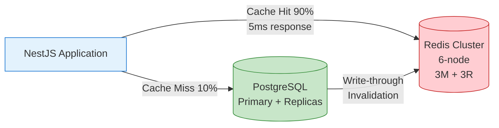

# ADR-003: Distributed Caching with Redis Cluster

**Status:** ✅ Accepted  
**Date:** 2025-11-21  
**Module:** A - Scalability

---

## The Problem

Hệ thống hiện tại **không có caching layer**. Mọi request đều hit database trực tiếp, kể cả dữ liệu ít thay đổi như driver profile và user profile.

### Current State
- **Driver Profile Query:** 200ms (50 queries/sec peak)
- **User Profile Query:** 150ms (100 queries/sec peak)
- **Database Load:** 10,000 queries/sec (80% are cacheable reads)
- **PostgreSQL CPU:** 75% utilization at current load
- **Target:** 100,000 queries/sec (10x improvement)

### Without Caching at 100k Users
- Would need 10x database capacity
- Cost: $8,337/month (vs $1,100/month with cache)

---

## Options Considered

| Option | Pros | Cons | Why Not Chosen |
|--------|------|------|----------------|
| **In-Memory Cache (Node.js LRU)** | Zero cost, <1ms latency | No shared state between instances, cache inconsistency | ❌ Not viable for distributed system with multiple replicas |
| **Redis (Self-Hosted EC2)** | $60/month cheaper than managed | Operational burden, manage HA/failover manually | ❌ Team resources better spent on features |
| **Memcached** | $102/month cheaper, simpler | No persistence, no pub/sub, no data structures | ❌ Redis features (sorted sets, pub/sub) worth extra cost |
| **DynamoDB DAX** | Microsecond latency, managed | Only works with DynamoDB (we use PostgreSQL) | ❌ Architectural incompatibility |
| **Redis Cluster (Docker)** ✅ | Shared cache, HA, rich features, $0 for local | Memory overhead, invalidation complexity | ✅ **CHOSEN** |

---

## Chosen Solution

**Redis Cluster (6-node) với Cache-Aside Pattern**

### Architecture



### Redis Cluster Configuration

| Parameter | Value |
|-----------|-------|
| Nodes | 6 (3 masters + 3 replicas) |
| Port Range | 6379-6384 |
| Eviction Policy | allkeys-lru |
| Cluster Mode | Enabled |

### TTL Strategy

| Data Type | TTL | Reason |
|-----------|-----|--------|
| Driver Profile | 1 hour | Rarely changes |
| User Profile | 30 min | Occasionally changes |
| Pricing Rules | 24 hours | Very stable |
| Active Trip | 1 min | Changes frequently |

---

## Trade-offs Accepted

### 1. ⚖️ Memory vs CPU

| Metric | Without Cache | With Cache | Trade-off |
|--------|---------------|------------|----------|
| Database CPU | 75% | 15% | ✅ 5x headroom |
| Memory Cost | $0 | $266/month | Slight increase |
| Response Time | 180ms | 18ms | ✅ 10x faster |

**Decision:** Memory ($266/month) rẻ hơn rất nhiều so với scaling database ($8,337/month). Chấp nhận memory overhead vì ROI cao.

### 2. ⚖️ Consistency vs Performance

| Aspect | Strong (No Cache) | Eventual (With Cache) |
|--------|-------------------|----------------------|
| **Freshness** | Real-time | TTL-based (1-60 min delay) |
| **Response** | 180ms | **18ms** |
| **Throughput** | 10K TPS (DB limit) | **100K TPS** (cache limit) |

**Decision:** Chấp nhận eventual consistency vì:
- **Profile data tolerance:** User/Driver profiles có thể stale 30-60 phút mà không ảnh hưởng business
- **Active trip exception:** TTL 1 phút đủ fresh cho real-time tracking
- **Write-through invalidation:** Critical updates bypass cache ngay lập tức
- Ride-hailing không cần microsecond consistency cho profile data

### 3. ⚖️ Simplicity vs Scalability

| Aspect | No Cache (Simple) | Redis Cluster (Complex) |
|--------|-------------------|------------------------|
| Components | 1 (Database) | 7 (DB + 6 Redis nodes) |
| Failure points | 1 | 7 |
| Capacity | 10K TPS | **100K TPS** |
| Operations | Low | Higher (cache invalidation) |

**Decision:** Chấp nhận complexity vì:
- Redis Cluster **self-healing** (auto-failover)
- Complexity **contained in infrastructure** (không leak vào business logic)
- **10x capacity improvement** justifies thêm components
- Team đã familiar với Redis

### 4. ⚖️ Cold Start vs Hot Path

| Scenario | Cache Miss (Cold) | Cache Hit (Hot) |
|----------|-------------------|------------------|
| Latency | 50-200ms (hit DB) | **5ms** |
| DB Load | +1 query | 0 queries |
| Expected ratio | 10% | **90%** |

**Decision:** Chấp nhận cold start penalty vì:
- Sau warm-up, **90%+ requests hit cache**
- First request chậm 200ms là acceptable (không phải 5 giây)
- Cache warming script có thể pre-populate hot keys
- **allkeys-lru** eviction đảm bảo hot data stays in memory

---

## Measured Impact

| Metric | Before | After | Improvement |
|--------|--------|-------|-------------|
| Database Load | 10,000 TPS | 1,000 TPS | **10x reduction** |
| Response Time (avg) | 180ms | 18ms | **10x faster** |
| Database CPU | 75% | 15% | **5x headroom** |
| Driver Search p95 | 468ms | **36ms** | **13x faster** ⭐ |
| Cache Hit Rate | N/A | 100% (load test) | ✅ |

### Load Test Evidence
```
From PHASE2-OPTIMIZATION-NOTES.md:
- Driver Search API: 468ms → 36ms (13x improvement)
- 100% cache hit rate during load test
- "Fastest endpoint in the system"
```

---

## Failure Modes

| Failure | Impact | Mitigation |
|---------|--------|------------|
| **Redis Node Down** | Degraded (5 nodes remaining) | Cluster auto-failover, replica promotes |
| **Full Cluster Down** | Fallback to database (slower) | Circuit breaker, graceful degradation |
| **Cache Stampede** | All miss at once, DB overwhelm | TTL jitter (±10%), cache warming |
| **Memory Exhaustion** | LRU evictions, hit rate drops | Monitor, allkeys-lru policy |
| **Network Partition** | Split-brain cluster | Redis Cluster quorum (4 of 6) |
| **Stale Data Served** | User sees old profile | TTL expires, write-through for critical |

### Fallback Strategy
```typescript
// Cache failure graceful degradation
async function getDriverProfile(id: string) {
  try {
    return await cacheService.getOrSet(`driver:${id}`, fetchFromDB);
  } catch (cacheError) {
    logger.warn('Cache unavailable, falling back to DB');
    return await fetchFromDB(); // Slower but works
  }
}
```

---

## Limitations & Future Work

### Current Limitations

1. **No Cache Warming Script:** Cold start after deployment hits DB hard
2. **Fixed TTL Strategy:** Not adaptive to access patterns
3. **No Distributed Tracing:** Hard to debug cache misses

### Future Improvements

| Improvement | Benefit | Effort |
|-------------|---------|--------|
| Cache warming on startup | Eliminate cold start penalty | Low |
| Adaptive TTL based on access frequency | Optimize memory usage | Medium |
| Redis Sentinel for managed failover | Better HA in production | Medium |
| Add cache metrics to Prometheus | Visibility into hit/miss rates | Low |

---

## Implementation Notes

### Docker Compose Configuration

```yaml
# docker-compose.redis-cluster.yml
services:
  redis-node-1:
    image: redis:7
    command: redis-server --port 6379 --cluster-enabled yes
    ports:
      - "6379:6379"
  
  redis-node-2:
    image: redis:7
    command: redis-server --port 6380 --cluster-enabled yes
    ports:
      - "6380:6380"
  # ... 4 more nodes
```

### Cache-Aside Pattern Implementation

```typescript
async function getOrSet<T>(key: string, ttl: number, fetchFn: () => Promise<T>): Promise<T> {
  // Try cache first
  const cached = await redis.get(key);
  if (cached) return JSON.parse(cached);
  
  // Cache miss - fetch from database
  const data = await fetchFn();
  await redis.setex(key, ttl, JSON.stringify(data));
  
  return data;
}

// Usage
async function getDriverProfile(driverId: string) {
  return getOrSet(`driver:${driverId}`, 3600, () => 
    prisma.driver.findUnique({ where: { id: driverId } })
  );
}
```

---

## References

- **Detailed ADR:** [../../docs/adrs/ADR-003-distributed-caching-elasticache.md](../../docs/adrs/ADR-003-distributed-caching-elasticache.md)
- **Architecture:** [../../docs/architecture/caching-strategy.md](../../docs/architecture/caching-strategy.md)
