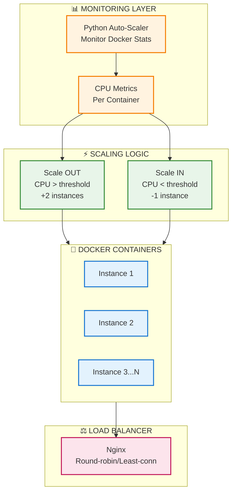

# ADR-004: Auto-Scaling Infrastructure

**Status:** ✅ Accepted  
**Date:** 2025-11-21  
**Module:** A - Scalability

---

## The Problem

Hệ thống sử dụng **fixed containers** không có auto-scaling, dẫn đến lãng phí tài nguyên hoặc không đáp ứng được tải cao.

```
┌─────────────────────────────────────────────────────────────┐
│  Fixed Container Deployment (No Auto-Scaling)               │
├─────────────────────────────────────────────────────────────┤
│                                                             │
│  NIGHT HOURS:     ████░░░░░░  Traffic: Low                 │
│  Containers:      ████████    Fixed: High                   │
│  Result:          WASTE - paying for unused capacity        │
│                                                             │
│  PEAK HOURS:      ██████████████  Traffic: Very High       │
│  Containers:      ████████        Fixed: Same               │
│  Result:          OVERLOAD - requests fail                  │
│                                                             │
└─────────────────────────────────────────────────────────────┘
```

**Symptoms:**
- **Over-Provisioning (Night):** Traffic thấp nhưng vẫn provisioned nhiều containers → lãng phí
- **Under-Provisioning (Peak):** Traffic cao vượt quá capacity → requests fail
- **Manual Scaling Pain:** DevOps phải can thiệp thủ công, mất thời gian, không react kịp

**Scale Gap:**
- **Capacity:** Từ fixed capacity lên elastic capacity
- **Efficiency:** Giảm lãng phí resources khi idle
- **Responsiveness:** Tự động scale theo traffic patterns

**Root Cause:** Fixed container count → không adapt theo workload changes.

---

## Options Considered

### Option 1: EC2 Auto-Scaling Groups

**Mô tả:** Sử dụng AWS EC2 Auto-Scaling Groups để scale VM instances.

| Pros | Cons |
|------|------|
| ✅ Native AWS, mature | ❌ **Launch time chậm** (phút để boot VM) |
| ✅ Rich scaling policies | ❌ Không phù hợp cho burst traffic |
| ✅ CloudWatch integration | ❌ Chỉ chạy trên AWS |

**Verdict:** ❌ Too slow cho ride-hailing burst traffic. VM boot time quá lâu so với container startup.

---

### Option 2: Kubernetes (EKS/k8s) ⭐ Ideal nhưng overkill

**Mô tả:** Deploy lên Kubernetes với Horizontal Pod Autoscaler (HPA).

| Pros | Cons |
|------|------|
| ✅ **Industry standard** cho container orchestration | ❌ **Massive complexity** |
| ✅ Rich ecosystem (Helm, Operators) | ❌ **Steep learning curve** (tuần để học) |
| ✅ Full orchestration features | ❌ Overkill cho 3 services |
| ✅ HPA với custom metrics | ❌ Setup time đáng kể |

**Tại sao vẫn muốn Kubernetes?**
- Production-grade orchestration
- Industry standard, valuable skill
- Rich ecosystem

**Tại sao không chọn?**
- **Team skill gap:** Không có k8s experience, cần thời gian đáng kể để học
- **Complexity:** 3 services không justify k8s overhead (Deployment, Service, Ingress, ConfigMap, Secret, HPA, PDB...)
- **Demo scope:** Quá phức tạp cho course project

**Khi nào sẽ migrate sang k8s?**
- Khi có hơn 10+ services
- Khi team có k8s experience
- Khi cần advanced orchestration features

---

### Option 3: AWS Lambda (Serverless)

**Mô tả:** Rewrite services thành Lambda functions - true serverless.

| Pros | Cons |
|------|------|
| ✅ True serverless, scale vô hạn | ❌ **Cold start** ảnh hưởng latency |
| ✅ Pay-per-invocation | ❌ **Complete rewrite** needed |
| ✅ Zero ops | ❌ Không phù hợp cho long-running processes |

**Verdict:** ❌ Cold start không acceptable cho ride-hailing. Driver search cần latency thấp, cold start sẽ làm UX xấu.

---

### Option 4: ECS Fargate ⭐ Ideal cho production

**Mô tả:** AWS ECS Fargate - managed container service với Application Auto Scaling.

| Pros | Cons |
|------|------|
| ✅ Managed containers | ❌ **Requires AWS** (không chạy local) |
| ✅ Scale nhanh (phút) | ❌ Chi phí cho development |
| ✅ CloudWatch integration | ❌ Không test được offline |
| ✅ Production-grade | |

**Verdict:** ⏳ Sẽ dùng cho production, nhưng cần giải pháp local development.

---

### Option 5: Docker Compose + Python Auto-Scaler ✅ CHOSEN

**Mô tả:** Docker Compose replicas + custom Python script monitoring CPU và auto-scale.

| Pros | Cons |
|------|------|
| ✅ **Scale nhanh** (giây để start container) | ❌ Not production-grade |
| ✅ **$0 cost** cho local development | ❌ Single host only |
| ✅ **Simple implementation** | ❌ Basic monitoring (CPU only) |
| ✅ **Chạy được trên laptop** | |
| ✅ **Same concept** như production auto-scaling | |

---

## Why Docker + Python Script? Decision Matrix

| Criteria | Weight | EC2 ASG | Kubernetes | Lambda | ECS Fargate | Docker+Script |
|----------|--------|---------|------------|--------|-------------|---------------|
| **Scale Speed** | 25% | 2 | 4 | 5 | 4 | 4 |
| **Local Dev Support** | 25% | 1 | 2 | 1 | 1 | 5 |
| **Team Familiarity** | 20% | 3 | 1 | 2 | 3 | 5 |
| **Implementation Effort** | 15% | 3 | 1 | 2 | 3 | 5 |
| **Production Ready** | 15% | 5 | 5 | 4 | 5 | 2 |
| **TOTAL** | 100% | **2.4** | **2.4** | **2.6** | **2.9** | **4.3** |

**Kết luận:** Docker + Python Script wins với score 4.3/5 cho development environment. ECS Fargate là production path.

---

## Chosen Solution

**Docker Compose Replicas + Python Auto-Scaler Script**



**Auto-Scaler Flow:**
```
1. Python script polls Docker stats (CPU usage per container)
2. Calculate average CPU across all instances
   ├── CPU > 70% → Scale OUT (+2 instances)
   └── CPU < 30% → Scale IN (-1 instance)
3. Execute: docker compose up -d --scale service=N
4. Wait cooldown period before next evaluation
5. Repeat
```

**Key Components:**
| Component | Purpose | Config |
|-----------|---------|--------|
| Python Script | Monitor & trigger scaling | Poll interval: configurable |
| Docker Compose | Container orchestration | --scale flag |
| Nginx LB | Distribute traffic | Round-robin / least-conn |
| Cooldown | Prevent flapping | Period between scale actions |

**Scaling Configuration:**
| Parameter | Value | Reason |
|-----------|-------|--------|
| Min Instances | 2 | Always have warm capacity |
| Max Instances | 10 (configurable) | Resource limit |
| Scale Out Threshold | CPU > 70% | Before saturation |
| Scale In Threshold | CPU < 30% | Conservative scale-in |
| Scale Out Step | +2 instances | Aggressive for burst |
| Scale In Step | -1 instance | Conservative for stability |

---

## Trade-offs của Solution Đã Chọn

> **Nguyên tắc:** Mọi architectural decision đều có trade-offs. Section này phân tích những gì chúng ta **được** và **mất** khi chọn Docker + Python Script.

### Trade-off 1: 🎯 Simplicity vs 🏭 Production-Grade

```
┌─────────────────────────────────────────────────────────────┐
│  KUBERNETES (Complex)     │  DOCKER + SCRIPT (Simple)      │
├───────────────────────────┼─────────────────────────────────┤
│  Full orchestration       │  Basic scaling only            │
│  Steep learning curve     │  No learning curve             │
│  Setup time: days         │  Setup time: hours             │
│  Production-ready         │  Demo/dev ready                │
└───────────────────────────┴─────────────────────────────────┘
```

| Metric | Kubernetes | Docker + Script | Verdict |
|--------|------------|-----------------|---------|
| Learning curve | Tuần để học | **Không cần học thêm** | ✅ Script wins |
| Setup time | Ngày | **Vài giờ** | ✅ Script wins |
| Team experience | Không có | Familiar | ✅ Script wins |
| Features | Full orchestration | Basic scaling | k8s richer |

**What we gain:** Ship faster, no learning curve, rapid iteration
**What we lose:** Production-grade features (HA, self-healing, rolling updates)
**Why acceptable:**
- **Course demo scope:** Chứng minh concept, không cần production-grade
- **Team velocity:** 0 learning curve = ship features faster
- **3 services only:** k8s overhead không justified
- **Clear migration path:** Docker → ECS Fargate → EKS (nếu cần)

---

### Trade-off 2: ❄️ Cold Start vs 🔥 Always-Warm

```
┌─────────────────────────────────────────────────────────────┐
│  COLD (Scale-out needed)  │  WARM (Existing instances)     │
├───────────────────────────┼─────────────────────────────────┤
│  Container startup delay  │  Immediate response            │
│  First requests may queue │  Served instantly              │
│  Cost: pay-per-use        │  Cost: always running          │
└───────────────────────────┴─────────────────────────────────┘
```

| Scenario | Cold (Scale-out) | Warm (Existing) |
|----------|------------------|------------------|
| Response time | Có delay (container startup) | **Immediate** |
| First request | May queue | ✅ Served |
| Cost | Scale on-demand | Min 2 always running |

**What we gain:** Elastic capacity, scale on-demand
**What we lose:** Startup delay khi scale out
**Why acceptable:**
- **Min 2 instances always warm** - không có cold start cho normal traffic
- **Aggressive scale-out (+2)** - compensate cho delay
- Cold start chỉ xảy ra khi **burst beyond current capacity**
- Container startup nhanh hơn nhiều so với VM

---

### Trade-off 3: 💻 Local Portability vs ☁️ Cloud-Native

| Aspect | AWS ECS Fargate | Docker + Script |
|--------|-----------------|------------------|
| Where runs | AWS only | **Any laptop** |
| Cost (dev) | Chi phí hàng tháng | **$0** |
| AWS account | Required | Not needed |
| Debugging | Remote logs | **Local Docker logs** |
| Offline dev | Không | **Có** |

**What we gain:** Mọi developer chạy được trên laptop, $0 cost
**What we lose:** Production-grade managed service features
**Why acceptable:**
- **Team development:** Mỗi dev có thể develop và test locally
- **No AWS cost during development**
- **Same concept, different implementation:** Scale logic identical
- Production sẽ dùng ECS Fargate

---

### Trade-off 4: 🔮 Predictive vs 📈 Reactive Scaling

```
┌─────────────────────────────────────────────────────────────┐
│  PREDICTIVE (ML-based)    │  REACTIVE (Threshold-based)    │
├───────────────────────────┼─────────────────────────────────┤
│  Pre-scale before peak    │  Scale after threshold hit     │
│  Complex ML model         │  Simple if/else logic          │
│  Implementation: weeks    │  Implementation: hours         │
│  Accurate (learns)        │  Good enough (fixed rules)     │
└───────────────────────────┴─────────────────────────────────┘
```

| Approach | Predictive (ML) | Reactive (Threshold) |
|----------|-----------------|----------------------|
| Accuracy | High (learn patterns) | Medium (fixed rules) |
| Complexity | High (ML model) | **Low** (if/else) |
| Cold start | Pre-scale | Có delay nhỏ |
| Implementation | Tuần | **Vài giờ** |

**What we gain:** Simple implementation, quick to build
**What we lose:** Pre-emptive scaling, pattern learning
**Why acceptable:**
- **Demo scope:** Threshold-based đủ chứng minh concept
- **Implementation time:** Vài giờ vs vài tuần
- **Ride-hailing predictability:** Rush hour patterns có thể hardcode nếu cần
- Load test đã chứng minh system scale thành công

---

## Khi nào nên migrate sang solution khác?

| Trigger | Current (Docker+Script) | Migrate To | Reason |
|---------|-------------------------|------------|--------|
| Production deployment | ✅ Dev only | ECS Fargate | Managed, HA |
| Need multi-host | Single host | Docker Swarm / ECS | Horizontal scaling |
| 10+ services | 3 services | Kubernetes (EKS) | Orchestration needs |
| Predictive scaling | Reactive | AWS Predictive Scaling | ML-based |

---

## Expected Benefits

**Performance Improvements:**
- **Scale-out time:** Từ manual (phút) xuống automatic (giây)
- **Peak capacity:** Tăng đáng kể nhờ dynamic scaling
- **Resource efficiency:** Giảm lãng phí tài nguyên trong idle periods

**Operational Benefits:**
- **Zero manual intervention:** Auto-scaler tự động điều chỉnh replicas
- **Elastic capacity:** Hệ thống tự adapt theo traffic patterns
- **Cost optimization:** Scale-in khi traffic thấp, scale-out khi cần

---

## Failure Modes

| Failure | Impact | Mitigation | Recovery |
|---------|--------|------------|----------|
| **Script Crash** | No scaling, fixed capacity | Restart script, min 2 buffer | Restart script |
| **Scale Too Slow** | Requests fail during ramp | Aggressive threshold, +2 step | Auto-recovers |
| **Scale Flapping** | Thrashing containers | Cooldown period | Adjust thresholds |
| **Max Capacity** | Requests queue/fail | Alert, increase max | Manual intervention |
| **Docker Crash** | All containers down | Docker auto-restart | Host monitoring |
| **Resource Exhaustion** | OOM kills containers | Resource limits per container | Increase limits |

### Graceful Degradation
```python
# Auto-scaler with safety bounds
def scale_service(current, target):
    target = max(MIN_REPLICAS, min(target, MAX_REPLICAS))
    if target != current:
        os.system(f"docker compose up -d --scale user-service={target}")
        log(f"Scaled: {current} → {target}")
```

---

## Limitations & Future Work

### Current Limitations:
1. **Not Production-Grade:** Python script lacks HA, monitoring
2. **Single Host Only:** Cannot scale across multiple machines
3. **No Predictive Scaling:** Reactive only, có delay
4. **Limited Metrics:** CPU only, no memory/network triggers

### Future Improvements:
| Priority | Task | Effort | Value |
|----------|------|--------|-------|
| 🔴 High | Migrate to ECS Fargate | High | Production-grade, managed |
| 🟡 Medium | Add memory-based scaling | Low | More accurate triggers |
| 🟡 Medium | Add Prometheus metrics | Medium | Better observability |
| 🟢 Low | Implement predictive scaling | High | Proactive for rush hour |
| 🟢 Low | Multi-host Docker Swarm | Medium | Scale beyond single machine |

### Production Migration Path
```
┌─────────────────┐    ┌─────────────────┐    ┌─────────────────┐
│   Local Dev     │ →  │    Staging      │ →  │   Production    │
│ Docker + Script │    │  ECS Fargate    │    │ ECS + App Auto  │
│     ($0)        │    │  (managed)      │    │   Scaling       │
└─────────────────┘    └─────────────────┘    └─────────────────┘
```

---

## Implementation Notes

### Docker Compose Replicas

```yaml
# docker-compose.replicas.yml
services:
  user-service:
    deploy:
      replicas: 2  # Initial minimum
      resources:
        limits:
          cpus: '1.0'
          memory: 1G
```

### Python Auto-Scaler Script

```python
# scripts/auto-scaler.py
import docker
import time
import os

MIN_REPLICAS = 2
MAX_REPLICAS = 10
SCALE_UP_THRESHOLD = 70  # CPU %
SCALE_DOWN_THRESHOLD = 30
COOLDOWN = 60  # seconds

def get_cpu_usage(container_name):
    stats = client.containers.get(container_name).stats(stream=False)
    # Calculate CPU percentage from stats
    return cpu_percent

def scale_service(service_name, replicas):
    replicas = max(MIN_REPLICAS, min(replicas, MAX_REPLICAS))
    os.system(f"docker compose up -d --scale {service_name}={replicas}")

def main():
    current = MIN_REPLICAS
    while True:
        cpu = get_average_cpu()
        
        if cpu > SCALE_UP_THRESHOLD:
            current += 2  # Aggressive scale-out
            scale_service("user-service", current)
        elif cpu < SCALE_DOWN_THRESHOLD:
            current -= 1  # Conservative scale-in
            scale_service("user-service", current)
        
        time.sleep(COOLDOWN)
```

### Nginx Load Balancer

```nginx
# nginx-lb.conf
upstream user_service {
    least_conn;  # Load balance to least connections
    server user-service:3001;
}

server {
    location /api/users {
        proxy_pass http://user_service;
    }
}
```


