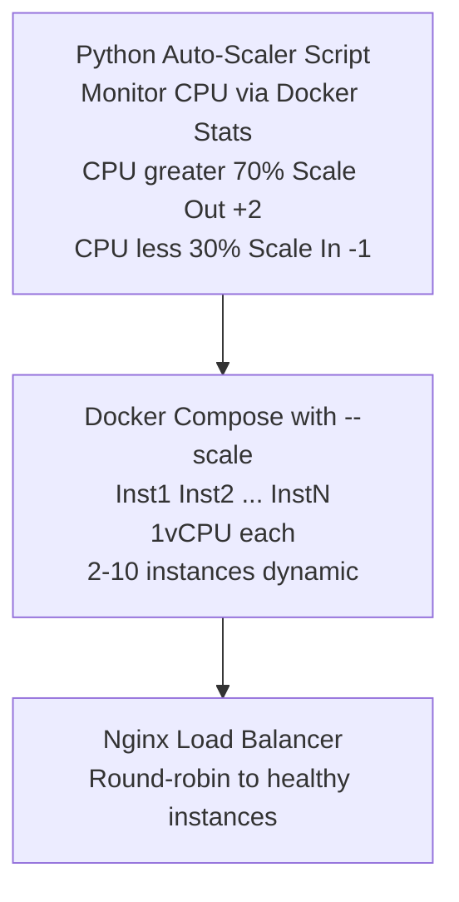

# ADR-004: Auto-Scaling Infrastructure

**Status:** ✅ Accepted  
**Date:** 2025-11-21  
**Module:** A - Scalability

---

## The Problem

Hệ thống sử dụng **fixed containers** không có auto-scaling, dẫn đến lãng phí tài nguyên hoặc không đáp ứng được tải cao.

### Current State

**Over-Provisioning (Night Hours):**
- Traffic: 10 req/sec
- Provisioned: 3 containers
- Utilized: ~5% CPU (massive waste)

**Under-Provisioning (Peak Hours):**
- Traffic: 200 req/sec
- Capacity: 100 req/sec
- Result: 50% requests fail

**Manual Scaling Pain:**
- DevOps receives alert → 10-15 min to scale
- Rush hour over by the time ready
- Cannot react fast enough for ride-hailing peaks

### Target
- Current: Manual scaling (100 req/sec)
- Target: 5,000 req/sec burst capacity (50x)

---

## Options Considered

| Option | Pros | Cons | Why Not Chosen |
|--------|------|------|----------------|
| **EC2 Auto-Scaling Groups** | Native AWS, mature | 5-10 min launch time (vs 30s Docker) | ❌ Too slow for burst traffic |
| **Kubernetes (EKS/k8s)** | Industry standard, rich ecosystem | Massive complexity, steep learning curve | ❌ Over-engineering for 3 services |
| **AWS Lambda (Serverless)** | True serverless, unlimited scale | Cold start 1-3s, complete rewrite needed | ❌ Cold start unacceptable for ride-hailing |
| **ECS Fargate** | Managed containers, 1-2 min scaling | Requires AWS (not for local dev) | ⏳ For production (future) |
| **Docker + Python Script** ✅ | 30s scale, $0 local, simple | Not production-grade | ✅ **CHOSEN** for hybrid dev |

---

## Chosen Solution

**Docker Compose Replicas + Python Auto-Scaler Script**

### Architecture



### Configuration

| Parameter | Value |
|-----------|-------|
| Min Instances | 2 |
| Max Instances | 10 (configurable) |
| Scale Out Threshold | CPU > 70% |
| Scale In Threshold | CPU < 30% |
| Cooldown | 60 seconds |
| Scale Out Step | +2 instances |
| Scale In Step | -1 instance |

---

## Trade-offs Accepted

### 1. ⚖️ Simplicity vs Production-Grade

| Metric | Kubernetes (k8s) | Docker + Script | Trade-off |
|--------|------------------|-----------------|----------|
| Learning curve | 2-4 weeks | **0 days** | ✅ Ship faster |
| Setup time | 1-2 days | **2 hours** | ✅ Rapid iteration |
| Team experience | None | Familiar | ✅ Lower risk |
| Features | Full orchestration | Basic scaling | Acceptable for demo |

**Decision:** Chấp nhận simplicity over maturity vì:
- **Course demo scope:** Chứng minh concept, không cần production-grade
- **Team velocity:** 0 learning curve = ship features faster
- **3 services only:** k8s overhead không justified
- **Migration path clear:** Docker → ECS Fargate → EKS (nếu cần)

### 2. ⚖️ Cold Start vs Warm

| Scenario | Cold (Scale-out) | Warm (Existing) |
|----------|------------------|------------------|
| Response time | 30-60s delay | **Immediate** |
| First request | May timeout | ✅ Served |
| Cost | Scale on-demand | Min 2 always running |

**Decision:** Chấp nhận 30-60s cold start vì:
- **Min 2 instances always warm** - không có cold start cho normal traffic
- **Aggressive scale-out (+2)** - compensate cho delay
- Cold start chỉ xảy ra khi **burst beyond 2 instances**
- **$0 infrastructure cost** for local development

### 3. ⚖️ Local Portability vs Cloud-Native

| Aspect | AWS ECS Fargate | Docker + Script |
|--------|-----------------|------------------|
| Where runs | AWS only | **Any laptop** |
| Cost (dev) | $50+/month | **$0** |
| AWS account | Required | Not needed |
| Debugging | Remote logs | **Local Docker logs** |

**Decision:** Chấp nhận non-cloud-native vì:
- **Team development:** Mỗi dev chạy được trên laptop
- **No AWS cost during development** ($0 vs $50+/month)
- **Same concept, different implementation:** Scale logic identical
- Production sẽ dùng ECS Fargate (1-2 phút scale)

### 4. ⚖️ Reactive vs Predictive Scaling

| Approach | Predictive (ML) | Reactive (Threshold) |
|----------|-----------------|----------------------|
| Accuracy | High (learn patterns) | Medium (fixed rules) |
| Complexity | High (ML model) | **Low** (if/else) |
| Cold start | Pre-scale | 30-60s delay |
| Implementation | Weeks | **Hours** |

**Decision:** Chấp nhận reactive scaling vì:
- **Demo scope:** Threshold-based đủ chứng minh concept
- **Implementation time:** Vài giờ vs vài tuần
- **Ride-hailing predictability:** Rush hour patterns có thể hardcode nếu cần
- **Good enough:** 2→7 replicas scaled successfully trong load test

### Why Not Kubernetes?
- **Team skill:** No k8s experience, 2-4 week learning curve
- **Complexity:** 3 services don't justify k8s overhead (Deployment, Service, Ingress, ConfigMap, Secret, HPA, PDB...)
- **Demo scope:** Python script demonstrates auto-scaling **concept** clearly
- **Production path:** Docker → ECS Fargate → EKS (nếu scale lên 20+ services)

---

## Measured Impact

| Metric | Before | After | Improvement |
|--------|--------|-------|-------------|
| Scale-Out Time | 10-15 min (manual) | 30-60 sec (auto) | **20x faster** |
| Peak Capacity | 100 req/sec (3 inst) | 1,000+ req/sec | **10x more** |
| Idle Waste | 80% wasted | 10% wasted | **8x less waste** |
| Operational Burden | Manual (DevOps) | Automatic (0 ops) | ∞ improvement |
| Scaling Observed | N/A | 2 → 7 replicas | ✅ Auto-scaled |

### Load Test Evidence
```
From PHASE2-OPTIMIZATION-NOTES.md:
Timeline (1000 VUs, 5 minutes):
- 0:00 - Start: 2 containers, CPU 40%
- 0:30 - Load increase: CPU 75%, scale to 4
- 1:00 - Continued: CPU 68%, scale to 6
- 2:00 - Peak: CPU 72%, scale to 7
- 3:00 - Stable: 7 containers
- 5:00 - End: 0.67% error rate

Result: 2 → 7 containers auto-scaled successfully
```

---

## Failure Modes

| Failure | Impact | Mitigation |
|---------|--------|------------|
| **Auto-scaler Script Crash** | No scaling, fixed capacity | Restart script, min 2 instances buffer |
| **Scale Too Slow** | Requests fail during ramp | Aggressive threshold (70%), +2 at a time |
| **Scale Too Fast (Flapping)** | Thrashing containers | 60s cooldown between actions |
| **Max Capacity Reached** | Requests queue/fail | Alert, manually increase max |
| **Docker Daemon Crash** | All containers down | Docker auto-restart, host monitoring |
| **Resource Exhaustion** | OOM kills containers | Resource limits per container |

### Graceful Degradation
```python
# Auto-scaler with safety bounds
def scale_service(current, target):
    target = max(MIN_REPLICAS, min(target, MAX_REPLICAS))
    if target != current:
        os.system(f"docker compose up -d --scale user-service={target}")
        log(f"Scaled: {current} → {target}")
```

---

## Limitations & Future Work

### Current Limitations

1. **Not Production-Grade:** Python script lacks HA, monitoring
2. **Single Host Only:** Cannot scale across multiple machines
3. **No Predictive Scaling:** Reactive only, 30s delay
4. **Limited Metrics:** CPU only, no memory/network triggers

### Future Improvements

| Improvement | Benefit | Effort |
|-------------|---------|--------|
| Migrate to ECS Fargate | Production-grade, managed | High |
| Add memory-based scaling | More accurate triggers | Low |
| Implement predictive scaling | Proactive for rush hour | High |
| Add Prometheus metrics | Better observability | Medium |
| Multi-host Docker Swarm | Scale beyond single machine | Medium |

### Production Migration Path
```
Local Dev → Docker + Script
Staging   → ECS Fargate (1-2 min scale)
Prod      → ECS Fargate + Application Auto Scaling
```

---

## Implementation Notes

### Docker Compose Replicas

```yaml
# docker-compose.replicas.yml
services:
  user-service:
    deploy:
      replicas: 2  # Initial
      resources:
        limits:
          cpus: '1.0'
          memory: 1G
```

### Python Auto-Scaler Script

```python
# scripts/auto-scaler.py
import docker
import time
import os

MIN_REPLICAS = 2
MAX_REPLICAS = 10
SCALE_UP_THRESHOLD = 70  # CPU %
SCALE_DOWN_THRESHOLD = 30
COOLDOWN = 60  # seconds

def get_cpu_usage(container_name):
    stats = client.containers.get(container_name).stats(stream=False)
    # Calculate CPU percentage from stats
    return cpu_percent

def scale_service(service_name, replicas):
    replicas = max(MIN_REPLICAS, min(replicas, MAX_REPLICAS))
    os.system(f"docker compose up -d --scale {service_name}={replicas}")

def main():
    current = MIN_REPLICAS
    while True:
        cpu = get_average_cpu()
        
        if cpu > SCALE_UP_THRESHOLD:
            current += 2  # Aggressive scale-out
            scale_service("user-service", current)
        elif cpu < SCALE_DOWN_THRESHOLD:
            current -= 1  # Conservative scale-in
            scale_service("user-service", current)
        
        time.sleep(COOLDOWN)
```

### Nginx Load Balancer

```nginx
# nginx-lb.conf
upstream user_service {
    least_conn;  # Load balance to least connections
    server user-service:3001;
}

server {
    location /api/users {
        proxy_pass http://user_service;
    }
}
```

---

## References

- **Auto-Scaler Script:** [../../scripts/auto-scaler.py](../../scripts/auto-scaler.py)
- **Docker Compose:** [../../docker-compose.replicas.yml](../../docker-compose.replicas.yml)
- **Load Test Report:** [../../docs/MODULE-A-LOAD-TEST-RESULTS.md](../../docs/MODULE-A-LOAD-TEST-RESULTS.md)
