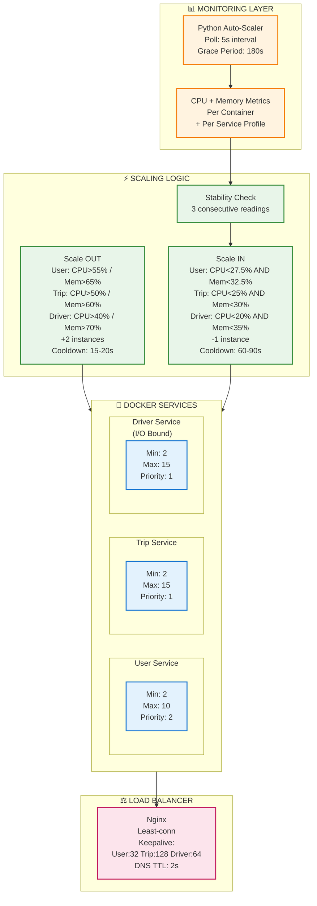

# ADR-004: Auto-Scaling Infrastructure

**Status:** ✅ Accepted  
**Date:** 2025-11-21  
**Module:** A - Scalability

---

## The Problem

Hệ thống sử dụng **fixed containers** không có auto-scaling, dẫn đến lãng phí tài nguyên hoặc không đáp ứng được tải cao.

```
┌─────────────────────────────────────────────────────────────┐
│  Fixed Container Deployment (No Auto-Scaling)               │
├─────────────────────────────────────────────────────────────┤
│                                                             │
│  NIGHT HOURS:     ████░░░░░░  Traffic: Low                 │
│  Containers:      ████████    Fixed: High                   │
│  Result:          WASTE - paying for unused capacity        │
│                                                             │
│  PEAK HOURS:      ██████████████  Traffic: Very High       │
│  Containers:      ████████        Fixed: Same               │
│  Result:          OVERLOAD - requests fail                  │
│                                                             │
└─────────────────────────────────────────────────────────────┘
```

**Symptoms:**
- **Over-Provisioning (Night):** Traffic thấp nhưng vẫn provisioned nhiều containers → lãng phí
- **Under-Provisioning (Peak):** Traffic cao vượt quá capacity → requests fail
- **Manual Scaling Pain:** DevOps phải can thiệp thủ công, mất thời gian, không react kịp

**Scale Gap:**
- **Capacity:** Từ fixed capacity lên elastic capacity
- **Efficiency:** Giảm lãng phí resources khi idle
- **Responsiveness:** Tự động scale theo traffic patterns

**Root Cause:** Fixed container count → không adapt theo workload changes.

---

## Options Considered

### Option 1: EC2 Auto-Scaling Groups

**Mô tả:** Sử dụng AWS EC2 Auto-Scaling Groups để scale VM instances.

| Pros | Cons |
|------|------|
| ✅ Native AWS, mature | ❌ **Launch time chậm** (phút để boot VM) |
| ✅ Rich scaling policies | ❌ Không phù hợp cho burst traffic |
| ✅ CloudWatch integration | ❌ Chỉ chạy trên AWS |

**Verdict:** ❌ Too slow cho ride-hailing burst traffic. VM boot time quá lâu so với container startup.

---

### Option 2: Kubernetes (EKS/k8s) ⭐ Ideal nhưng overkill

**Mô tả:** Deploy lên Kubernetes với Horizontal Pod Autoscaler (HPA).

| Pros | Cons |
|------|------|
| ✅ **Industry standard** cho container orchestration | ❌ **Massive complexity** |
| ✅ Rich ecosystem (Helm, Operators) | ❌ **Steep learning curve** (tuần để học) |
| ✅ Full orchestration features | ❌ Overkill cho 3 services |
| ✅ HPA với custom metrics | ❌ Setup time đáng kể |

**Tại sao vẫn muốn Kubernetes?**
- Production-grade orchestration
- Industry standard, valuable skill
- Rich ecosystem

**Tại sao không chọn?**
- **Team skill gap:** Không có k8s experience, cần thời gian đáng kể để học
- **Complexity:** 3 services không justify k8s overhead (Deployment, Service, Ingress, ConfigMap, Secret, HPA, PDB...)
- **Demo scope:** Quá phức tạp cho course project

**Khi nào sẽ migrate sang k8s?**
- Khi có hơn 10+ services
- Khi team có k8s experience
- Khi cần advanced orchestration features

---

### Option 3: AWS Lambda (Serverless)

**Mô tả:** Rewrite services thành Lambda functions - true serverless.

| Pros | Cons |
|------|------|
| ✅ True serverless, scale vô hạn | ❌ **Cold start** ảnh hưởng latency |
| ✅ Pay-per-invocation | ❌ **Complete rewrite** needed |
| ✅ Zero ops | ❌ Không phù hợp cho long-running processes |

**Verdict:** ❌ Cold start không acceptable cho ride-hailing. Driver search cần latency thấp, cold start sẽ làm UX xấu.

---

### Option 4: ECS Fargate ⭐ Ideal cho production

**Mô tả:** AWS ECS Fargate - managed container service với Application Auto Scaling.

| Pros | Cons |
|------|------|
| ✅ Managed containers | ❌ **Requires AWS** (không chạy local) |
| ✅ Scale nhanh (phút) | ❌ Chi phí cho development |
| ✅ CloudWatch integration | ❌ Không test được offline |
| ✅ Production-grade | |

**Verdict:** ⏳ Sẽ dùng cho production, nhưng cần giải pháp local development.

---

### Option 5: Docker Compose + Python Auto-Scaler ✅ CHOSEN

**Mô tả:** Docker Compose replicas + custom Python script monitoring CPU và auto-scale.

| Pros | Cons |
|------|------|
| ✅ **Scale nhanh** (giây để start container) | ❌ Not production-grade |
| ✅ **$0 cost** cho local development | ❌ Single host only |
| ✅ **Simple implementation** | ❌ Basic monitoring (CPU only) |
| ✅ **Chạy được trên laptop** | |
| ✅ **Same concept** như production auto-scaling | |

---

## Why Docker + Python Script? Decision Matrix

| Criteria | Weight | EC2 ASG | Kubernetes | Lambda | ECS Fargate | Docker+Script |
|----------|--------|---------|------------|--------|-------------|---------------|
| **Scale Speed** | 25% | 2 | 4 | 5 | 4 | 4 |
| **Local Dev Support** | 25% | 1 | 2 | 1 | 1 | 5 |
| **Team Familiarity** | 20% | 3 | 1 | 2 | 3 | 5 |
| **Implementation Effort** | 15% | 3 | 1 | 2 | 3 | 5 |
| **Production Ready** | 15% | 5 | 5 | 4 | 5 | 2 |
| **TOTAL** | 100% | **2.4** | **2.4** | **2.6** | **2.9** | **4.3** |

**Kết luận:** Docker + Python Script wins với score 4.3/5 cho development environment. ECS Fargate là production path.

---

## Chosen Solution

**Docker Compose Replicas + Python Auto-Scaler Script**



**Auto-Scaler Flow:**
```
1. Python script polls Docker stats every 5s (CPU + Memory per container)
2. Apply grace period (180s) - no scale-in during startup
3. Calculate metrics per service with service-specific profiles:
   
   Scale OUT (OR condition - any threshold exceeded):
   ├── User Service: CPU>55% OR Memory>65% → Scale OUT +2
   ├── Trip Service: CPU>50% OR Memory>60% → Scale OUT +2 (Priority 1)
   └── Driver Service: CPU>40% OR Memory>70% → Scale OUT +2 (I/O bound)
   
   Scale IN (AND condition - both thresholds below 50% of target):
   ├── User Service: CPU<27.5% (50% of 55%) AND Memory<32.5% (50% of 65%) → Scale IN -1
   ├── Trip Service: CPU<25% (50% of 50%) AND Memory<30% (50% of 60%) → Scale IN -1
   └── Driver Service: CPU<20% (50% of 40%) AND Memory<35% (50% of 70%) → Scale IN -1

4. Stability check: Require 3 consecutive low readings before scale-in
5. Execute scaling:
   ├── Scale OUT: +2 instances, cooldown 15-20s
   └── Scale IN: -1 instance, cooldown 60-90s (after 3 consecutive low readings)
6. Update Nginx upstream via dynamic DNS (TTL 2s)
7. Repeat
```

**Key Components:**
| Component | Purpose | Config |
|-----------|---------|--------|
| Python Script | Monitor & trigger scaling | Poll: 5s, Grace: 180s |
| Service Profiles | Per-service thresholds | CPU + Memory targets |
| Stability Check | Prevent flapping | 3 consecutive readings |
| Docker Compose | Container orchestration | --scale flag |
| Nginx LB | Distribute traffic | Least-conn + keepalive |
| Cooldown | Rate limiting | Scale-out: 15-20s, Scale-in: 60-90s |

**Scaling Configuration:**
| Service | Min | Max | **Scale-OUT Threshold** | **Scale-IN Threshold** | Priority | Cooldown |
|---------|-----|-----|-------------------------|------------------------|----------|----------|
| User | 2 | 10 | CPU>55% OR Mem>65% | CPU<27.5% AND Mem<32.5% | 2 | OUT:15s IN:60s |
| Trip | 2 | 15 | CPU>50% OR Mem>60% | CPU<25% AND Mem<30% | 1 (Highest) | OUT:15s IN:90s |
| Driver | 2 | 15 | CPU>40% OR Mem>70% | CPU<20% AND Mem<35% | 1 (I/O) | OUT:20s IN:90s |

**Scale-IN Logic Detail:**
```python
# Scale-IN requires BOTH conditions + 3 consecutive readings

def should_scale_in(cpu, mem, config):
    # 1. Must be past grace period (180s)
    if (now - start_time) < 180:
        return False
    
    # 2. Both CPU AND Memory must be below 50% of target
    below_threshold = (
        cpu < config["target_cpu"] * 0.5 AND 
        mem < config["target_memory"] * 0.5
    )
    
    if not below_threshold:
        stability_counter[service] = 0  # Reset
        return False
    
    # 3. Must be low for 3 consecutive readings (15 seconds)
    stability_counter[service] += 1
    return stability_counter[service] >= 3
```

**Why Conservative Scale-IN?**
- Aggressive scale-out (+2): React fast to traffic spike
- Conservative scale-in (-1): Avoid thrashing (scale out → scale in → scale out)
- 50% threshold: Large safety margin before removing capacity
- 3 consecutive readings: Ensure sustained low load, not temporary dip

**Nginx Load Balancer Config:**
| Upstream | Algorithm | Keepalive | DNS TTL | Health Check |
|----------|-----------|-----------|---------|--------------|
| user_backend | least_conn | 32 connections | 2s | max_fails:3, timeout:10s |
| trip_backend | least_conn | 128 connections | 2s | max_fails:3, timeout:10s |
| driver_backend | least_conn | 64 connections | 2s | max_fails:3, timeout:10s |

---

## Trade-offs của Solution Đã Chọn

> **Nguyên tắc:** Mọi architectural decision đều có trade-offs. Section này phân tích những gì chúng ta **được** và **mất** khi chọn Docker + Python Script.

### Trade-off 1: 🎯 Simplicity vs 🏭 Production-Grade

```
┌─────────────────────────────────────────────────────────────┐
│  KUBERNETES (Complex)     │  DOCKER + SCRIPT (Simple)      │
├───────────────────────────┼─────────────────────────────────┤
│  Full orchestration       │  Basic scaling only            │
│  Steep learning curve     │  No learning curve             │
│  Setup time: days         │  Setup time: hours             │
│  Production-ready         │  Demo/dev ready                │
└───────────────────────────┴─────────────────────────────────┘
```

| Metric | Kubernetes | Docker + Script | Verdict |
|--------|------------|-----------------|---------|
| Learning curve | Tuần để học | **Không cần học thêm** | ✅ Script wins |
| Setup time | Ngày | **Vài giờ** | ✅ Script wins |
| Team experience | Không có | Familiar | ✅ Script wins |
| Features | Full orchestration | Basic scaling | k8s richer |

**What we gain:** Ship faster, no learning curve, rapid iteration
**What we lose:** Production-grade features (HA, self-healing, rolling updates)
**Why acceptable:**
- **Course demo scope:** Chứng minh concept, không cần production-grade
- **Team velocity:** 0 learning curve = ship features faster
- **3 services only:** k8s overhead không justified
- **Clear migration path:** Docker → ECS Fargate → EKS (nếu cần)

---

### Trade-off 2: ❄️ Cold Start vs 🔥 Always-Warm

```
┌─────────────────────────────────────────────────────────────┐
│  COLD (Scale-out needed)  │  WARM (Existing instances)     │
├───────────────────────────┼─────────────────────────────────┤
│  Container startup delay  │  Immediate response            │
│  First requests may queue │  Served instantly              │
│  Cost: pay-per-use        │  Cost: always running          │
└───────────────────────────┴─────────────────────────────────┘
```

| Scenario | Cold (Scale-out) | Warm (Existing) |
|----------|------------------|------------------|
| Response time | Có delay (container startup) | **Immediate** |
| First request | May queue | ✅ Served |
| Cost | Scale on-demand | Min 2 always running |

**What we gain:** Elastic capacity, scale on-demand
**What we lose:** Startup delay khi scale out
**Why acceptable:**
- **Min 2 instances always warm** - không có cold start cho normal traffic
- **Aggressive scale-out (+2)** - compensate cho delay
- Cold start chỉ xảy ra khi **burst beyond current capacity**
- Container startup nhanh hơn nhiều so với VM

---

### Trade-off 3: 💻 Local Portability vs ☁️ Cloud-Native

| Aspect | AWS ECS Fargate | Docker + Script |
|--------|-----------------|------------------|
| Where runs | AWS only | **Any laptop** |
| Cost (dev) | Chi phí hàng tháng | **$0** |
| AWS account | Required | Not needed |
| Debugging | Remote logs | **Local Docker logs** |
| Offline dev | Không | **Có** |
| Metrics | CloudWatch | **CPU + Memory** |
| Service profiles | Per-target tracking | **Per-service thresholds** |
| Stability | Built-in | **3x consecutive readings** |

**What we gain:** Mọi developer chạy được trên laptop, $0 cost
**What we lose:** Production-grade managed service features
**Why acceptable:**
- **Team development:** Mỗi dev có thể develop và test locally
- **No AWS cost during development**
- **Same concept, different implementation:** Scale logic identical
- Production sẽ dùng ECS Fargate

---

### Trade-off 4: 🔮 Predictive vs 📈 Reactive Scaling

```
┌─────────────────────────────────────────────────────────────┐
│  PREDICTIVE (ML-based)    │  REACTIVE (Threshold-based)    │
├───────────────────────────┼─────────────────────────────────┤
│  Pre-scale before peak    │  Scale after threshold hit     │
│  Complex ML model         │  Simple if/else logic          │
│  Implementation: weeks    │  Implementation: hours         │
│  Accurate (learns)        │  Good enough (fixed rules)     │
└───────────────────────────┴─────────────────────────────────┘
```

| Approach | Predictive (ML) | Reactive (Threshold) |
|----------|-----------------|----------------------|
| Accuracy | High (learn patterns) | Medium (fixed rules) |
| Complexity | High (ML model) | **Low** (if/else) |
| Cold start | Pre-scale | Có delay nhỏ |
| Implementation | Tuần | **Vài giờ** |

**What we gain:** Simple implementation, quick to build
**What we lose:** Pre-emptive scaling, pattern learning
**Why acceptable:**
- **Demo scope:** Threshold-based đủ chứng minh concept
- **Implementation time:** Vài giờ vs vài tuần
- **Ride-hailing predictability:** Rush hour patterns có thể hardcode nếu cần
- Load test đã chứng minh system scale thành công

---

## Khi nào nên migrate sang solution khác?

| Trigger | Current (Docker+Script) | Migrate To | Reason |
|---------|-------------------------|------------|--------|
| Production deployment | ✅ Dev only | ECS Fargate | Managed, HA |
| Need multi-host | Single host | Docker Swarm / ECS | Horizontal scaling |
| 10+ services | 3 services | Kubernetes (EKS) | Orchestration needs |
| Predictive scaling | Reactive | AWS Predictive Scaling | ML-based |

---

## Expected Benefits

**Performance Improvements:**
- **Scale-out time:** Từ manual (phút) xuống automatic (giây)
- **Peak capacity:** Tăng đáng kể nhờ dynamic scaling
- **Resource efficiency:** Giảm lãng phí tài nguyên trong idle periods

**Operational Benefits:**
- **Zero manual intervention:** Auto-scaler tự động điều chỉnh replicas
- **Elastic capacity:** Hệ thống tự adapt theo traffic patterns
- **Cost optimization:** Scale-in khi traffic thấp, scale-out khi cần

---

## Failure Modes

| Failure | Impact | Mitigation | Recovery |
|---------|--------|------------|----------|
| **Script Crash** | No scaling, fixed capacity | Restart script, min 2 buffer | Restart script |
| **Scale Too Slow** | Requests fail during ramp | Aggressive threshold, +2 step | Auto-recovers |
| **Scale Flapping** | Thrashing containers | Cooldown period | Adjust thresholds |
| **Max Capacity** | Requests queue/fail | Alert, increase max | Manual intervention |
| **Docker Crash** | All containers down | Docker auto-restart | Host monitoring |
| **Resource Exhaustion** | OOM kills containers | Resource limits per container | Increase limits |

### Graceful Degradation
```python
# Auto-scaler with safety bounds
def scale_service(current, target):
    target = max(MIN_REPLICAS, min(target, MAX_REPLICAS))
    if target != current:
        os.system(f"docker compose up -d --scale user-service={target}")
        log(f"Scaled: {current} → {target}")
```

---

## Limitations & Future Work

### Current Limitations:
1. **Not Production-Grade:** Python script lacks HA, monitoring dashboard
2. **Single Host Only:** Cannot scale across multiple machines
3. **No Predictive Scaling:** Reactive only, có delay nhỏ khi scale-out
4. **Basic Orchestration:** Không có self-healing, rolling updates như k8s

### Actual Implementation Exceeds ADR Scope:
✅ **Memory metrics added** - Not just CPU, also Memory thresholds
✅ **Service-specific profiles** - Different thresholds per service (User: 55%, Trip: 50%, Driver: 40%)
✅ **Stability checks** - Requires 3 consecutive readings before scale-in
✅ **Grace period** - 180s no scale-in during startup
✅ **Sophisticated cooldowns** - Scale-out fast (15-20s), scale-in cautious (60-90s)
✅ **Priority system** - Trip Service priority 1, scales first during contention
✅ **Nginx optimizations** - Keepalive connections (32-128 per upstream), DNS TTL 2s

### Future Improvements:
| Priority | Task | Effort | Value |
|----------|------|--------|-------|
| 🔴 High | Migrate to ECS Fargate | High | Production-grade, managed |
| 🟡 Medium | Add memory-based scaling | Low | More accurate triggers |
| 🟡 Medium | Add Prometheus metrics | Medium | Better observability |
| 🟢 Low | Implement predictive scaling | High | Proactive for rush hour |
| 🟢 Low | Multi-host Docker Swarm | Medium | Scale beyond single machine |

### Production Migration Path
```
┌─────────────────┐    ┌─────────────────┐    ┌─────────────────┐
│   Local Dev     │ →  │    Staging      │ →  │   Production    │
│ Docker + Script │    │  ECS Fargate    │    │ ECS + App Auto  │
│     ($0)        │    │  (managed)      │    │   Scaling       │
└─────────────────┘    └─────────────────┘    └─────────────────┘
```

---

## Implementation Notes

### Docker Compose Replicas

```yaml
# docker-compose.replicas.yml
services:
  user-service:
    deploy:
      replicas: 2  # Initial minimum
      resources:
        limits:
          cpus: '1.0'
          memory: 1G
```

### Python Auto-Scaler Script

```python
# scripts/auto-scaler.py - ACTUAL IMPLEMENTATION
import docker
import time
import os
from datetime import datetime

# Service-specific profiles
CONFIG = {
    "user-service": {
        "min_replicas": 2,
        "max_replicas": 10,
        "target_cpu": 55.0,      # More aggressive than generic 70%
        "target_memory": 65.0,   # Memory metric added
        "priority": 2,
        "scale_out_cooldown": 15,
        "scale_in_cooldown": 60,
    },
    "trip-service": {
        "min_replicas": 2,
        "max_replicas": 15,
        "target_cpu": 50.0,      # Highest priority
        "target_memory": 60.0,
        "priority": 1,           # Scale first
        "scale_out_cooldown": 15,
        "scale_in_cooldown": 90,
    },
    "driver-service": {
        "min_replicas": 2,
        "max_replicas": 15,
        "target_cpu": 40.0,      # I/O bound, lower threshold
        "target_memory": 70.0,
        "priority": 1,
        "scale_out_cooldown": 20,
        "scale_in_cooldown": 90,
    },
}

POLL_INTERVAL = 5  # seconds
GRACE_PERIOD = 180  # No scale-in for 180s after startup
STABILITY_COUNT = 3  # Require 3 consecutive low readings before scale-in

class AutoScaler:
    def __init__(self):
        self.client = docker.from_env()
        self.start_time = datetime.now()
        self.stability_counters = {}  # Track consecutive low readings
    
    def get_metrics(self, service_name):
        """Get CPU and Memory metrics for all containers of a service"""
        containers = self.get_service_containers(service_name)
        if not containers:
            return None, None
        
        cpu_total = 0
        mem_total = 0
        for container in containers:
            stats = container.stats(stream=False)
            cpu_percent = self.calculate_cpu_percent(stats)
            mem_percent = self.calculate_mem_percent(stats)
            cpu_total += cpu_percent
            mem_total += mem_percent
        
        return cpu_total / len(containers), mem_total / len(containers)
    
    def should_scale_out(self, cpu, mem, config):
        """Check if should scale out - OR condition (CPU OR Memory)"""
        return cpu > config["target_cpu"] or mem > config["target_memory"]
    
    def should_scale_in(self, cpu, mem, config):
        """Check if should scale in - AND condition (both below threshold)"""
        # Must be in grace period first
        if (datetime.now() - self.start_time).seconds < GRACE_PERIOD:
            return False
        
        below_threshold = (cpu < config["target_cpu"] * 0.5 and 
                          mem < config["target_memory"] * 0.5)
        
        if not below_threshold:
            self.stability_counters[service_name] = 0
            return False
        
        # Require STABILITY_COUNT consecutive low readings
        self.stability_counters[service_name] = \
            self.stability_counters.get(service_name, 0) + 1
        
        return self.stability_counters[service_name] >= STABILITY_COUNT
    
    def scale_service(self, service_name, target_replicas, config):
        """Scale service with bounds checking"""
        target = max(config["min_replicas"], 
                    min(target_replicas, config["max_replicas"]))
        
        os.system(f"docker compose up -d --scale {service_name}={target}")
        log(f"[{service_name}] Scaled to {target} replicas")
    
    def run(self):
        """Main auto-scaling loop"""
        while True:
            for service_name, config in sorted(CONFIG.items(), 
                                              key=lambda x: x[1]["priority"]):
                cpu, mem = self.get_metrics(service_name)
                if cpu is None:
                    continue
                
                current = len(self.get_service_containers(service_name))
                
                if self.should_scale_out(cpu, mem, config):
                    target = current + 2  # Aggressive scale-out
                    self.scale_service(service_name, target, config)
                    time.sleep(config["scale_out_cooldown"])
                
                elif self.should_scale_in(cpu, mem, config):
                    target = current - 1  # Conservative scale-in
                    self.scale_service(service_name, target, config)
                    time.sleep(config["scale_in_cooldown"])
            
            time.sleep(POLL_INTERVAL)

if __name__ == "__main__":
    AutoScaler().run()
```

### Nginx Load Balancer

```nginx
# nginx-lb.conf - ACTUAL IMPLEMENTATION
resolver 127.0.0.11 valid=2s;  # Docker DNS, 2s TTL for dynamic discovery

upstream user_backend {
    least_conn;  # Route to least connections (not round-robin)
    keepalive 32;  # Connection pool
    server user-service:3001 max_fails=3 fail_timeout=10s;
}

upstream trip_backend {
    least_conn;
    keepalive 128;  # Highest traffic service
    server trip-service:3002 max_fails=3 fail_timeout=10s;
}

upstream driver_backend {
    least_conn;
    keepalive 64;  # I/O bound service
    server driver-service:3003 max_fails=3 fail_timeout=10s;
}

server {
    listen 80;
    
    # Connection pooling optimization
    keepalive_requests 10000;
    keepalive_timeout 300s;
    
    location /api/users {
        proxy_pass http://user_backend;
        proxy_http_version 1.1;
        proxy_set_header Connection "";  # Enable keepalive
    }
    
    location /api/trips {
        proxy_pass http://trip_backend;
        proxy_http_version 1.1;
        proxy_set_header Connection "";
    }
    
    location /api/drivers {
        proxy_pass http://driver_backend;
        proxy_http_version 1.1;
        proxy_set_header Connection "";
    }
}
```


