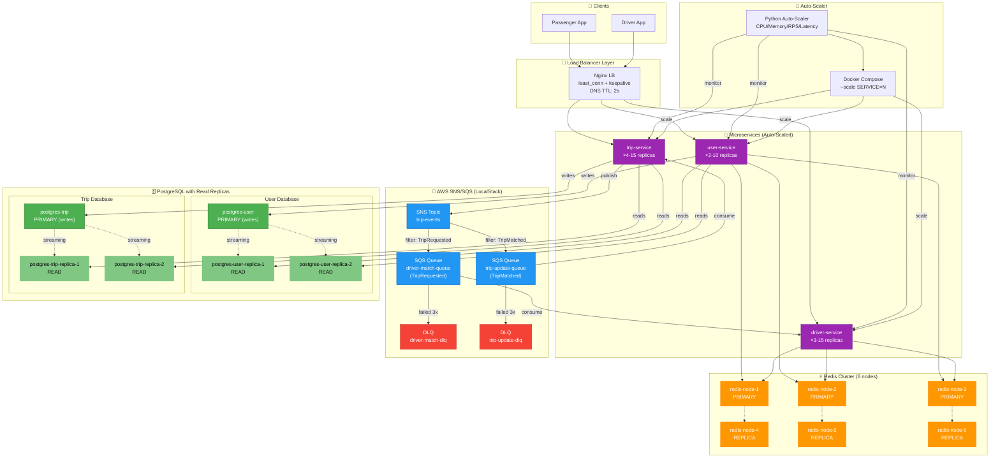
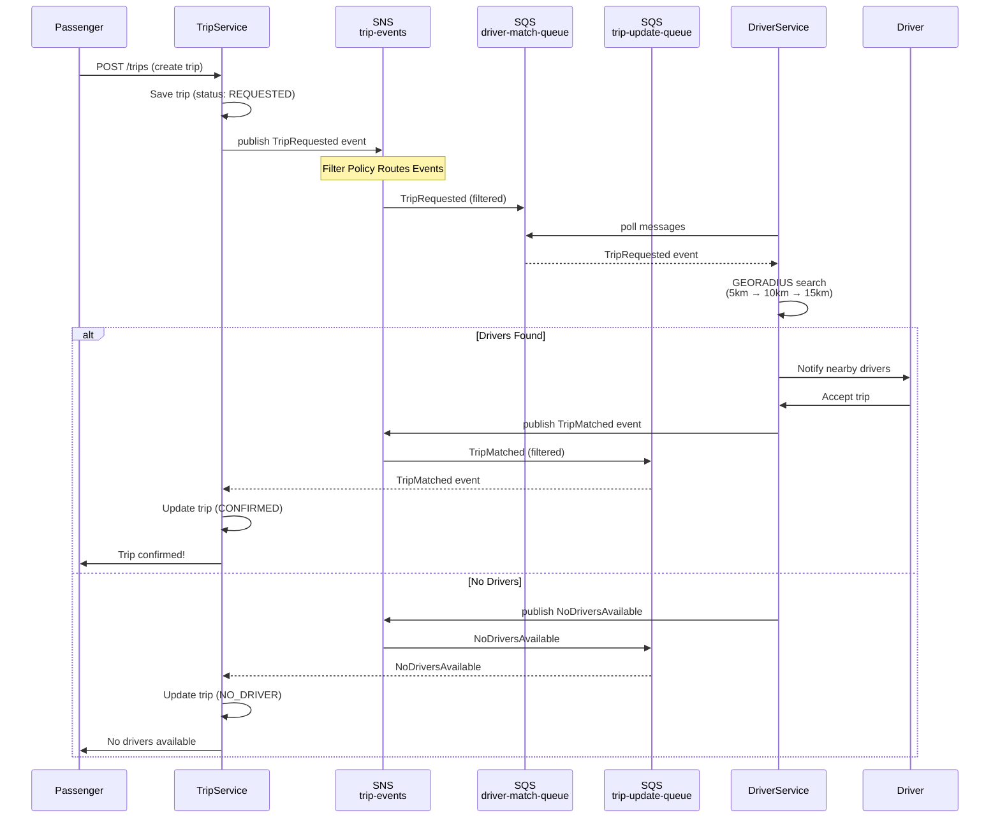
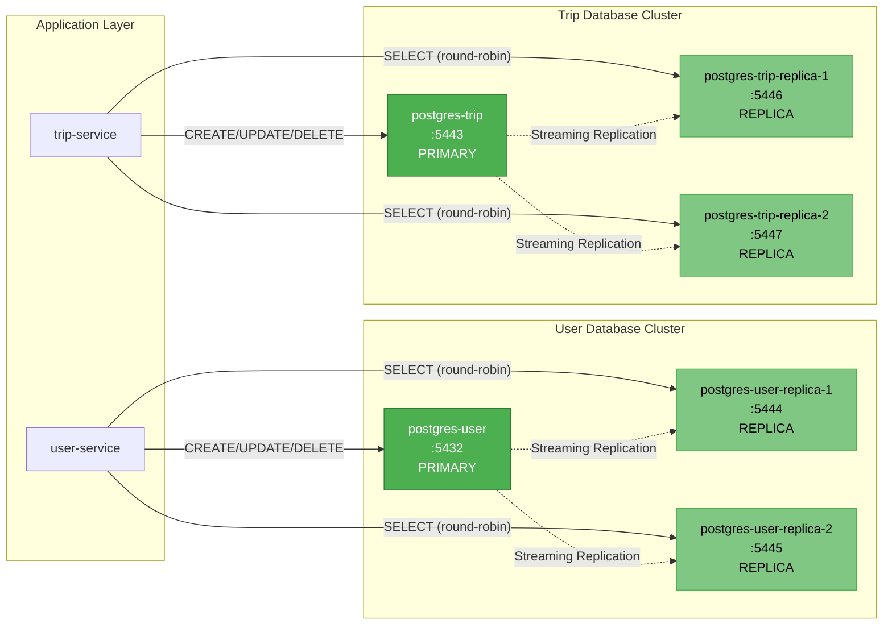
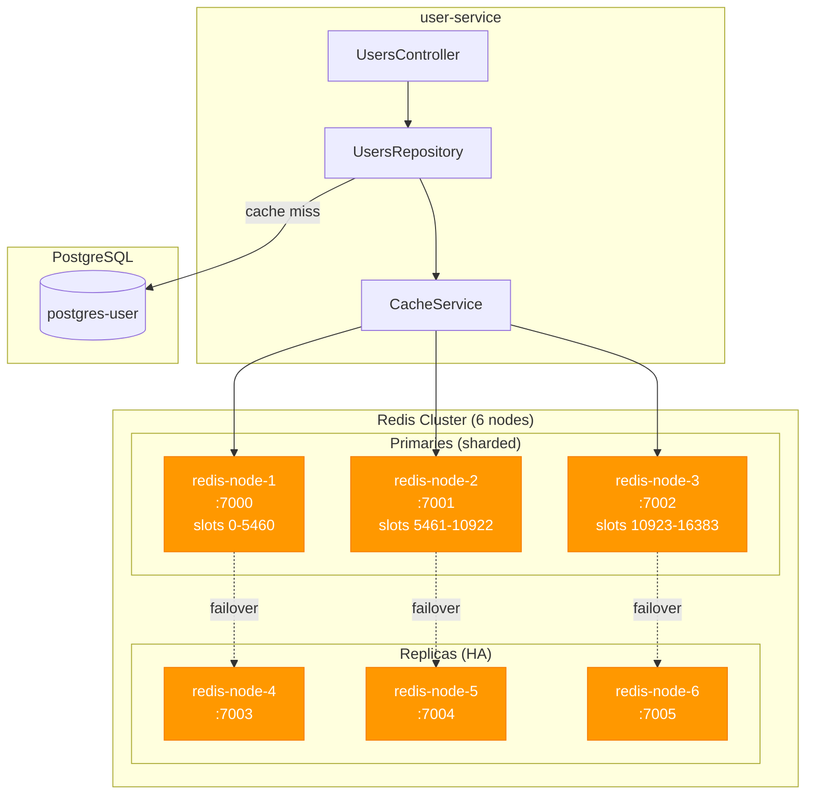
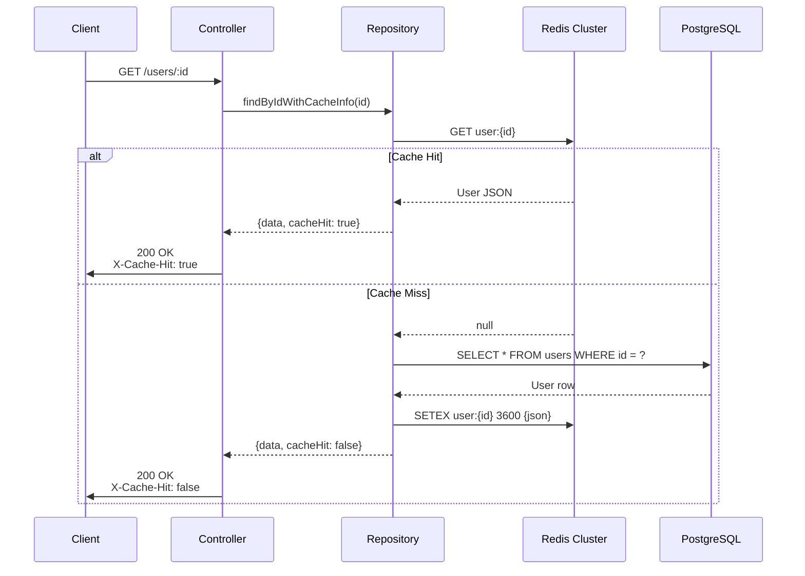
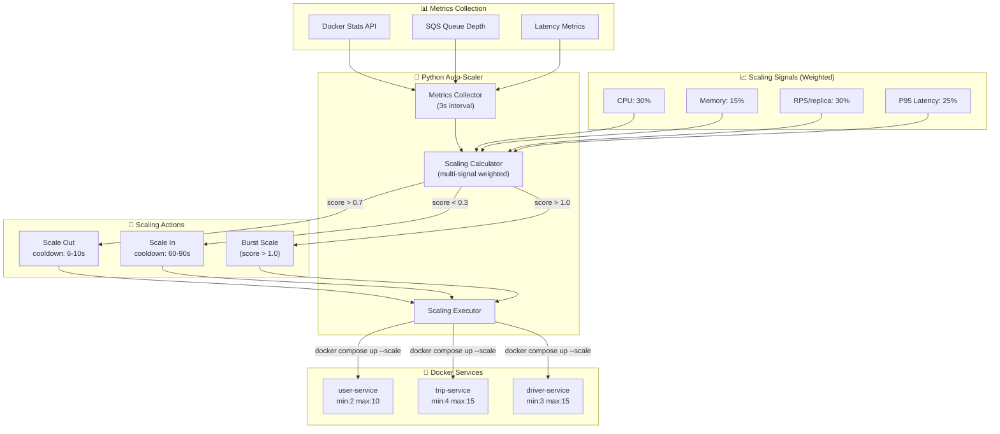
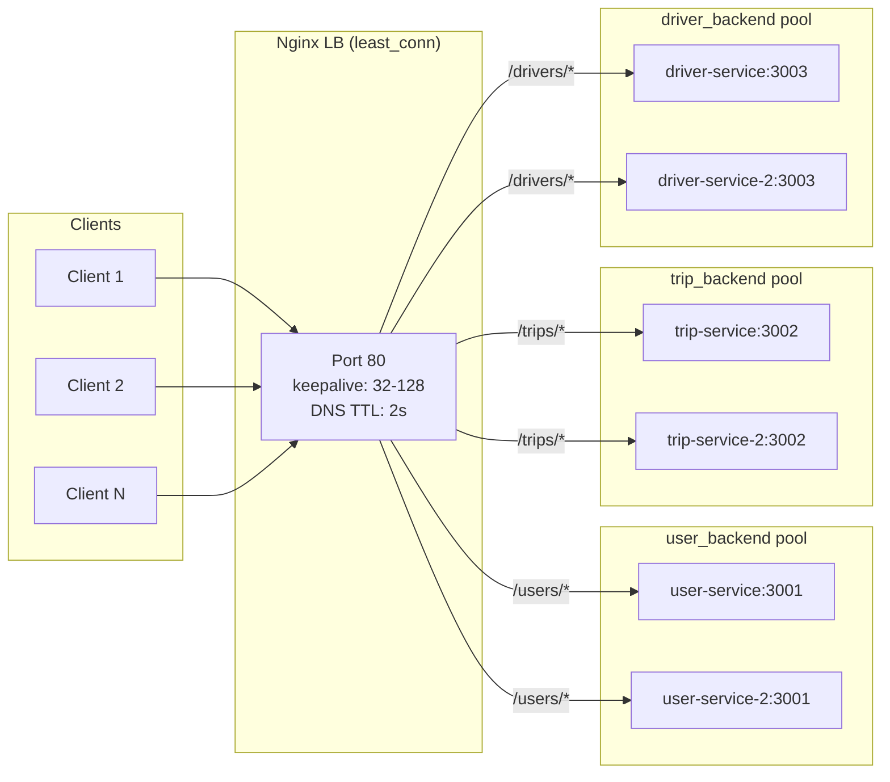

# UIT-GO Current Implementation Architecture

> **Generated:** December 12, 2025  
> **Scope:** All 4 scalability patterns - SNS/SQS, Read Replicas, Distributed Caching, Auto-Scaling

---

## 1. High-Level System Architecture



---

## 2. Story 2.1: Async Communication Flow (SNS/SQS)



### SNS/SQS Resources Created

| Resource | Type | Purpose | DLQ |
|----------|------|---------|-----|
| `trip-events` | SNS Topic | Central event bus | - |
| `driver-match-queue` | SQS Queue | Receives `TripRequested` | `driver-match-dlq` |
| `trip-update-queue` | SQS Queue | Receives `TripMatched`, `NoDriversAvailable` | `trip-update-dlq` |

---

## 3. Story 2.2: Database Read Scaling (Replicas)



### Read/Write Routing Logic

```typescript
// PrismaReplicaService - Round-robin read routing
getReadClient(): PrismaClient {
  if (this.replicas.length === 0) {
    return this.primaryClient; // Fallback to primary
  }
  const client = this.replicas[this.currentIndex];
  this.currentIndex = (this.currentIndex + 1) % this.replicas.length;
  return client;
}
```

---

## 4. Story 2.3: Distributed Caching (Redis Cluster)



### Cache TTL Configuration

| Data Type | Cache Key Pattern | TTL | Source |
|-----------|-------------------|-----|--------|
| User Profile | `user:{userId}` | 3600s (1 hour) | `CACHE_TTL_USER` env var |
| Driver Profile | `driver:user:{userId}` | 1800s (30 min) | `CACHE_TTL_DRIVER_PROFILE` env var |
| Driver Status | `driver:status:{driverId}` | 3600s (1 hour) | Hardcoded in `DriversService` |
| Driver Location | `driver:location:{driverId}` | 300s (5 min) | Hardcoded `LOCATION_TTL` |
| Driver Geo Index | `driver:geo` | No TTL | Geospatial index |

### Cache-Aside Pattern Flow



---

## 5. Story 2.4: Auto-Scaling (Docker Compose)



### Scaling Thresholds

| Service | Min | Max | Target CPU | Target RPS/replica | P95 Target |
|---------|-----|-----|------------|-------------------|------------|
| user-service | 2 | 10 | 55% | 100 | 200ms |
| trip-service | 4 | 15 | 45% | 60 | 300ms |
| driver-service | 3 | 15 | 35% | 100 | 150ms |

### Burst Scaling Rules

| Scaling Score | Replica Delta | Trigger |
|---------------|---------------|---------|
| > 1.0 | +2 | High load |
| > 1.5 | +3 | Very high load |
| > 2.0 | +4 | Critical load |
| > 3.0 | +5 | Emergency |

---

## 6. Nginx Load Balancer Configuration



### Upstream Keepalive Configuration

| Upstream | Algorithm | Keepalive Connections | Purpose |
|----------|-----------|----------------------|---------|
| user_backend | least_conn | 32 | Auth/Profile - moderate traffic |
| trip_backend | least_conn | 128 | Trip creation - highest traffic |
| driver_backend | least_conn | 64 | Location updates - medium traffic |

---

## 7. Complete Infrastructure Summary

### Docker Compose Files

| File | Purpose | Components |
|------|---------|------------|
| `docker-compose.yml` | Base services | user/trip/driver services, postgres, redis, nginx |
| `docker-compose.localstack.yml` | AWS emulation | LocalStack (SNS, SQS) |
| `docker-compose.replicas.yml` | Read scaling | 4 postgres read replicas |
| `docker-compose.redis-cluster.yml` | Distributed cache | 6-node Redis cluster |
| `docker-compose.loadbalancer.yml` | LB config | Nginx load balancer |

### Port Mapping

| Service | Internal Port | External Port |
|---------|---------------|---------------|
| nginx-lb | 80 | 3000 |
| user-service | 3001 | 3001 |
| trip-service | 3002 | 3002 |
| driver-service | 3003 | 3003 |
| postgres-user | 5432 | 5432 |
| postgres-trip | 5432 | 5443 |
| postgres-user-replica-1 | 5432 | 5444 |
| postgres-user-replica-2 | 5432 | 5445 |
| postgres-trip-replica-1 | 5432 | 5446 |
| postgres-trip-replica-2 | 5432 | 5447 |
| redis-node-1 | 6379 | 7000 |
| redis-node-2 | 6379 | 7001 |
| redis-node-3 | 6379 | 7002 |
| redis-node-4 | 6379 | 7003 |
| redis-node-5 | 6379 | 7004 |
| redis-node-6 | 6379 | 7005 |
| LocalStack | 4566 | 4566 |

---

## 8. Startup Command

```bash
# Full stack with all scalability patterns
docker compose \
  -f docker-compose.yml \
  -f docker-compose.localstack.yml \
  -f docker-compose.replicas.yml \
  -f docker-compose.redis-cluster.yml \
  -f docker-compose.loadbalancer.yml \
  up -d

# Start auto-scaler (separate terminal)
python scripts/auto-scaler.py
```
