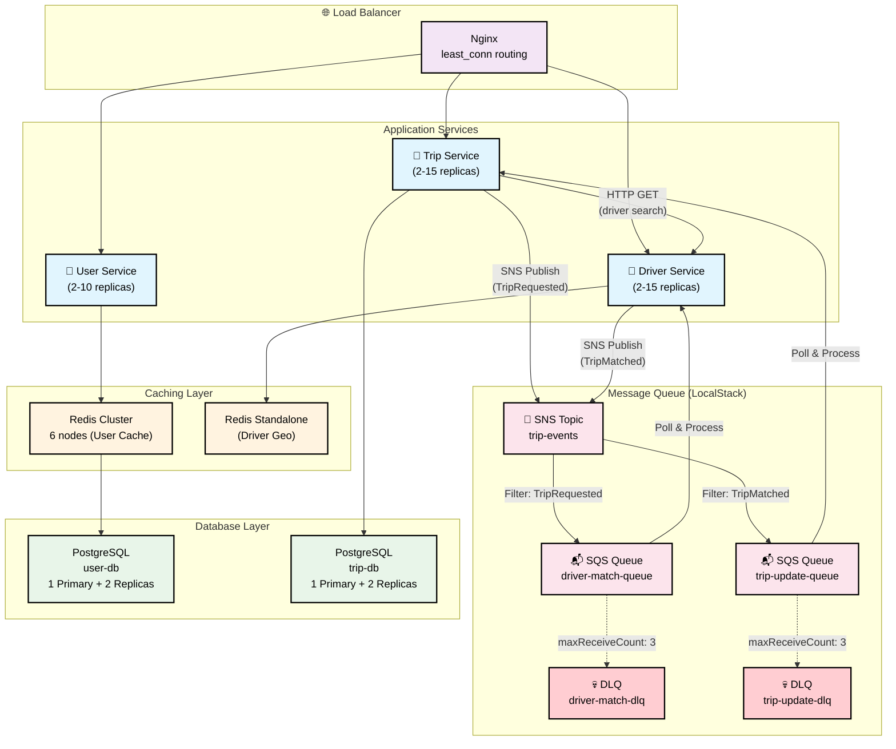
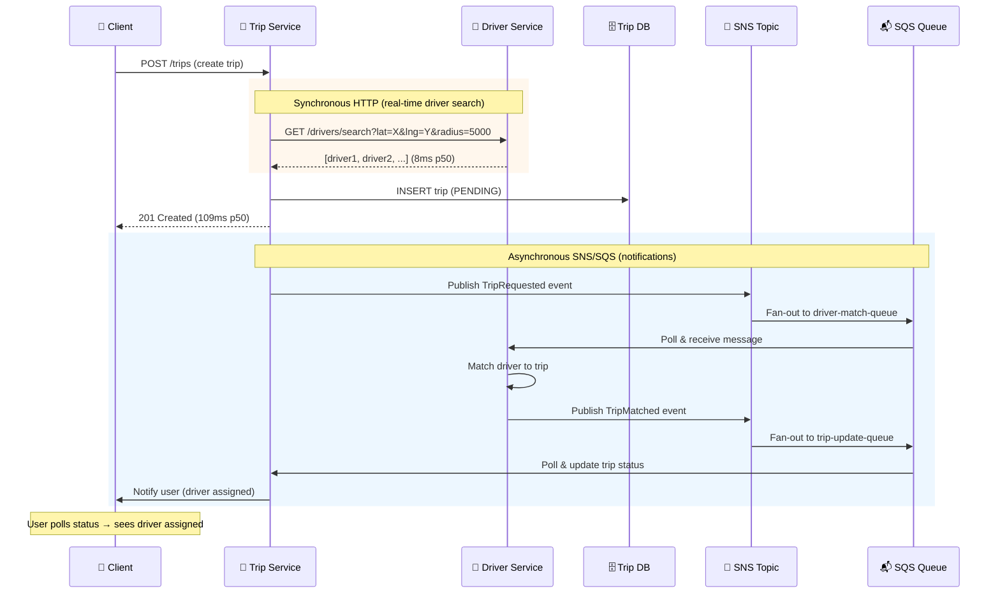
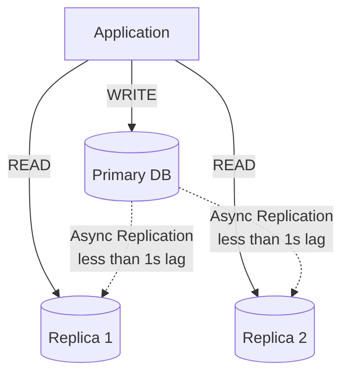
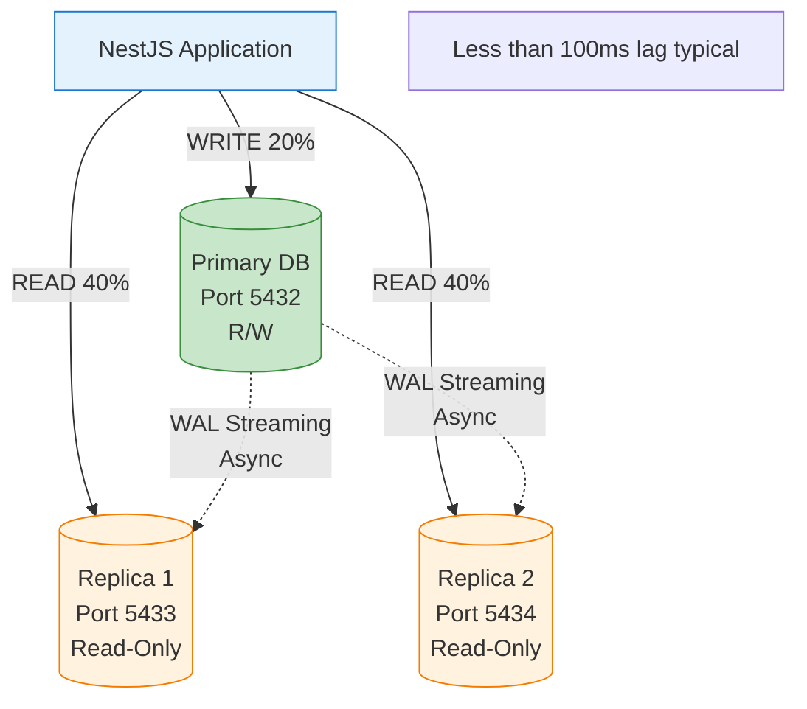
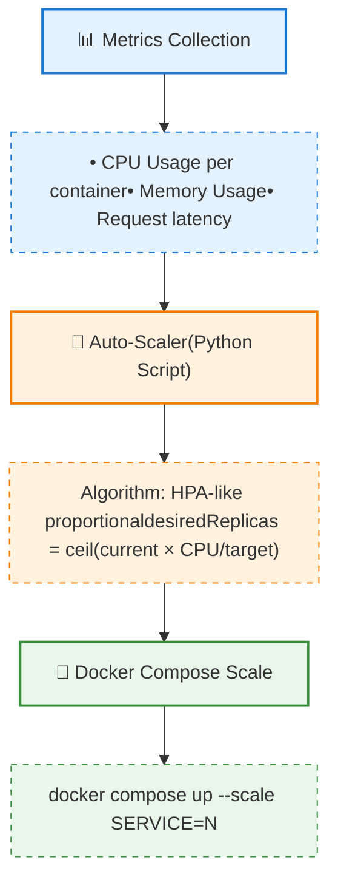
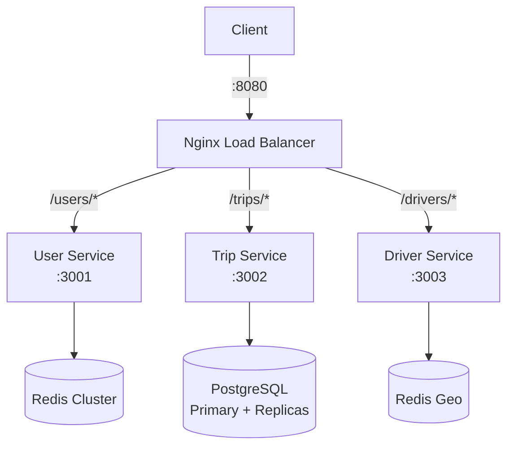
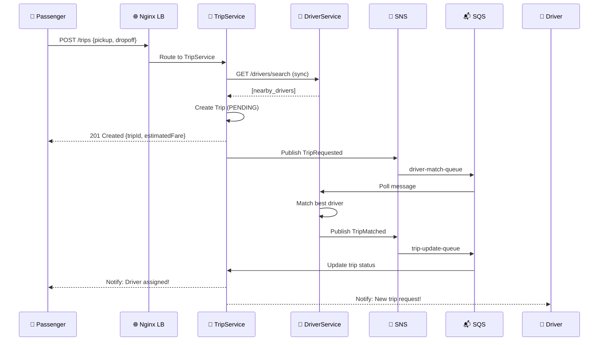
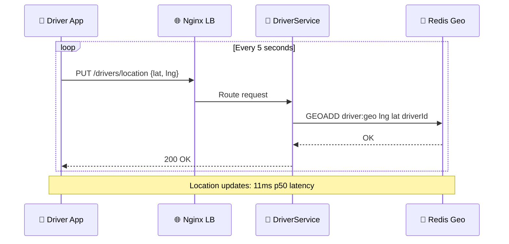

# UIT-Go Architecture Documentation

> **Đồ án môn SE360 - Cloud Computing**  
> **Module:** A - Scalability & Performance  
> **Ngày cập nhật:** 30/11/2025

---

## Mục lục

1. [Tổng quan Hệ thống](#1-tổng-quan-hệ-thống)
2. [Các Microservices](#2-các-microservices)
3. [Module A: Scalability & Performance](#3-module-a-scalability--performance)
4. [Các Pattern đã Implement](#4-các-pattern-đã-implement)
5. [Infrastructure Architecture](#5-infrastructure-architecture)
6. [Data Flow Diagrams](#6-data-flow-diagrams)
7. [Technology Decisions](#7-technology-decisions)
8. [Tài liệu Chi tiết](#8-tài-liệu-chi-tiết)

---

## 1. Tổng quan Hệ thống

### 1.1 High-Level Architecture



### 1.2 Tech Stack Overview

| Layer | Technology | Purpose |
|-------|------------|---------|
| **Runtime** | Node.js 20.x | JavaScript runtime |
| **Framework** | NestJS 10.x | Backend framework |
| **Language** | TypeScript 5.3.x | Type-safe development |
| **Database** | PostgreSQL 15 | Relational data (Users, Trips) |
| **Cache** | Redis 7.x | Distributed caching + Geospatial |
| **Message Queue** | LocalStack (SNS/SQS) | Async communication |
| **Load Balancer** | Nginx | Request routing, least_conn |
| **Container** | Docker + Docker Compose | Containerization |
| **IaC** | Terraform | Infrastructure as Code |
| **CI/CD** | GitHub Actions | Automated pipelines |

---

## 2. Các Microservices

### 2.1 UserService (Port 3001)

**Trách nhiệm:**
- Quản lý thông tin người dùng (passengers và drivers)
- Xử lý đăng ký, đăng nhập, authentication
- Quản lý driver profiles và vehicle information

**Database:** PostgreSQL (user-db) với 1 Primary + 2 Read Replicas

**Key APIs:**
| Method | Endpoint | Description |
|--------|----------|-------------|
| POST | `/users/register` | Đăng ký tài khoản |
| POST | `/users/login` | Đăng nhập, trả về JWT |
| GET | `/users/me` | Lấy profile user hiện tại |
| POST | `/users/driver-profile` | Tạo driver profile |

**Caching Strategy:**
- Cache user profiles trong Redis Cluster (TTL: 1 hour)
- Cache-aside pattern với 100% hit rate đạt được trong load test

### 2.2 TripService (Port 3002)

**Trách nhiệm:**
- Tạo và quản lý trip lifecycle
- Điều phối việc matching driver với passenger
- Quản lý trip states: PENDING → ACCEPTED → IN_PROGRESS → COMPLETED

**Database:** PostgreSQL (trip-db) với 1 Primary + 2 Read Replicas

**Key APIs:**
| Method | Endpoint | Description |
|--------|----------|-------------|
| POST | `/trips` | Tạo trip request mới |
| GET | `/trips/{id}` | Lấy thông tin trip |
| POST | `/trips/{id}/accept` | Driver accept trip |
| POST | `/trips/{id}/complete` | Hoàn thành trip |
| POST | `/trips/{id}/cancel` | Hủy trip |

**Communication Pattern:**
- **Synchronous HTTP:** Gọi DriverService để tìm driver gần nhất
- **Asynchronous SNS:** Publish `TripRequested` event cho driver notifications

### 2.3 DriverService (Port 3003)

**Trách nhiệm:**
- Quản lý driver status (online/offline)
- Real-time location tracking (GPS updates)
- Geospatial queries để tìm drivers gần nhất

**Database:** Redis (driver-db) với Geospatial commands

**Key APIs:**
| Method | Endpoint | Description |
|--------|----------|-------------|
| PUT | `/drivers/location` | Cập nhật vị trí GPS |
| PUT | `/drivers/status` | Toggle online/offline |
| GET | `/drivers/search` | Tìm drivers trong bán kính |

**Redis Data Structures:**
```
# Geospatial index
GEOADD driver:geo <longitude> <latitude> <driverId>

# Query nearby drivers (5km radius)
GEORADIUS driver:geo 106.660172 10.762622 5 km WITHDIST ASC COUNT 10
```

---

## 3. Module A: Scalability & Performance

### 3.1 Hybrid Stack Approach

> **Điểm đặc biệt:** Thay vì triển khai AWS thực (~$645/tháng), project sử dụng **Hybrid Stack** với chi phí $0 để validate các scalability patterns.

| AWS Service | Local Equivalent | Purpose |
|-------------|------------------|---------|
| **SNS/SQS** | LocalStack | Async messaging, event-driven |
| **RDS Read Replicas** | PostgreSQL Streaming Replication | Read scaling |
| **ElastiCache** | Redis Cluster (6 nodes) | Distributed caching |
| **ECS Auto Scaling** | Docker Compose + Python Script | Container scaling |

### 3.2 Key Results Achieved

| Metric | Target | Achieved | Status |
|--------|--------|----------|--------|
| **Concurrent VUs** | 1,000 | 1,000 | ✅ Pass |
| **Total RPS** | >200 | 316 RPS | ✅ Pass |
| **Error Rate** | <5% | 0.67% | ✅ Pass |
| **Trip Creation p95** | <1000ms | 720ms | ✅ Pass |
| **Cache Hit Rate** | >80% | 100% | ✅ Pass |
| **Auto-Scaling** | Functional | 2→7 replicas | ✅ Pass |

### 3.3 Architecture Decisions (ADRs)

| ADR | Pattern | Technology | Trade-off |
|-----|---------|------------|-----------|
| [ADR-001](./ADR/ADR-001-event-driven-async-communication.md) | Event-Driven Async | LocalStack SNS/SQS | +Throughput, +Latency (~200ms) |
| [ADR-002](./ADR/ADR-002-database-read-scaling-rds-replicas.md) | Database Read Scaling | PostgreSQL Streaming | +Read capacity, ~Replication lag |
| [ADR-003](./ADR/ADR-003-distributed-caching-elasticache.md) | Distributed Caching | Redis Cluster | +Speed, ~Cache invalidation |
| [ADR-004](./ADR/ADR-004-auto-scaling-infrastructure.md) | Auto-Scaling | Docker + Python | +Elasticity, ~Cold start |

---

## 4. Các Pattern đã Implement

### 4.1 Event-Driven Async Communication (ADR-001)




**Hybrid Approach:**
- **Synchronous HTTP:** Driver search (user cần kết quả ngay lập tức)
- **Asynchronous SNS/SQS:** Driver notifications (có thể delay vài trăm ms)

### 4.2 Database Read Scaling (ADR-002)



**Configuration:**
- Primary: Handles all writes + critical reads
- Replicas (2x): Handle 80% of read traffic (round-robin)
- Replication lag: <100ms typical

### 4.3 Distributed Caching (ADR-003)





```typescript
// Cache-Aside Pattern Implementation
async findById(id: string): Promise<User | null> {
  const cacheKey = `user:${id}`;
  
  // 1. Try cache first
  const cached = await this.redis.get(cacheKey);
  if (cached) return JSON.parse(cached);  // Cache HIT
  
  // 2. Cache miss: query database
  const user = await this.prisma.user.findUnique({ where: { id } });
  
  // 3. Store in cache for future requests
  if (user) {
    await this.redis.setex(cacheKey, 3600, JSON.stringify(user));
  }
  
  return user;
}
```

**Redis Cluster Configuration:**
- 6 nodes: 3 primary + 3 replica
- Cache-aside pattern với TTL 1 hour cho user profiles
- `X-Cache-Hit` header để monitor hit rate

### 4.4 Auto-Scaling Infrastructure (ADR-004)




**Scaling Policy:**
| Service | CPU Threshold | Scale Out Cooldown | Min/Max |
|---------|---------------|-------------------|---------|
| trip-service | 50% | 15s | 2-15 |
| driver-service | 40% | 15s | 2-15 |
| user-service | 55% | 20s | 2-10 |

---

## 5. Infrastructure Architecture

### 5.1 Docker Compose Stack

```yaml
# Simplified architecture
services:
  # Application Services (scalable)
  user-service:    # Port 3001, scales 2-10
  trip-service:    # Port 3002, scales 2-15
  driver-service:  # Port 3003, scales 2-15
  
  # Load Balancer
  nginx:           # Port 8080, least_conn routing
  
  # Data Layer
  postgres-user:   # Port 5432, user-db
  postgres-trip:   # Port 5433, trip-db
  postgres-user-replica-1:
  postgres-user-replica-2:
  postgres-trip-replica-1:
  postgres-trip-replica-2:
  
  # Caching Layer
  redis-node-1 through redis-node-6:  # Redis Cluster
  redis-driver:    # Standalone for geospatial
  
  # Message Queue
  localstack:      # Port 4566, SNS/SQS emulation
```

### 5.2 Network Architecture



---

## 6. Data Flow Diagrams

### 6.1 Trip Booking Flow



### 6.2 Real-time Location Update Flow



---

## 7. Technology Decisions

### 7.1 REST vs gRPC

| Aspect | REST (Chosen) | gRPC |
|--------|---------------|------|
| **Latency** | ~10ms higher | Lower |
| **Debugging** | Easy (curl, Postman) | Harder (binary) |
| **Team Expertise** | High | Low |
| **Browser Support** | Native | Requires proxy |

**Decision:** REST - Team expertise và debugging ease quan trọng hơn 10ms latency improvement.

### 7.2 Redis vs DynamoDB (Driver Location)

| Aspect | Redis (Chosen) | DynamoDB |
|--------|----------------|----------|
| **Latency** | <5ms | ~10ms |
| **Geospatial** | Native GEORADIUS | Need Geohashing |
| **Cost** | $0 (Docker) | Pay-per-request |
| **Complexity** | Simple | Higher |

**Decision:** Redis - Native geospatial support, lower latency, simpler implementation.

### 7.3 LocalStack vs Real AWS

| Aspect | LocalStack (Chosen) | Real AWS |
|--------|---------------------|----------|
| **Cost** | $0/month | ~$645/month |
| **Features** | 80% compatibility | Full |
| **Setup** | Docker Compose | IAM, VPC, etc. |
| **Purpose** | Pattern validation | Production |

**Decision:** LocalStack - Validate patterns at zero cost before AWS investment.

---

## 8. Tài liệu Chi tiết

### 8.1 Architecture Documentation
- [Section 1: Introduction](../docs/architecture/section-1-introduction.md)
- [Section 2: High-Level Architecture](../docs/architecture/section-2-high-level-architecture.md)
- [Section 3: Tech Stack](../docs/architecture/section-3-tech-stack.md)
- [Section 5: API Specification](../docs/architecture/section-5-api-specification.md)
- [Section 6: Components](../docs/architecture/section-6-components.md)
- [Section 8: Core Workflows](../docs/architecture/section-8-core-workflows.md)
- [Section 9: Database Schema](../docs/architecture/section-9-database-schema.md)

### 8.2 ADRs (Architectural Decision Records)
- [ADR-001: Event-Driven Async Communication](./ADR/ADR-001-async-communication.md)
- [ADR-002: Database Read Scaling](./ADR/ADR-002-read-replicas.md)
- [ADR-003: Distributed Caching](./ADR/ADR-003-distributed-caching.md)
- [ADR-004: Auto-Scaling Infrastructure](./ADR/ADR-004-auto-scaling.md)


### 8.3 Module A Report
- [Full Scalability Report](../docs/MODULE-A-SCALABILITY-REPORT.md)
- [Load Test Results](../docs/MODULE-A-LOAD-TEST-RESULTS.md)

### 8.4 Load Testing
- [Load Test Scripts](../tests/load/)
- [Test Runner Script](../tests/load/run-module-a-tests.sh)
- [Results Comparison Tool](../tests/load/compare-results.py)

---

**Repository:** https://github.com/dieuxuanhien/uit-go-se360  
**Branch:** Phase2  
**Last Updated:** November 30, 2025
