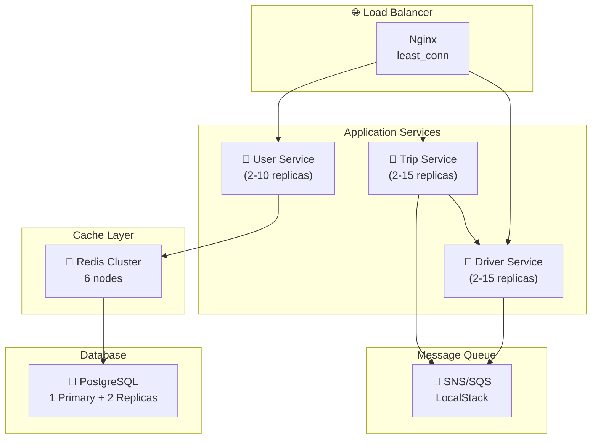

# UIT-GO Presentation Slides
## Module A: Scalability & Performance

> **Course:** SE360 - Cloud Computing  
> **Time:** 7 phút (Architecture & Specialized Module)  
> **Team:** UIT-GO Development Team

---

# 📋 SLIDE DECK OUTLINE

| # | Slide | Duration | Purpose |
|---|-------|----------|---------|
| 1 | Title + Hook | 30s | Gây ấn tượng, đặt vấn đề |
| 2 | The Problem | 45s | Pain points của sync architecture |
| 3 | Our Approach: Hybrid Stack | 45s | Giải pháp $0 cost |
| 4 | High-Level Architecture | 60s | System overview |
| 5-8 | 4 Trade-off Decisions | 3 phút (45s each) | Core presentation |
| 9 | Load Test Results | 45s | Evidence + Numbers |
| 10 | Key Takeaways | 30s | Summary + Lessons |

---

# SLIDE 1: TITLE + HOOK

## 🚀 UIT-GO: Building a Scalable Ride-Hailing Backend
### Module A: Scalability & Performance

**Visual:** Hình ảnh app Grab/Gojek với animation "Finding driver..."

> **Hook Statement:**  
> *"Mỗi ngày, hàng triệu users booking rides. Điều gì xảy ra khi 1000 người cùng bấm 'Book Now' trong 1 giây?"*

**Speaker Notes:**
- Ride-hailing là bài toán điển hình của distributed systems
- 1000 VUs concurrent = simulating rush hour scenario
- Trade-offs are everywhere - không có perfect solution

---

# SLIDE 2: THE PROBLEM

## ❌ Synchronous Architecture = Bottleneck

```
┌─────────────────────────────────────────────────────────────┐
│  [User] ──HTTP──> [TripService] ──HTTP──> [DriverService]  │
│                         │                       │          │
│                    BLOCKED                   BLOCKED        │
│                    Waiting...                Querying...    │
│                         │                       │          │
│  [User waits several seconds before seeing "Finding..."]   │
└─────────────────────────────────────────────────────────────┘
```

**3 Pain Points:**

| Problem | Impact |
|---------|--------|
| 🐢 **High Latency** | User chờ vài giây mới thấy kết quả |
| 💥 **Cascading Failures** | DriverService slow → TripService timeout → User error |
| 📈 **No Burst Handling** | Concurrent requests cao → Requests fail |

**Speaker Notes:**
- Đây là trạng thái ban đầu trước khi implement Module A
- Synchronous = blocking I/O = wasted threads
- Scale gap: Cần hỗ trợ nhiều users hơn đáng kể

---

# SLIDE 3: OUR APPROACH - HYBRID STACK

## 💡 Zero-Cost AWS Pattern Validation

> *"Làm sao validate AWS scalability patterns mà không tốn $645/tháng?"*

| AWS Production | Local Equivalent | Purpose |
|----------------|------------------|---------|
| SNS/SQS | **LocalStack** | Async messaging |
| RDS Read Replicas | **PostgreSQL Streaming** | Read scaling |
| ElastiCache | **Redis Cluster (6 nodes)** | Distributed cache |
| ECS Auto Scaling | **Docker + Python Script** | Container scaling |

**Visual:** Diagram so sánh AWS vs Local với highlight "$0/month"

**Key Message:**
> *"Same patterns, same concepts, different implementation. Chi phí development = $0."*

**Speaker Notes:**
- LocalStack emulates 80% AWS behavior
- Patterns validated locally → minimal changes khi deploy AWS
- Focus vào learning concepts, không phải AWS billing

---

# SLIDE 4: HIGH-LEVEL ARCHITECTURE

## 🏗️ System Architecture Overview



**4 Scalability Patterns Implemented:**

| ADR | Pattern | Technology |
|-----|---------|------------|
| ADR-001 | Event-Driven Async | SNS/SQS |
| ADR-002 | Database Read Scaling | Read Replicas |
| ADR-003 | Distributed Caching | Redis Cluster |
| ADR-004 | Auto-Scaling | Docker + Script |

**Speaker Notes:**
- Mỗi service có database riêng (Database per Service)
- Communication: Sync HTTP + Async SNS/SQS
- Tiếp theo: Đi sâu vào 4 trade-off decisions

---

# SLIDE 5: TRADE-OFF #1 - ASYNC COMMUNICATION

## ⚖️ ADR-001: Latency vs Throughput

### The Decision: SNS/SQS (Async) thay vì HTTP (Sync)

```
SYNC (Before):           ASYNC (After):
User ──> Trip ──> Driver  User ──> Trip ──> DB
         │                        │
    [Wait 3-5s]              [201 OK instantly]
         │                        │
    "Driver found"           Trip publishes event
                                  │
                             SQS ──> Driver processes
                                  │
                             User polls → "Driver found"
```

| What We GAIN ✅ | What We LOSE ❌ |
|----------------|----------------|
| **Throughput cao hơn** - Non-blocking | **Eventual consistency** - có delay nhỏ |
| **Instant feedback** - User thấy "Finding..." ngay | **Phải poll** - User không có real-time result |
| **Service isolation** - No cascading failures | **Debugging khó hơn** - Async flow |
| **Backpressure handling** - Queue buffers burst | |

### Why Acceptable?
> *"Ride-hailing UX đã chuẩn: User expect 'Finding driver' animation, không expect instant driver match."*

**Speaker Notes:**
- Fire-and-forget pattern: SNS publish không await
- DLQ đảm bảo no message loss (retry 3 lần)
- LocalStack emulates AWS behavior với $0 cost

---

# SLIDE 6: TRADE-OFF #2 - READ REPLICAS

## ⚖️ ADR-002: Consistency vs Read Capacity

### The Decision: PostgreSQL Streaming Replication (1 Primary + 2 Replicas)

```
┌─────────────────────────────────────────────────────┐
│  Application                                        │
│       │                                             │
│  ┌────┴────┐                                        │
│  ▼         ▼                                        │
│ WRITE     READ                                      │
│  │         │                                        │
│  ▼         ├──────> Replica 1 ──┐                   │
│ Primary    │                    ├─ Round Robin      │
│  │         └──────> Replica 2 ──┘                   │
│  │                      ▲                           │
│  └──WAL Streaming───────┘ (async, có lag nhỏ)      │
└─────────────────────────────────────────────────────┘
```

| What We GAIN ✅ | What We LOSE ❌ |
|----------------|----------------|
| **Read capacity tăng 3x** | **Replication lag** - có thể đọc stale data |
| **High availability** - Replica làm backup | **Routing complexity** - Code phải biết route đến đâu |
| **$0 local** - Docker Compose | |

### Real Issue Encountered:
```
❌ User creates trip → immediately check status → 404 (replica chưa có data)
✅ Fix: Route trip status checks to Primary for new trips
```

**Speaker Notes:**
- Đa số reads không cần microsecond freshness
- Critical reads (read-after-write) vẫn dùng Primary
- Lesson learned: Understand replication lag impact

---

# SLIDE 7: TRADE-OFF #3 - DISTRIBUTED CACHING

## ⚖️ ADR-003: Staleness vs Speed

### The Decision: Redis Cluster (6 nodes) với Cache-Aside Pattern

```typescript
async findById(id: string): Promise<User | null> {
  // 1. Try cache first (sub-ms)
  const cached = await redis.get(`user:${id}`);
  if (cached) return JSON.parse(cached); // ⚡ CACHE HIT
  
  // 2. Cache miss → query DB (10-50ms)
  const user = await prisma.user.findUnique({ where: { id } });
  
  // 3. Populate cache for next time
  await redis.setex(`user:${id}`, 3600, JSON.stringify(user));
  return user;
}
```

| What We GAIN ✅ | What We LOSE ❌ |
|----------------|----------------|
| **Response nhanh hơn nhiều** (memory vs disk I/O) | **Data có thể stale** (TTL-based) |
| **Database load giảm đáng kể** | **Memory cost** |
| **100% cache hit rate** (after warm-up) | **Cold start penalty** (first request chậm) |

### TTL Strategy:
| Data Type | TTL | Reason |
|-----------|-----|--------|
| User Profile | 1 hour | Rarely changes |
| Active Trip | 1 min | Needs freshness |
| Driver Location | Short | Real-time data |

**Speaker Notes:**
- Profile data tolerance cho staleness cao
- Cache-aside pattern đơn giản và hiệu quả
- allkeys-lru eviction: hot data stays in memory

---

# SLIDE 8: TRADE-OFF #4 - AUTO-SCALING

## ⚖️ ADR-004: Simplicity vs Elasticity

### The Decision: Docker Compose + Python Script (thay vì Kubernetes)

```python
# HPA-like algorithm
desiredReplicas = ceil(currentReplicas × (currentCPU / targetCPU))

# Example: 4 replicas at 80% CPU, target 50%
# → ceil(4 × 80/50) = ceil(6.4) = 7 replicas
```

| What We GAIN ✅ | What We LOSE ❌ |
|----------------|----------------|
| **Ship faster** - no k8s learning curve | **Not production-grade** |
| **$0 local development** | **Single host only** |
| **Same concept** as k8s HPA | **Cold start** khi scale out |

### Scaling Observation (1000 VUs):
```
Time        CPU%    Replicas    Event
20:50:45    54.6%   2           -
20:51:00    77.8%   2→3         Scale out
20:51:19    122.4%  3→4         Scale out
20:51:40    84.5%   4→5         Scale out
20:52:00    61.9%   5→6         Scale out
20:52:20    57.7%   6→7         Scale out
20:52:40    46.6%   7           ✅ Stabilized
```

**Speaker Notes:**
- Trip-service scale 2→7 = 3.5x capacity increase
- User-service stable at 2 (100% cache hit)
- Driver-service stable at 2 (async processing via SQS)

---

# SLIDE 9: LOAD TEST RESULTS

## 📊 1000 VUs - Evidence of Scalability

### Test Configuration:
- **Tool:** k6
- **Virtual Users:** 1,000 concurrent
- **Duration:** 5 minutes
- **Workload:** 70% trip creation, 30% location updates

### Results Summary:

| Metric | Target | Achieved | Status |
|--------|--------|----------|--------|
| **Concurrent VUs** | 1,000 | 1,000 | ✅ |
| **Total RPS** | >200 | **316 RPS** | ✅ |
| **Error Rate** | <5% | **0.67%** | ✅ |
| **Trip Creation p95** | <1000ms | **720ms** | ✅ |
| **Cache Hit Rate** | >80% | **100%** | ✅ |
| **Auto-Scale** | Functional | **2→7 replicas** | ✅ |

### Latency Breakdown:
| Endpoint | p50 | p95 |
|----------|-----|-----|
| Trip Creation | 109ms | 720ms |
| Driver Search | 8ms | 34ms |
| Location Update | 11ms | 42ms |
| Profile Lookup | 7ms | 22ms |

**Visual:** Chart showing throughput over time với scale events marked

**Speaker Notes:**
- 316 RPS = 1.1M requests/hour capability
- Error rate 0.67% mainly during scale transition
- Driver search 8ms p50 = Redis geo-indexing hiệu quả

---

# SLIDE 10: KEY TAKEAWAYS

## 🎯 Lessons Learned

### 1. Trade-offs Are Everywhere
> *"Không có perfect solution. Chỉ có solution phù hợp với context."*

| Decision | What We Gained | What We Lost |
|----------|----------------|--------------|
| Async | Throughput | Immediate result |
| Replicas | Capacity | Consistency |
| Caching | Speed | Freshness |
| Auto-scale | Elasticity | Simplicity |

### 2. Validate Patterns at Zero Cost
- LocalStack + Docker = AWS patterns với $0/month
- Same concepts, different implementation
- Migrate to AWS when needed

### 3. Measure Before & After
- Load testing validates assumptions
- Numbers prove architecture works
- Without evidence, it's just theory

---

## 🔮 Production Migration Path

```
┌─────────────────┐    ┌─────────────────┐    ┌─────────────────┐
│   Local Dev     │ →  │    Staging      │ →  │   Production    │
│ LocalStack      │    │  Real AWS       │    │ Full AWS Stack  │
│ Docker Compose  │    │  ECS Fargate    │    │ ECS + SNS/SQS   │
│     ($0)        │    │  (~$200/month)  │    │  (~$645/month)  │
└─────────────────┘    └─────────────────┘    └─────────────────┘
```

---

# Q&A PREPARATION

## Anticipated Questions & Answers

### Q1: "Tại sao không dùng Kubernetes?"
> **A:** Kubernetes là ideal cho production với 10+ services, nhưng với 3 services và team chưa có k8s experience, Docker + Script cho phép ship faster với 0 learning curve. Chúng tôi sử dụng same concepts (HPA algorithm) và có clear migration path khi cần.

### Q2: "Replication lag có ảnh hưởng gì không?"
> **A:** Có, chúng tôi gặp issue 404 khi user check trip status ngay sau khi tạo trip (replica chưa có data). Solution: Route critical read-after-write queries đến Primary. Lesson learned: Understand consistency requirements per use case.

### Q3: "Tại sao Redis Cluster 6 nodes thay vì 3?"
> **A:** 6 nodes = 3 masters + 3 replicas. Cluster mode cho high availability: nếu 1 master down, replica tự promote. Nếu chỉ 3 nodes (1 master per node), mất 1 node = mất 1/3 data.

### Q4: "LocalStack có giống 100% AWS không?"
> **A:** Không, khoảng 80% compatibility. Polling delay cao hơn AWS thực. Tuy nhiên, đủ để validate patterns và concepts. Production sẽ dùng real AWS services.

### Q5: "Chi phí production ước tính bao nhiêu?"
> **A:** Estimated ~$645/month cho full AWS stack (ECS Fargate + RDS + ElastiCache + SNS/SQS). Development cost = $0 với hybrid stack approach.

---

# APPENDIX: VISUAL AIDS

## Diagram 1: Async Flow (for ADR-001 slide)

```
┌────────────────────────────────────────────────────────────────────┐
│                    TRIP CREATION FLOW                              │
├────────────────────────────────────────────────────────────────────┤
│                                                                    │
│  [Client]                                                          │
│     │                                                              │
│     │ POST /trips                                                  │
│     ▼                                                              │
│  [Trip Service]                                                    │
│     │                                                              │
│     ├──HTTP──> [Driver Service] → Find nearby drivers              │
│     │              └── 8ms p50 (Redis geo-indexing)                │
│     │                                                              │
│     ├── Save trip (PENDING) to DB                                  │
│     │                                                              │
│     ├── 201 Created (109ms p50) ──────────> [Client sees result]   │
│     │                                                              │
│     └──SNS Publish─> [trip-events]                                 │
│                          │                                         │
│                          ├──> [driver-match-queue]                 │
│                          │         │                               │
│                          │         └──> [Driver Service]           │
│                          │                   │                     │
│                          │              Match driver               │
│                          │                   │                     │
│                          │         [TripMatched event]             │
│                          │                   │                     │
│                          └<─────────────────┘                      │
│                                                                    │
│  [Client polls status] → Sees "Driver assigned"                    │
│                                                                    │
└────────────────────────────────────────────────────────────────────┘
```

## Diagram 2: Read Replica Routing (for ADR-002 slide)

```
┌────────────────────────────────────────────────────────────────────┐
│                    ROUTING DECISION TREE                           │
├────────────────────────────────────────────────────────────────────┤
│                                                                    │
│                         [Query arrives]                            │
│                              │                                     │
│                              ▼                                     │
│                    ┌─────────────────┐                             │
│                    │  Is it WRITE?   │                             │
│                    └────────┬────────┘                             │
│                             │                                      │
│              ┌──────────────┴──────────────┐                       │
│              ▼                              ▼                      │
│            YES                             NO                      │
│              │                              │                      │
│              ▼                              ▼                      │
│        [PRIMARY]              ┌─────────────────────┐              │
│                               │ Is read-after-write │              │
│                               │   (recently created)?│              │
│                               └──────────┬──────────┘              │
│                                          │                         │
│                       ┌──────────────────┴───────────────┐         │
│                       ▼                                  ▼         │
│                      YES                                NO         │
│                       │                                  │         │
│                       ▼                                  ▼         │
│                 [PRIMARY]                    [REPLICA round-robin] │
│                                                                    │
└────────────────────────────────────────────────────────────────────┘
```

## Diagram 3: Auto-Scaling Timeline (for ADR-004 slide)

```
┌────────────────────────────────────────────────────────────────────┐
│                    SCALING TIMELINE (1000 VUs)                     │
├────────────────────────────────────────────────────────────────────┤
│                                                                    │
│  CPU%  │                                                           │
│  120   │              ████                                         │
│  100   │            ██    ██                                       │
│   80   │    ████████        ██████                                 │
│   60   │  ██                      ████████                         │
│   40   │██                                ██████████████████       │
│   20   │                                                           │
│        └───────────────────────────────────────────────────────    │
│            │     │    │    │    │    │                             │
│         Start   T1   T2   T3   T4   T5  Stabilized                 │
│                                                                    │
│  Replicas: 2 → 3 → 4 → 5 → 6 → 7                                   │
│                                                                    │
│  Legend:                                                           │
│  ████ = CPU Usage    T1-T5 = Scale events                          │
│                                                                    │
└────────────────────────────────────────────────────────────────────┘
```

---

# PRESENTER CHECKLIST

## Before Presentation:
- [ ] Verify all numbers match MODULE-A-SCALABILITY-REPORT.md
- [ ] Test diagrams render correctly in presentation tool
- [ ] Practice 7-minute timing (use timer)
- [ ] Prepare backup local demo (Docker Compose stack running)

## Key Messages to Emphasize:
1. **Trade-offs are the core** - Not just "what we built" but "why we chose this"
2. **Evidence-based** - Load test results validate decisions
3. **$0 development cost** - Hybrid stack approach
4. **Clear migration path** - Local → AWS production ready

## Timing Guide:
| Section | Time | Cumulative |
|---------|------|------------|
| Hook + Problem | 1:15 | 1:15 |
| Approach + Architecture | 1:45 | 3:00 |
| 4 Trade-offs (45s each) | 3:00 | 6:00 |
| Results + Takeaways | 1:00 | 7:00 |

---

**Document Created:** November 30, 2025  
**For:** SE360 Final Presentation  
**Module:** A - Scalability & Performance
