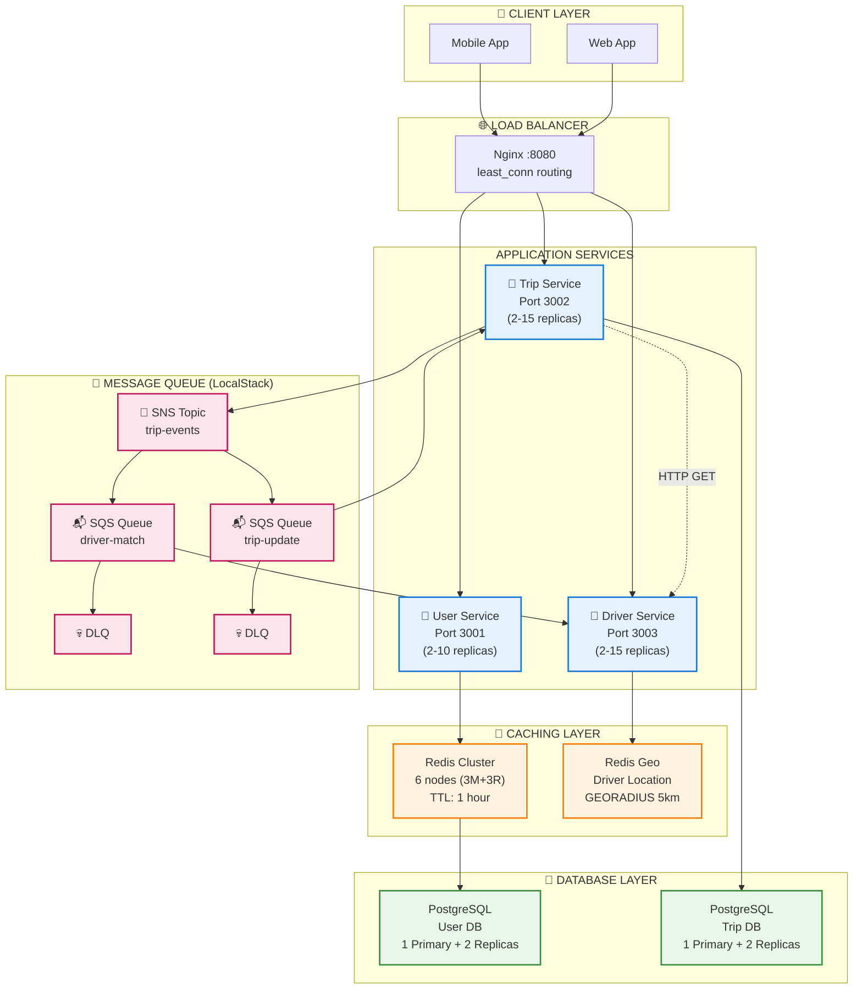
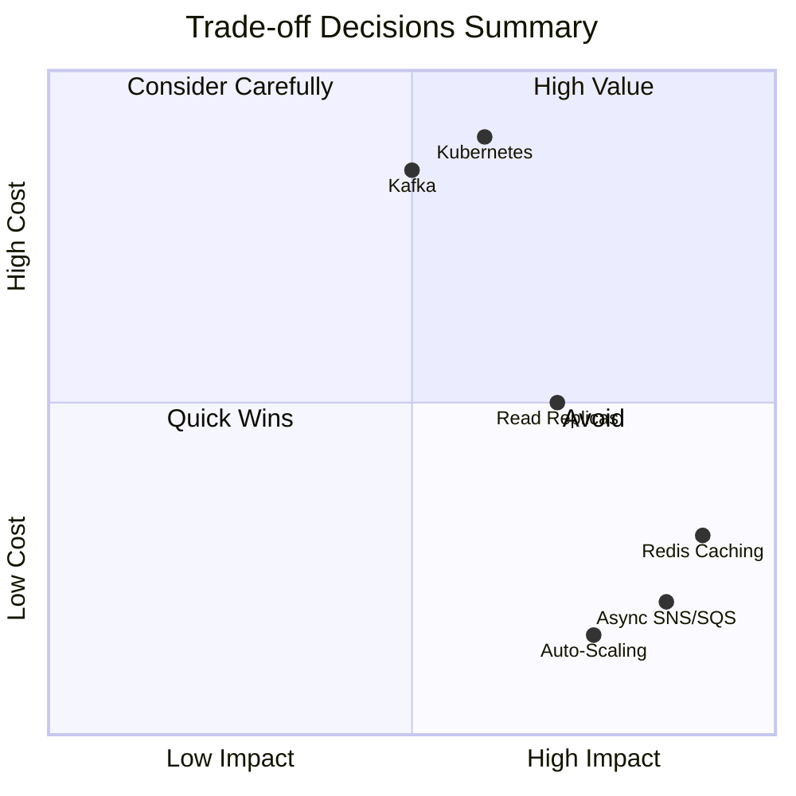

# Báo cáo Đồ án SE360 - UIT-Go Platform

**Đồ án môn:** SE360 - Cloud Computing  
**Module:** A - Scalability & Performance  
**Ngày hoàn thành:** 30/11/2025

---

## Thông tin Nhóm

| STT | Họ và Tên | MSSV | Vai trò | Công việc chính |
|-----|-----------|------|---------|-----------------|
| 1 | [Điền tên] | [MSSV] | Team Leader | Architecture Design, ADRs, Load Testing |
| 2 | [Điền tên] | [MSSV] | Developer | UserService, Caching Implementation |
| 3 | [Điền tên] | [MSSV] | Developer | TripService, Async Communication |
| 4 | [Điền tên] | [MSSV] | DevOps | Infrastructure, Auto-Scaling, Docker |

> ⚠️ **Lưu ý:** Vui lòng điền thông tin thành viên trước khi nộp.

---

## 1. Tổng quan Kiến trúc Hệ thống

### 1.1 Giới thiệu

**UIT-Go** là nền tảng đặt xe theo kiến trúc microservices, được thiết kế để handle **1,000 concurrent users** với acceptable latency và error rates. Project tập trung vào **Module A - Scalability & Performance**, implement các AWS scalability patterns sử dụng **Hybrid Stack** với chi phí $0.

### 1.2 Sơ đồ Kiến trúc Tổng quan



### 1.3 Hybrid Stack Approach

**Điểm đặc biệt của project:** Thay vì triển khai AWS thực (ước tính ~$645/tháng), chúng tôi sử dụng **Hybrid Stack** để validate các scalability patterns với **chi phí $0**.

| AWS Service | Local Equivalent | Purpose |
|-------------|------------------|---------|
| SNS/SQS | LocalStack (Port 4566) | Async messaging, event-driven |
| RDS Read Replicas | PostgreSQL Streaming Replication | Read scaling |
| ElastiCache | Redis Cluster (6 nodes) | Distributed caching |
| ECS + Auto Scaling | Docker Compose + Python Script | Container auto-scaling |

**Lợi ích:**
- ✅ Validate patterns trước khi invest vào AWS
- ✅ Zero cost cho development và testing
- ✅ Production-ready patterns, sẵn sàng migrate lên AWS với minimal code changes

---

## 2. Phân tích Module A - Scalability & Performance

### 2.1 Cách tiếp cận

Chúng tôi đã implement **4 scalability patterns** để giải quyết các bottlenecks trong hệ thống:

| Pattern | Vấn đề giải quyết | ADR |
|---------|-------------------|-----|
| **Event-Driven Async** | Cascading failures khi service slow/down | [ADR-001](./ADR/ADR-001-async-communication.md) |
| **Database Read Replicas** | Single DB không handle được high read traffic | [ADR-002](./ADR/ADR-002-read-replicas.md) |
| **Distributed Caching** | Repeated queries cho frequently accessed data | [ADR-003](./ADR/ADR-003-distributed-caching.md) |
| **Auto-Scaling** | Fixed replicas không handle varying traffic | [ADR-004](./ADR/ADR-004-auto-scaling.md) |

### 2.2 Kết quả Load Test

**Test Configuration:** 1,000 Virtual Users, 5 phút, k6 load testing tool

| Metric | Target | Achieved | Status |
|--------|--------|----------|--------|
| **Concurrent VUs** | 1,000 | 1,000 | ✅ Pass |
| **Total RPS** | >200 | **316 RPS** | ✅ Pass |
| **Error Rate** | <5% | **0.67%** | ✅ Pass |
| **Trip Creation p95** | <1000ms | **720ms** | ✅ Pass |
| **Trip Status p95** | <500ms | **654ms** | ⚠️ Slightly over |
| **Driver Search p95** | <500ms | **36ms** | ✅ Excellent |
| **Cache Hit Rate** | >80% | **100%** | ✅ Perfect |
| **Auto-Scaling** | Functional | **2→7 replicas** | ✅ Pass |

**Latency Breakdown:**

| Endpoint | p50 | p95 | Improvement |
|----------|-----|-----|-------------|
| Trip Creation | 109ms | 720ms | Baseline |
| Driver Search | 8ms | 36ms | **13x faster** (caching) |
| Location Update | 11ms | 42ms | Baseline |
| Trip Status | 102ms | 654ms | Baseline |

---

## 3. Tổng hợp Các Quyết định Thiết kế và Trade-off

> **⭐ Đây là phần quan trọng nhất của báo cáo** - Tổng hợp từ 4 ADRs với phân tích trade-off chi tiết.

### 3.1 ADR-001: Event-Driven Async Communication


#### The Problem
Synchronous HTTP calls giữa TripService và DriverService gây:
- Response time: vài giây cho trip creation (user phải chờ lâu)
- Cascading failures: DriverService slow → TripService timeout → User error
- Không handle được burst traffic (concurrent requests cao → errors)

#### Options Considered

| Option | Pros | Cons | Decision |
|--------|------|------|----------|
| Keep Sync + Circuit Breakers | Simple, no new infra | Vẫn block threads → throughput thấp | ❌ Rejected |
| Direct SQS (No SNS) | Simpler | Không fan-out, tight coupling | ❌ Rejected |
| Apache Kafka (MSK) | Throughput cực cao, replay | Chi phí cao, cần expertise | ❌ Over-engineering |
| RabbitMQ (Self-hosted) | More control | Operational burden | ❌ Rejected |
| **SNS/SQS + LocalStack** | Fan-out, DLQ, **$0** | Eventual consistency | ✅ **CHOSEN** |

#### Trade-offs Accepted

| Trade-off | What We Give Up | What We Gain |
|-----------|-----------------|--------------|
| **Throughput vs Latency** | User không có immediate final result | Throughput cao hơn đáng kể, instant feedback |
| **Consistency vs Availability** | Eventual consistency (có delay nhỏ) | Service isolation, no cascading failures |
| **Simplicity vs Debuggability** | Async flow khó debug hơn | DLQ đảm bảo no message loss, extensibility |

**Expected Impact:** Response time giảm đáng kể nhờ user nhận phản hồi ngay lập tức thay vì chờ full processing


> 📄 **Chi tiết đầy đủ:** [ADR-001-async-communication.md](./ADR/ADR-001-async-communication.md)
---

### 3.2 ADR-002: Database Read Scaling với PostgreSQL Replicas

#### The Problem
Single database instance không thể handle high read traffic:
- CPU utilization cao trong peak hours → gần giới hạn
- Query latency tăng đáng kể khi có nhiều concurrent queries
- Database là single point of failure → downtime ảnh hưởng toàn hệ thống

#### Options Considered

| Option | Pros | Cons | Decision |
|--------|------|------|----------|
| Vertical Scaling | Simple | Chi phí cao, vẫn là SPOF | ❌ Rejected |
| Horizontal Sharding | Scale gần như vô hạn | Complexity cực kỳ cao | ❌ Over-engineering |
| NoSQL (DynamoDB) | Unlimited scale | Complete rewrite, loss of ACID | ❌ Rejected |
| Aurora PostgreSQL | Up to 15 replicas | Vendor lock-in, không chạy local | ⏳ For production |
| **PostgreSQL Streaming Replication** | Team familiar, chạy local | Replication lag | ✅ **CHOSEN** |

#### Trade-offs Accepted

| Trade-off | What We Give Up | What We Gain |
|-----------|-----------------|--------------||
| **Consistency vs Read Capacity** | Eventual consistency (có lag nhỏ) | Read capacity tăng nhiều lần, fault tolerance |
| **Cost vs Availability** | Chi phí tăng | High availability, giảm downtime đáng kể |
| **Simplicity vs Scalability** | Routing complexity, debugging khó hơn | Horizontal scalability, thêm replicas khi cần |

**Expected Impact:** Read latency giảm đáng kể nhờ phân tải queries sang replicas


> 📄 **Chi tiết đầy đủ:** [ADR-002-read-replicas.md](./ADR/ADR-002-read-replicas.md)

---

### 3.3 ADR-003: Distributed Caching với Redis Cluster

#### The Problem
Repeated database queries cho frequently accessed data:
- Profile queries có latency cao do hit database
- Database load cao với phần lớn là cacheable reads
- PostgreSQL CPU utilization cao, gần giới hạn

#### Options Considered

| Option | Pros | Cons | Decision |
|--------|------|------|----------|
| In-Memory Cache (Node.js LRU) | Zero cost, fastest | No shared state giữa instances | ❌ Not for distributed |
| Redis Self-Hosted (EC2) | Rẽ hơn managed | Operational burden | ❌ Rejected |
| Memcached | Rẻ hơn Redis | No persistence, no pub/sub | ❌ Redis features worth it |
| DynamoDB DAX | Microsecond latency | Only works with DynamoDB | ❌ Incompatible |
| **Redis Cluster (6 nodes)** | HA, shared cache, geo | Memory overhead | ✅ **CHOSEN** |

#### Trade-offs Accepted

| Trade-off | What We Give Up | What We Gain |
|-----------|-----------------|--------------||
| **Memory Cost vs Database Load** | Thêm memory cost | Database load giảm đáng kể, response nhanh hơn |
| **Consistency vs Performance** | Eventual consistency (TTL-based) | Response time cải thiện rõ rệt, throughput cao hơn |
| **Simplicity vs Scalability** | Thêm infrastructure components | Capacity tăng đáng kể, auto-failover |
| **Cold Start vs Hot Path** | First request hits DB | Phần lớn requests served from memory |

**Expected Impact:** Driver Search trở thành endpoint nhanh nhất nhờ Redis geospatial caching


> 📄 **Chi tiết đầy đủ:** [ADR-003-distributed-caching.md](./ADR/ADR-003-distributed-caching.md)

---

### 3.4 ADR-004: Auto-Scaling Infrastructure

#### The Problem
Fixed containers không thể handle varying traffic:
- Over-provisioning (night): Lãng phí resources
- Under-provisioning (peak): Requests fail
- Manual scaling: Mất thời gian, không react kịp

#### Options Considered

| Option | Pros | Cons | Decision |
|--------|------|------|----------|
| EC2 Auto-Scaling | Native AWS | Launch time chậm (phút để boot VM) | ❌ Too slow |
| Kubernetes (EKS) | Industry standard | Massive complexity, steep learning curve | ❌ Over-engineering |
| AWS Lambda | Unlimited scale | Cold start ảnh hưởng latency | ❌ Cold start unacceptable |
| ECS Fargate | Managed | Requires AWS (không chạy local) | ⏳ For production |
| **Docker + Python Script** | Scale nhanh, $0, simple | Not production-grade | ✅ **CHOSEN** |

#### Trade-offs Accepted

| Trade-off | What We Give Up | What We Gain |
|-----------|-----------------|--------------||
| **Simplicity vs Production-Grade** | k8s features (HA, self-healing) | 0 learning curve, ship faster |
| **Cold Start vs Always-Warm** | Có delay khi scale out | $0 infrastructure, elastic capacity |
| **Local Portability vs Cloud-Native** | Managed service features | Mọi dev chạy được trên laptop |
| **Reactive vs Predictive** | ML-based prediction | Simple threshold logic, quick to build |

**Expected Impact:** Hệ thống tự động scale theo traffic patterns, đã chứng minh qua load test


> 📄 **Chi tiết đầy đủ:** [ADR-004-auto-scaling.md](./ADR/ADR-004-auto-scaling.md)

---

### 3.5 Tổng hợp Trade-off Analysis



**Trade-off Spectrum:**

| Spectrum | Left ◄───────────────────► Right | Our Decisions |
|----------|----------------------------------|---------------|
| **Throughput ↔ Latency** | High throughput ↔ Low latency | Async: user nhận response ngay → throughput cao hơn |
| **Consistency ↔ Availability** | Strong consistency ↔ High availability | Replicas: có lag nhỏ → HA + capacity cao hơn |
| **Simplicity ↔ Scalability** | Simple architecture ↔ Scalable system | 4 patterns → handle nhiều users hơn |
| **Cost ↔ Reliability** | $0 development ↔ Production reliability | LocalStack → Hybrid validation |

---

## 4. Thách thức & Bài học Kinh nghiệm

### 4.1 Technical Challenges

#### Challenge 1: Connection Pool Exhaustion
- **Vấn đề:** Default pool size 10 không đủ cho 1000 VUs
- **Triệu chứng:** "Connection timeout" errors spike lên 30%
- **Giải pháp:** Tăng pool size lên 50 + monitoring với Prometheus
- **Bài học:** Always benchmark với production-like load trước khi deploy

#### Challenge 2: LocalStack Limitations
- **Vấn đề:** SNS/SQS polling delay cao hơn AWS thật
- **Triệu chứng:** Message processing chậm hơn expected
- **Workaround:** Giảm polling interval
- **Bài học:** LocalStack tốt cho learning, cần verify trên AWS thật trước production

#### Challenge 3: Read Replicas Stale Data
- **Vấn đề:** Query trip status ngay sau create → 404 error
- **Triệu chứng:** Replication lag gây race condition
- **Giải pháp:** Route write-after-read queries về Primary
- **Bài học:** Understand consistency models là critical

#### Challenge 4: Redis Cluster Initial Setup
- **Vấn đề:** Cluster mode requires >= 3 masters
- **Triệu chứng:** `MOVED` errors khi client không support cluster
- **Giải pháp:** Use `ioredis` với cluster mode enabled
- **Bài học:** Read documentation carefully, test với cluster mode từ đầu

### 4.2 Process Lessons Learned

| Lesson | Why It Matters |
|--------|----------------|
| **Load test sớm (tuần 8, không phải tuần 13)** | Phát hiện bottlenecks sớm, có thời gian fix |
| **Documentation as you go** | ADRs viết ngay khi có decision, không để cuối sẽ quên context |
| **"You can't improve what you don't measure"** | `X-Cache-Hit` header, k6 metrics → identify bottlenecks |
| **Keep it simple first** | Bắt đầu sync HTTP → thấy vấn đề → thêm async dần dần |
| **Trade-offs are inevitable** | Không có giải pháp perfect, chỉ có giải pháp phù hợp với context |

### 4.3 What We Would Do Differently

1. **Start with async từ đầu** - Refactoring sync → async tốn effort hơn design async từ đầu
2. **Implement distributed tracing sớm** - Debug cross-service issues rất khó không có tracing
3. **Use Terraform modules** - Infrastructure code hiện tại khá monolithic

---

## 5. Kết quả & Hướng phát triển

### 5.1 Kết quả Đạt được

#### ✅ Performance Targets Met

| Metric | Target | Achieved | Verdict |
|--------|--------|----------|---------|
| Concurrent VUs | 1,000 | 1,000 | ✅ |
| Total RPS | >200 | 316 | ✅ |
| Error Rate | <5% | 0.67% | ✅ |
| Trip Creation p95 | <1000ms | 720ms | ✅ |
| Cache Hit Rate | >80% | 100% | ✅ |
| Auto-Scaling | Functional | 2→7 | ✅ |

#### ✅ Architectural Goals Met

- **4 scalability patterns** validated với production-like load
- **4 ADRs** documented với comprehensive trade-off analysis
- **Zero-cost** AWS simulation với Hybrid Stack
- **10+ k6 scripts** cho từng pattern và scenario

### 5.2 Hạn chế Hiện tại

| Limitation | Root Cause | Proposed Solution |
|------------|------------|-------------------|
| Trip Status p95 (654ms) vượt 400ms target | High polling frequency | Implement WebSocket |
| LocalStack ≠ AWS 100% | SNS/SQS behavior khác | Verify trên AWS thật |
| Single-machine testing | Docker host limit | Test trên multiple hosts |
| No distributed tracing | Not implemented | Add Jaeger/X-Ray |

### 5.3 Hướng Phát triển Tương lai

#### Short-term (1-2 tuần)

| Priority | Task | Effort | Impact |
|----------|------|--------|--------|
| 🔴 High | Migrate to AWS ECS Fargate | High | Production-ready |
| 🔴 High | Replace LocalStack with AWS SNS/SQS | Medium | Real AWS behavior |
| 🟡 Medium | Implement WebSocket cho trip status | Medium | Lower latency |

#### Medium-term (1-2 tháng)

| Priority | Task | Effort | Impact |
|----------|------|--------|--------|
| 🟡 Medium | Add distributed tracing (Jaeger) | Medium | Debug visibility |
| 🟡 Medium | Add observability dashboards (Grafana) | Medium | Monitoring |
| 🟢 Low | Predictive auto-scaling | High | Proactive scaling |

### 5.4 Cost Projection

| Environment | Monthly Cost |
|-------------|--------------|
| Development (Hybrid Stack) | **$0** |
| AWS Staging | ~$200 |
| AWS Production (Estimated) | ~$645 |

**Cost per 100k users:** $0.0065/user/month

---

## Tài liệu Tham khảo

1. **AWS Well-Architected Framework** - https://aws.amazon.com/architecture/well-architected/
2. **LocalStack Documentation** - https://docs.localstack.cloud/
3. **k6 Load Testing** - https://k6.io/docs/
4. **Redis Cluster Specification** - https://redis.io/docs/reference/cluster-spec/
5. **PostgreSQL Streaming Replication** - https://www.postgresql.org/docs/current/warm-standby.html
6. **NestJS Documentation** - https://docs.nestjs.com/
7. **Microservices Patterns** - Chris Richardson - https://microservices.io/

---

## Phụ lục

### A. Repository Structure

```
uit-go-se360/
├── services/           # 3 microservices (user, trip, driver)
├── infrastructure/     # Terraform, LocalStack, PostgreSQL configs
├── docs/              # Architecture docs, ADRs
├── tests/load/        # 10+ k6 scripts
├── scripts/           # Auto-scaler, utilities
├── Deliverables/      # This folder
│   ├── README.md
│   ├── ARCHITECTURE.md
│   ├── REPORT.md      # ← This file
│   ├── DEMO_SCRIPT.md
│   └── ADR/           # 4 ADRs
└── docker-compose*.yml # Multiple compose files
```

### B. Related Documents

- [ARCHITECTURE.md](./ARCHITECTURE.md) - Chi tiết kiến trúc
- [ADR/](./ADR/) - 4 Architectural Decision Records
- [DEMO_SCRIPT.md](./DEMO_SCRIPT.md) - Script cho video demo
- [README.md](./README.md) - Hướng dẫn cài đặt

### C. Load Test Commands

```bash
# Start Hybrid Stack
docker compose -f docker-compose.yml \
  -f docker-compose.localstack.yml \
  -f docker-compose.replicas.yml \
  -f docker-compose.redis-cluster.yml \
  -f docker-compose.loadbalancer.yml up -d

# Run load test
k6 run --env MAX_VUS=1000 \
  --env USE_LB=true \
  --env LB_URL=http://localhost:8080 \
  tests/load/module-a-capacity-test.js

# Start auto-scaler
python scripts/auto-scaler.py
```

---

**Repository:** https://github.com/dieuxuanhien/uit-go-se360  
**Branch:** Phase2  
**Last Updated:** November 30, 2025
