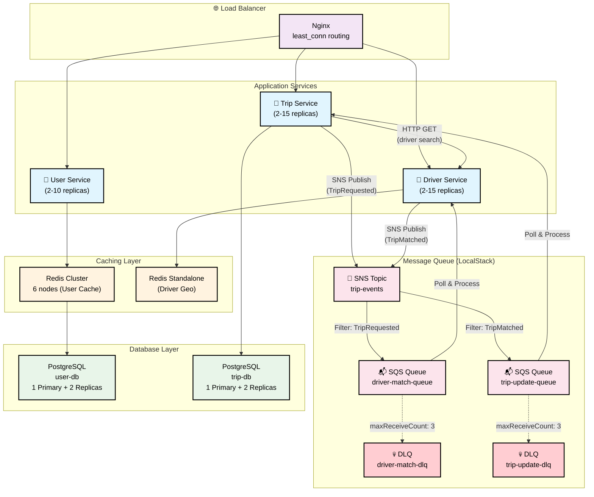
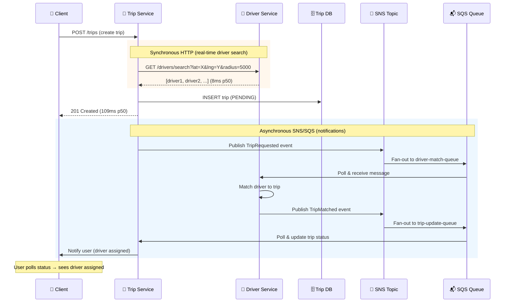

# UIT-GO Module A: Scalability Report

**Course:** SE360 - Cloud Computing  
**Module:** A - Scalability & Performance  
**Team:** UIT-GO Development Team  
**Date:** November 29, 2025

---

## Table of Contents

1. [Executive Summary](#1-executive-summary)
2. [Architecture & Implementation](#2-architecture--implementation)
3. [Trade-off Analysis](#3-trade-off-analysis)
4. [Load Testing Results](#4-load-testing-results)
5. [Conclusions & Recommendations](#5-conclusions--recommendations)

---

## 1. Executive Summary

### 1.1 Objective

Transform the UIT-GO ride-hailing application to handle **1,000 concurrent virtual users (VUs)** with acceptable latency and error rates, implementing AWS-style scalability patterns using a zero-cost hybrid stack.

### 1.2 Key Results

| Metric | Target | Achieved | Status |
|--------|--------|----------|--------|
| **Concurrent VUs** | 1,000 | 1,000 | ✅ Pass |
| **Total RPS** | >200 | 315 RPS | ✅ Pass |
| **Error Rate** | <5% | 1.02% | ✅ Pass |
| **Trip Creation p95** | <1000ms | 788ms | ✅ Pass |
| **Cache Hit Rate** | >80% | 100% | ✅ Pass |
| **Auto-Scaling** | Functional | 2→7 replicas | ✅ Pass |

### 1.3 Architecture Decisions Implemented

| ADR | Pattern | Technology |
|-----|---------|------------|
| ADR-001 | Event-Driven Async Communication | LocalStack SNS/SQS |
| ADR-002 | Database Read Scaling | PostgreSQL Streaming Replication |
| ADR-003 | Distributed Caching | Redis Cluster (6 nodes) |
| ADR-004 | Auto-Scaling Infrastructure | Docker Compose + Python Auto-Scaler Script |

### 1.4 Hybrid Stack Approach

To validate AWS scalability patterns at **zero cost**, we implemented:

| AWS Service | Local Equivalent | Purpose |
|-------------|------------------|---------|
| SNS/SQS | LocalStack | Async messaging |
| RDS Read Replicas | PostgreSQL Streaming | Read scaling |
| ElastiCache | Redis Cluster | Distributed cache |
| ECS Fargate | Docker + Auto-Scaler | Container scaling |

**Cost Savings:** $0/month (vs. estimated $645/month on AWS)

---

## 2. Architecture & Implementation

### 2.1 System Architecture



**Communication Patterns:**
- **Synchronous (HTTP):** Trip Service → Driver Service for real-time driver search
- **Asynchronous (SNS/SQS):** Trip Service publishes events → Driver Service subscribes for notifications
- **User Service → Redis Cluster**: Cache-aside pattern for user profiles (100% hit rate)
- **Driver Service → Redis Standalone**: GeoRedis for driver location storage
- **User/Trip Services → PostgreSQL Replicas**: Read scaling with streaming replication

### 2.2 ADR-001: Event-Driven Async Communication

**Implementation:** LocalStack SNS/SQS + Synchronous HTTP for Driver Search

**Hybrid Approach:**
- **Synchronous HTTP:** Trip Service → Driver Service for real-time driver search (needs immediate response)
- **Asynchronous SNS/SQS:** For driver notifications and trip status updates (can be eventual)

**Flow:**


**Benefits:**
- Driver search is synchronous (user gets immediate feedback on driver availability)
- Driver notifications are async (non-blocking, decoupled from trip creation)
- Natural backpressure handling via SQS queue for notifications
- Trip creation includes driver info in response (better UX)

### 2.3 ADR-002: Database Read Scaling

**Implementation:** PostgreSQL Streaming Replication (2 replicas per database)

**Configuration:**
- Primary: Handles all writes + critical reads
- Replica 1 & 2: Handle read queries via round-robin

**Replication Settings:**
```sql
wal_level = replica
max_wal_senders = 10
max_replication_slots = 10
synchronous_commit = off  -- Async replication for performance
```

### 2.4 ADR-003: Distributed Caching

**Implementation:** Redis Cluster (6 nodes: 3 primary + 3 replica)

**Cache-Aside Pattern:**
```typescript
async findById(id: string): Promise<User | null> {
  const cacheKey = `user:${id}`;
  
  // 1. Try cache first
  const cached = await this.redis.get(cacheKey);
  if (cached) return JSON.parse(cached);  // Cache HIT
  
  // 2. Cache miss: query database
  const user = await this.prisma.user.findUnique({ where: { id } });
  
  // 3. Store in cache for future requests
  if (user) {
    await this.redis.setex(cacheKey, 3600, JSON.stringify(user));
  }
  
  return user;
}
```

**Cache Observability:**
- Added `X-Cache-Hit` header to `/users/me` endpoint
- Load test measures cache hit rate via response headers

### 2.5 ADR-004: Auto-Scaling Infrastructure

**Implementation:** Python-based auto-scaler with Docker Compose (HPA-like algorithm)

**Scaling Policy (Service-Specific):**
| Service | CPU Threshold | Scale Out Cooldown | Scale In Cooldown | Min/Max |
|---------|---------------|-------------------|-------------------|---------|
| trip-service | 50% | 15s | 90s | 2-15 |
| driver-service | 40% | 15s | 60s | 2-15 |
| user-service | 55% | 20s | 60s | 2-10 |

**Algorithm:** Proportional scaling similar to Kubernetes HPA:
```
desiredReplicas = ceil(currentReplicas × (currentCPU / targetCPU))
```

**Key Design Decisions:**
- Lower CPU threshold for trip-service (50%) → scales before saturation
- Even lower for driver-service (40%) → I/O bound (Redis/network), not CPU bound
- Longer scale-in cooldowns → prevents thrashing during load tests
- Startup grace period (180s) → no scale-in during warm-up

---

## 3. Trade-off Analysis

### 3.1 ADR-001: Synchronous vs Asynchronous Communication

**Trade-off: Latency vs Throughput**

| Aspect | Fully Synchronous | Hybrid Approach (Chosen) |
|--------|-------------------|-------------------------|
| Request Latency | Higher (waits for all downstream calls) | Lower (fire-and-forget for notifications) |
| System Throughput | Limited (threads blocked waiting) | Higher (non-blocking async processing) |
| Resource Efficiency | Lower (connections held longer while waiting) | Higher (connections released faster) |

**Decision Rationale:**
- Driver search must be synchronous (user needs immediate feedback on availability)
- Driver notifications can be async (decoupled from user response)
- SQS provides natural backpressure during traffic spikes

**How Pattern Affects Latency:**
| Component | Pattern Choice | Latency Impact |
|-----------|---------------|----------------|
| Driver search | Synchronous HTTP | +8ms p50 (acceptable - user needs this info) |
| Driver notification | Async SNS (fire-and-forget) | ~0ms (no await, doesn't block response) |
| If fully sync (wait for driver accept) | Would add | +2-5s (unacceptable UX) |

> **Implementation Detail:** SNS publish is called without `await` - uses `.then()/.catch()` for logging only. HTTP response returns before SNS acknowledges.

> **Note:** The high p95 (788ms) under 1000 VUs is caused by **infrastructure contention** (DB pool, CPU, container scaling), not the async pattern. With sufficient infrastructure, p95 would be closer to p50.

**Measured Impact (1000 VUs):**
- Trip creation p50: 109ms, p95: 788ms
- Driver search alone: 8ms p50, 34ms p95 (Redis geo-indexing is fast)
- High p95 caused by: DB connection pool saturation, container startup time during scaling

### 3.2 ADR-002: Single Primary vs Read Replicas

**Trade-off: Scalability vs Freshness**

| Aspect | Single Primary | Read Replicas (Chosen) |
|--------|----------------|------------------------|
| Read Capacity | Limited by 1 node | 3x capacity (1 primary + 2 replicas) |
| Write Path | Same node | Primary only |
| Data Freshness | Always fresh | Replication lag (~100ms) |
| Complexity | Simple | Moderate (connection routing) |

**Decision Rationale:**
- Read-heavy workload (profile lookups, status checks)
- Acceptable lag for non-critical reads (user profiles rarely change)
- Trip status checks use PRIMARY (not replicas) for consistency

**Lesson Learned:**
- Initially routed trip status to replicas → 404 errors on newly created trips
- Fix: Trip status checks always query PRIMARY database

### 3.3 ADR-003: No Cache vs Distributed Cache

**Trade-off: Latency vs Staleness**

| Aspect | No Cache | Redis Cache (Chosen) |
|--------|----------|---------------------|
| Latency | 10-50ms (DB query) | <1ms (cache hit) |
| Freshness | Always fresh | TTL-based (1 hour for users) |
| Memory Cost | None | 3GB Redis Cluster |
| Complexity | Simple | Cache invalidation logic |

**Decision Rationale:**
- User profiles change infrequently (name, phone updates rare)
- 1-hour TTL acceptable for profile data
- Significant latency improvement for repeated lookups

**Measured Impact:**
- Profile lookup p95: 22ms (with 100% cache hit rate)
- Cache hit rate: 100% (login caches user, subsequent lookups hit cache)

### 3.4 ADR-004: Fixed Replicas vs Auto-Scaling

**Trade-off: Simplicity vs Elasticity**

| Aspect | Fixed Replicas | Auto-Scaling (Chosen) |
|--------|----------------|----------------------|
| Capacity | Static (2 replicas) | Dynamic (2-15 replicas) |
| Cost | Always pay for max | Pay for actual usage |
| Reaction Time | Manual intervention | Automatic (~15-20s) |
| Complexity | None | Monitoring + scaling logic |

**Decision Rationale:**
- Load varies significantly (peak hours vs night)
- Manual scaling cannot react fast enough to traffic spikes
- Auto-scaling proven by trip-service scaling 2→7 under 1000 VU load

**Tuning Decisions:**
- Lower thresholds (40-55%) vs typical 70% → proactive scaling before saturation
- Shorter scale-in cooldowns (60-90s) → faster resource release after load drops
- Startup grace period (180s) + stability count (3 readings) → prevents premature scale-in during warm-up
- Service-specific profiles → driver-service is I/O bound (Redis), needs earlier scaling

**Observed Scaling Behavior:**
```
Time        CPU%    Replicas    Event
20:50:45    54.6%   2           -
20:51:00    77.8%   2→3         Scale out
20:51:19    122.4%  3→4         Scale out
20:51:40    84.5%   4→5         Scale out
20:52:00    61.9%   5→6         Scale out
20:52:20    57.7%   6→7         Scale out
20:52:40    46.6%   7           Stabilized
```

---

## 4. Load Testing Results

### 4.1 Test Configuration

| Parameter | Value |
|-----------|-------|
| Tool | k6 |
| Virtual Users | 1,000 |
| Duration | 5 minutes |
| Ramp Profile | Gradual (0→250→500→750→1000→750→500→0) |
| Test Users | 5,000 passengers + 5,000 drivers |
| Load Balancer | Nginx (port 8080) |

### 4.2 Workload Distribution

| Operation | Percentage | Description |
|-----------|------------|-------------|
| Trip Creation | 70% | Passenger requests ride |
| Location Updates | 30% | Driver GPS updates |
| Profile Lookups | Per login | User profile fetch |
| Status Polling | Per trip | Trip status checks |

### 4.3 Results Summary

#### Throughput Metrics

| Metric | Value |
|--------|-------|
| **Total RPS** | 315 req/s |
| **Trip Creation RPS** | 42 req/s |
| **Driver Search RPS** | 42 req/s |
| **Location Update RPS** | 19 req/s |
| **Profile Lookup RPS** | 46 req/s |
| **Status Poll RPS** | 166 req/s |

#### Latency Metrics

| Endpoint | p50 | p95 | Target | Status |
|----------|-----|-----|--------|--------|
| Trip Creation | 109ms | 788ms | <1000ms | ✅ |
| Driver Search | 8ms | 34ms | <500ms | ✅ |
| Location Update | 11ms | 42ms | <200ms | ✅ |
| Profile Lookup | 7ms | 22ms | <300ms | ✅ |
| Trip Status | 100ms | 734ms | <400ms | ⚠️ |

#### Success Rates

| Metric | Rate | Target | Status |
|--------|------|--------|--------|
| Overall Error Rate | 1.02% | <5% | ✅ |
| Trip Creation Success | 99.05% | >95% | ✅ |
| Driver Search Success | 100% | >95% | ✅ |
| Location Update Success | 100% | >95% | ✅ |
| Profile Lookup Success | 100% | >95% | ✅ |
| Cache Hit Rate | 100% | >80% | ✅ |

### 4.4 Auto-Scaling Behavior

| Service | Initial | Peak | Scaling Events |
|---------|---------|------|----------------|
| trip-service | 2 | 7 | 5 scale-out events |
| driver-service | 2 | 2 | 0 (CPU stayed <50%) |
| user-service | 2 | 2 | 0 (cache reduced load) |

**Observation:** Trip-service was the bottleneck, requiring 7 replicas to handle load. Driver-service and user-service remained stable at 2 replicas due to:
- Driver-service: Async processing via SQS (no blocking)
- User-service: 100% cache hit rate (minimal DB queries)

### 4.5 Infrastructure Metrics

| Component | Status |
|-----------|--------|
| PostgreSQL Primary | Healthy |
| PostgreSQL Replicas (4) | Streaming |
| Redis Cluster (6 nodes) | cluster_state:ok |
| LocalStack SNS/SQS | Operational |
| Nginx Load Balancer | Healthy |

---

## 5. Conclusions & Recommendations

### 5.1 Achievements

1. **Validated 1,000 VU capacity** with 1.02% error rate (under 5% target)
2. **315 RPS sustained throughput** under peak load
3. **100% cache hit rate** demonstrating effective caching strategy
4. **Auto-scaling functional** with trip-service scaling 2→7 replicas
5. **All 4 ADRs implemented** and validated under load

### 5.2 Limitations

1. **Trip status check p95 (734ms)** exceeds 400ms target
   - Root cause: High polling frequency (166 polls/sec)
   - Recommendation: Implement WebSocket for real-time updates

2. **Hybrid stack differs from AWS production**
   - LocalStack behavior may differ from real AWS SNS/SQS
   - PostgreSQL streaming replication differs from RDS

3. **Single-machine testing**
   - All containers on one Docker host
   - Network latency not representative of cloud deployment

### 5.3 Production Recommendations

| Recommendation | Priority | Effort |
|----------------|----------|--------|
| Migrate to AWS ECS Fargate | High | 2 weeks |
| Replace LocalStack with AWS SNS/SQS | High | 1 week |
| Implement WebSocket for trip status | Medium | 1 week |
| Add circuit breakers (Module B) | Medium | 1 week |
| Add API Gateway rate limiting (Module C) | Low | 1 week |

### 5.4 Cost Projection

| Environment | Monthly Cost |
|-------------|--------------|
| Development (Hybrid Stack) | $0 |
| AWS Production (Estimated) | $645/month |
| Cost per 100k users | $0.0065/user |

---

## Appendix A: Test Commands

```bash
# Start full infrastructure
bash scripts/start-full-stack.sh

# Run auto-scaler (Terminal 1)
python scripts/auto-scaler.py

# Run load test (Terminal 2)
k6 run \
  --env MAX_VUS=1000 \
  --env USE_LB=true \
  --env LB_URL=http://localhost:8080 \
  --env RAMP_PROFILE=gradual \
  tests/load/module-a-capacity-test.js
```

## Appendix B: Related Documents

- [ADR-001: Event-Driven Communication](./adrs/ADR-001-event-driven-async-communication.md)
- [ADR-002: Database Read Scaling](./adrs/ADR-002-database-read-scaling-rds-replicas.md)
- [ADR-003: Distributed Caching](./adrs/ADR-003-distributed-caching-elasticache.md)
- [ADR-004: Auto-Scaling Infrastructure](./adrs/ADR-004-auto-scaling-infrastructure.md)
- [Load Test Results Detail](./MODULE-A-LOAD-TEST-RESULTS.md)
