## **SECTION 2: HIGH LEVEL ARCHITECTURE**

Let me draft all subsections of the High Level Architecture together:

### **2.1 Technical Summary**

UIT-Go implements a **cloud-native microservices architecture** deployed on AWS infrastructure, designed to demonstrate T-shaped engineering skills through a functional ride-hailing platform backend. The system consists of three independent microservices (UserService, TripService, DriverService) communicating via RESTful APIs, each with isolated databases following the Database per Service pattern. Services are containerized using Docker and deployed to AWS ECS (Fargate) for simplified container orchestration without Kubernetes complexity. Infrastructure is fully defined as code using Terraform, including VPC networking, RDS databases, ElastiCache for real-time driver location tracking, Application Load Balancers, and IAM security policies. This architecture prioritizes cost-conscious engineering decisions suitable for academic budgets while maintaining production-ready patterns, with built-in extensibility for Phase 2 specialization modules in Scalability, Reliability, Security, Observability, or FinOps/Automation.

---

### **2.2 Platform and Infrastructure Choice**

After analyzing the PRD requirements and academic constraints, I've identified the following viable platform approaches:

#### **Option 1: AWS Full Stack with ECS Fargate (RECOMMENDED)**

**Pros:**

- Serverless container orchestration - no EC2 management overhead
- Pay-per-use pricing aligns with academic budget constraints
- Native AWS integration (ALB, RDS, ElastiCache, CloudWatch)
- Terraform support is mature and well-documented
- Simpler than EKS, more managed than self-hosted EC2

**Cons:**

- Less control than self-managed EC2
- Cold start considerations for infrequently accessed services
- Slightly higher per-hour costs than EC2 Spot instances (but simpler)

#### **Option 2: AWS with Self-Managed EC2 + Docker Compose**

**Pros:**

- Maximum control and flexibility
- Cost optimization via Spot instances
- Identical to local development environment

**Cons:**

- Manual scaling and health monitoring required
- More operational complexity for academic team
- EC2 instance management overhead

#### **Option 3: AWS with EKS (Kubernetes)**

**Pros:**

- Industry-standard container orchestration
- Best for teams targeting DevOps/Platform engineering careers
- Superior scaling and self-healing capabilities

**Cons:**

- Steep learning curve and operational complexity
- Higher costs (EKS control plane + worker nodes)
- Overkill for three microservices

---

**RECOMMENDATION: AWS with ECS Fargate**

**Rationale:**

-**Balanced complexity:** More AWS-native than Kubernetes, more scalable than raw EC2

-**Cost-effective:** No idle EC2 costs, pay only for task runtime

-**Learning objectives:** Demonstrates containerization, IaC, and managed orchestration

-**Phase 2 ready:** Easy integration with Auto Scaling, X-Ray, CloudWatch for specialization modules

---

**Selected Platform Configuration:**

**Platform:** AWS (us-east-1 or closest region to Vietnam/project team)

**Key Services:**

-**Compute:** ECS Fargate (serverless container orchestration)

-**Networking:** VPC with public/private subnets, NAT Gateway, Application Load Balancer

-**Databases:**

- RDS PostgreSQL (UserService, TripService)
- ElastiCache Redis (DriverService location data with Geospatial commands)

-**Container Registry:** ECR (Elastic Container Registry)

-**Identity:** IAM roles with least-privilege policies for ECS tasks

-**Secrets:** AWS Secrets Manager for database credentials and API keys

-**Monitoring:** CloudWatch Logs + Metrics (baseline), extensible to X-Ray for tracing

**Deployment Regions:**

- Primary: us-east-1 (lowest cost, broadest service availability)
- Alternative: ap-southeast-1 (Singapore, lower latency to Vietnam if team prefers)

---

### **2.3 Repository Structure**

**Structure:** Monorepo

**Rationale:**

- PRD explicitly recommends monorepo for "simplified dependency management and versioning"
- Academic team collaboration is easier with single repository
- Unified CI/CD pipeline for all services
- Shared TypeScript types between services
- Single Terraform codebase for all infrastructure

**Monorepo Tool:** Native npm/pnpm workspaces (no additional tooling overhead)

**Why not Nx/Turborepo?**

- Adds learning curve and complexity
- Three microservices don't require sophisticated build caching
- Keep it simple for academic timeline

**Package Organization:**

```

uit-go-se360/

├── services/

│   ├── user-service/         # UserService microservice

│   ├── trip-service/         # TripService microservice  

│   └── driver-service/       # DriverService microservice

├── packages/

│   ├── shared-types/         # Shared TypeScript interfaces

│   └── common-utils/         # Shared utility functions

├── infrastructure/

│   └── terraform/            # All IaC definitions

├── docs/                     # PRD, architecture, ADRs

└── .github/workflows/        # CI/CD pipelines

```

---

### **2.4 High Level Architecture Diagram**

```mermaid

graph TB

    subgraph "Client Layer"

        API_CLIENT[API Client/Postman<br/>Testing Interface]

    end


    subgraph "AWS Cloud - VPC"

        subgraph "Public Subnet"

            ALB[Application Load Balancer<br/>HTTPS/TLS]

        end


        subgraph "Private Subnet - ECS Fargate"

            USER_SVC[UserService<br/>Node.js/NestJS<br/>Port 3001]

            TRIP_SVC[TripService<br/>Node.js/NestJS<br/>Port 3002]

            DRIVER_SVC[DriverService<br/>Node.js/NestJS<br/>Port 3003]

        end


        subgraph "Data Layer - Private Subnet"

            RDS_USER[(RDS PostgreSQL<br/>UserService DB)]

            RDS_TRIP[(RDS PostgreSQL<br/>TripService DB)]

            REDIS[(ElastiCache Redis<br/>Driver Locations<br/>Geospatial)]

        end


        subgraph "Shared Services"

            SECRETS[Secrets Manager<br/>DB Credentials]

            CLOUDWATCH[CloudWatch<br/>Logs & Metrics]

            ECR[ECR<br/>Container Images]

        end

    end


    API_CLIENT -->|HTTPS| ALB

    ALB -->|/users/*| USER_SVC

    ALB -->|/trips/*| TRIP_SVC

    ALB -->|/drivers/*| DRIVER_SVC


    USER_SVC -.->|REST API| TRIP_SVC

    TRIP_SVC -.->|REST API| DRIVER_SVC


    USER_SVC -->|SQL| RDS_USER

    TRIP_SVC -->|SQL| RDS_TRIP

    DRIVER_SVC -->|GEORADIUS| REDIS


    USER_SVC -.->|Logs| CLOUDWATCH

    TRIP_SVC -.->|Logs| CLOUDWATCH

    DRIVER_SVC -.->|Logs| CLOUDWATCH


    USER_SVC -.->|Fetch Secrets| SECRETS

    TRIP_SVC -.->|Fetch Secrets| SECRETS

    DRIVER_SVC -.->|Fetch Secrets| SECRETS


    style ALB fill:#FF9900

    style USER_SVC fill:#232F3E

    style TRIP_SVC fill:#232F3E

    style DRIVER_SVC fill:#232F3E

    style RDS_USER fill:#527FFF

    style RDS_TRIP fill:#527FFF

    style REDIS fill:#DC382D

```



---

### **2.5 Architectural Patterns**

-**Microservices Architecture:** Independent services with isolated databases - _Rationale:_ PRD mandates service isolation for scalability and Phase 2 specialization flexibility

-**Database per Service:** Each microservice owns its exclusive database schema - _Rationale:_ Prevents tight coupling, enables independent scaling and technology choices per service

-**API Gateway Pattern (via ALB):** Application Load Balancer as single entry point with path-based routing - _Rationale:_ Centralized TLS termination, health checks, and request routing without additional API Gateway costs

-**Repository Pattern:** Abstract data access behind repository interfaces in each service - _Rationale:_ Testability, potential future database migration, clean architecture boundaries

-**Stateless Services:** All services are horizontally scalable with no in-memory session state - _Rationale:_ Enables ECS task scaling for Phase 2 performance module; session state in JWT tokens or Redis if needed

-**Infrastructure as Code (IaC):** 100% Terraform-managed infrastructure with no manual AWS console changes - _Rationale:_ PRD requirement, reproducibility, version control, disaster recovery capability

-**Secrets Management:** All credentials stored in AWS Secrets Manager, injected at runtime - _Rationale:_ Security best practice, prevents credential leaks in code/containers

-**Health Check Pattern:** Each service exposes `/health` endpoint for ALB target group monitoring - _Rationale:_ Automatic unhealthy task replacement by ECS

-**Structured Logging:** JSON-formatted logs to CloudWatch with correlation IDs - _Rationale:_ Enables CloudWatch Insights queries, supports Observability module in Phase 2

---

### **Detailed Rationale:**

**Why ECS Fargate over EKS or EC2:**

-**Learning curve:** EKS requires Kubernetes expertise (pods, deployments, services, ingress) - adds 2-3 weeks to project timeline

-**Cost:** EKS control plane costs $72/month + worker node costs; Fargate is pay-per-task-second

-**Academic focus:** Project emphasizes system design trade-offs, not container orchestration complexity

-**Sufficient for requirements:** Three microservices don't need Kubernetes' advanced features

-**Phase 2 compatibility:** ECS integrates seamlessly with Auto Scaling, X-Ray, CloudWatch for all specialization modules

**Why PostgreSQL (RDS) for UserService and TripService:**

- Strong ACID guarantees for financial data (trip fares, driver earnings)
- Well-understood schema design for user accounts and trip state machines
- Excellent AWS-managed RDS support with automated backups
- Team likely has SQL experience from coursework

**Why Redis (ElastiCache) for DriverService location data:**

- PRD explicitly suggests Redis for "speed-first" approach
- Native `GEORADIUS` command for sub-second nearby driver searches
- Academic budget constraint: Single-node Redis cluster (~$15/month) sufficient for MVP
- Real-time location updates (high write throughput) favor in-memory datastore

**Why NOT DynamoDB for driver locations:**

- Geohashing implementation complexity
- Less intuitive for teams without NoSQL experience
- Cost advantage only emerges at very large scale (beyond project scope)
- Can revisit in Phase 2 Scalability module if team chooses

**Monorepo trade-offs:**

-**Pro:** Single CI/CD pipeline, shared types, atomic commits across services

-**Con:** Entire repo must be cloned for any service development

-**Decision:** Pros outweigh cons for 3-service academic project with single team

**ALB vs API Gateway:**

-**ALB chosen:** Simpler, lower cost ($16/month + data transfer), sufficient for HTTP/HTTPS routing

-**API Gateway skipped:** Adds complexity and cost ($3.50/million requests), features like request validation and rate limiting can be implemented in services if needed for Phase 2

---

**Select 1-9 or just type your question/feedback:**

1.**Proceed to next section** (Tech Stack)

2.**Expand or Contract for Audience** - Adjust technical depth

3.**Explain Reasoning (CoT Step-by-Step)** - Deeper dive into platform selection logic

4.**Critique and Refine** - Challenge these architectural choices

5.**Analyze Logical Flow and Dependencies** - Review architecture coherence

6.**Assess Alignment with Overall Goals** - Verify PRD alignment

7.**Identify Potential Risks and Unforeseen Issues** - What could go wrong?

8.**Challenge from Critical Perspective** - Devil's advocate on ECS vs EKS

9.**Tree of Thoughts Deep Dive** - Explore alternative architecture paths

dieuxuanhien: 1

GitHub Copilot: Perfect! Moving to the Tech Stack section.

---
