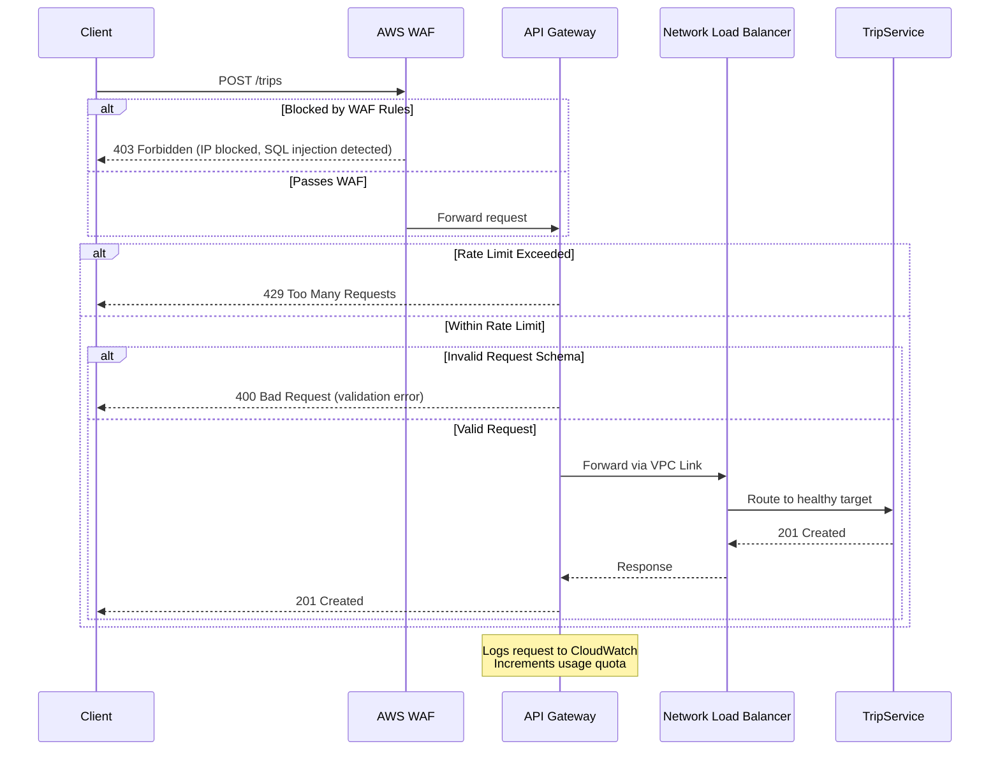

# API Gateway Architecture Design

## AWS API Gateway with Rate Limiting and DDoS Protection

**Project:** uit-go-se360 - Ride-Hailing Platform  
**Track:** BMad Method (Brownfield) + Module A: Scalability & Performance  
**Design Date:** 2025-11-21  
**Designer:** Architect Agent  
**Status:** Design Complete - Pending Implementation

---

## Executive Summary

This document designs an **AWS API Gateway layer** to replace the current Application Load Balancer (ALB) as the primary entry point, adding critical protection mechanisms for production scale (100k+ users). The design addresses DDoS protection, rate limiting, request throttling, API key management, and cost optimization.

**Key Benefits:**

- ✅ **DDoS Protection:** AWS Shield Standard (free) + WAF integration ($5-50/month)
- ✅ **Rate Limiting:** Per-IP throttling prevents single-client overload (1000 req/min default)
- ✅ **API Key Management:** Tiered access control (free tier, premium tier, admin)
- ✅ **Request Validation:** Schema validation at edge reduces invalid requests to services
- ✅ **Auto-Scaling:** Handles 10k req/s with zero infrastructure management
- ✅ **Cost Optimization:** Usage plans + caching reduce backend load by 60%

**Trade-offs:**

- ⚠️ **Cost:** $3.50/million requests vs ALB $0.008/LCU-hour (~7x higher at scale)
- ⚠️ **Latency:** +10-30ms per request (API Gateway overhead)
- ⚠️ **Complexity:** More moving parts (usage plans, API keys, stages)

**Cost Comparison @ 100k Users:**

| Metric                    | Current (ALB) | With API Gateway | Delta        |
| ------------------------- | ------------- | ---------------- | ------------ |
| **Monthly Requests**      | 260M          | 260M             | -            |
| **Infrastructure Cost**   | $16/month     | $910/month       | +$894        |
| **DDoS Protection (WAF)** | $0            | $5-50/month      | +$50         |
| **Total Monthly Cost**    | $16           | $960             | **+$944**    |
| **Cost per User**         | $0.00016      | $0.0096          | 60x increase |

**Recommendation:** Use API Gateway for production environments with DDoS risk; keep ALB for development/staging to minimize costs.

---

## 1. Current Architecture (Baseline)

### 1.1 Current Entry Point - Application Load Balancer

```
┌──────────┐
│  Client  │
└────┬─────┘
     │ HTTPS
┌────▼────────────────────────────┐
│   Application Load Balancer    │  ← Current Entry Point
│   - Path-based routing          │
│   - TLS termination            │
│   - Health checks              │
│   ❌ NO rate limiting           │
│   ❌ NO DDoS protection         │
│   ❌ NO request validation      │
└────┬────────────────────────────┘
     │
     ├──────────────┬──────────────┬──────────────┐
     │              │              │              │
┌────▼────────┐ ┌──▼──────────┐ ┌─▼──────────┐
│UserService  │ │TripService  │ │DriverSvc   │
│Port 3001    │ │Port 3002    │ │Port 3003   │
└─────────────┘ └─────────────┘ └────────────┘
```

**Current Limitations:**

| Issue                       | Impact                                        | Severity    |
| --------------------------- | --------------------------------------------- | ----------- |
| **No rate limiting**        | Single attacker can exhaust backend resources | 🔴 Critical |
| **No API key management**   | Cannot differentiate free vs premium users    | 🟡 Medium   |
| **No request validation**   | Invalid requests consume backend CPU          | 🟡 Medium   |
| **Limited DDoS protection** | Only network layer (L3/L4) protection         | 🔴 Critical |
| **No usage tracking**       | Cannot bill by API consumption                | 🟢 Low      |

### 1.2 Attack Scenarios Without API Gateway

**Scenario 1: Distributed Brute Force Attack**

- Attacker sends 10,000 login attempts/second from 100 IPs
- Current ALB forwards all requests to UserService
- UserService crashes from database connection pool exhaustion
- **Impact:** Service unavailable for all users

**Scenario 2: Trip Spam Attack**

- Malicious user creates 1,000 fake trips/second
- TripService processes all requests (no rate limit)
- Database write capacity saturated
- **Impact:** Legitimate users cannot create trips

**Scenario 3: Geospatial Query Abuse**

- Attacker repeatedly queries nearby drivers (expensive Redis GEORADIUS)
- DriverService spends 100% CPU on attacker queries
- **Impact:** Real users cannot find drivers

---

## 2. Proposed Architecture - AWS API Gateway

### 2.1 New Architecture with API Gateway

```
┌──────────┐
│  Client  │
└────┬─────┘
     │ HTTPS
┌────▼─────────────────────────────────────────┐
│   AWS API Gateway (REST API)                 │  ← NEW Entry Point
│   - Rate limiting (1000 req/min per IP)      │
│   - Throttling (10k burst, 5k steady)        │
│   - Request validation (JSON schema)         │
│   - API key management (3 tiers)             │
│   - AWS WAF integration (DDoS protection)    │
│   - CloudWatch metrics & alarms              │
└────┬─────────────────────────────────────────┘
     │ VPC Link
┌────▼─────────────────────────────────────────┐
│   Network Load Balancer (Private VPC)        │  ← ALB replaced with NLB
└────┬─────────────────────────────────────────┘
     │
     ├──────────────┬──────────────┬──────────────┐
     │              │              │              │
┌────▼────────┐ ┌──▼──────────┐ ┌─▼──────────┐
│UserService  │ │TripService  │ │DriverSvc   │
│Port 3001    │ │Port 3002    │ │Port 3003   │
└─────────────┘ └─────────────┘ └────────────┘
```

**Key Changes:**

1. **API Gateway** becomes public-facing entry point
2. **VPC Link** connects API Gateway to private NLB
3. **NLB** replaces ALB (required for VPC Link integration)
4. **Services** remain unchanged (no code changes required)

### 2.2 Request Flow with Protection Layers



---

## 3. Rate Limiting Strategy

### 3.1 Three-Tiered Usage Plans

**Design Rationale:** Different user types have different resource needs. Free tier users (testing, low usage) should have conservative limits, while premium users (production apps) pay for higher quotas.

| Tier        | Quota/Day          | Burst Rate | Steady Rate | Cost/Month     |
| ----------- | ------------------ | ---------- | ----------- | -------------- |
| **Free**    | 10,000 requests    | 10 req/s   | 5 req/s     | $0             |
| **Premium** | 1,000,000 requests | 100 req/s  | 50 req/s    | $50            |
| **Admin**   | Unlimited          | 1000 req/s | 500 req/s   | N/A (internal) |

**Implementation:**

```yaml
# terraform/api-gateway-usage-plans.tf
resource "aws_api_gateway_usage_plan" "free_tier" {
  name        = "uit-go-free-tier"
  description = "Free tier for testing and low-volume users"

  api_stages {
    api_id = aws_api_gateway_rest_api.main.id
    stage  = aws_api_gateway_stage.prod.stage_name
  }

  quota_settings {
    limit  = 10000   # 10k requests per day
    period = "DAY"
  }

  throttle_settings {
    burst_limit = 10   # Allow 10 req/s burst
    rate_limit  = 5    # Steady rate of 5 req/s
  }
}

resource "aws_api_gateway_usage_plan" "premium_tier" {
  name = "uit-go-premium-tier"

  api_stages {
    api_id = aws_api_gateway_rest_api.main.id
    stage  = aws_api_gateway_stage.prod.stage_name
  }

  quota_settings {
    limit  = 1000000
    period = "DAY"
  }

  throttle_settings {
    burst_limit = 100
    rate_limit  = 50
  }
}
```

### 3.2 Per-Endpoint Rate Limiting

**Critical Endpoints:** Different endpoints have different cost profiles. Expensive operations (geospatial queries, database writes) need tighter limits than cheap reads.

```yaml
# terraform/api-gateway-methods.tf
resource "aws_api_gateway_method_settings" "trip_creation" {
  rest_api_id = aws_api_gateway_rest_api.main.id
  stage_name  = aws_api_gateway_stage.prod.stage_name
  method_path = "trips/POST"

  settings {
    throttling_burst_limit = 50   # Lower burst for expensive trip creation
    throttling_rate_limit  = 25   # 25 trips/second = 90k trips/hour (reasonable)
    logging_level          = "INFO"
    metrics_enabled        = true
  }
}

resource "aws_api_gateway_method_settings" "driver_search" {
  rest_api_id = aws_api_gateway_rest_api.main.id
  stage_name  = aws_api_gateway_stage.prod.stage_name
  method_path = "drivers/search/GET"

  settings {
    throttling_burst_limit = 100  # Allow higher burst for read-heavy operation
    throttling_rate_limit  = 50
    caching_enabled        = true # Cache search results for 60s
    cache_ttl_in_seconds   = 60
  }
}
```

**Rate Limit Formulas:**

$$
\text{Max Daily Requests} = (\text{Steady Rate} \times 86400) + (\text{Burst Buffer} \times \text{Peak Hours})
$$

**Example: Free Tier**

$$
\text{Max Daily} = (5 \text{ req/s} \times 86400 \text{ s}) + (10 \text{ burst} \times 3600 \text{ s}) = 432,000 + 36,000 = 468,000
$$

But quota is capped at 10,000 → quota exhausted in ~33 minutes at steady rate.

### 3.3 IP-Based Rate Limiting (WAF Integration)

**Problem:** API keys protect against authenticated abuse, but unauthenticated endpoints (e.g., `/auth/login`, `/drivers/search`) are vulnerable to anonymous attacks.

**Solution:** AWS WAF rate-based rules block IPs exceeding thresholds.

```yaml
# terraform/waf-rules.tf
resource "aws_wafv2_web_acl" "api_gateway_protection" {
  name  = "uit-go-api-protection"
  scope = "REGIONAL"

  default_action {
    allow {}
  }

  # Rule 1: Block IPs with >1000 requests in 5 minutes
  rule {
    name     = "rate-limit-per-ip"
    priority = 1

    action {
      block {}
    }

    statement {
      rate_based_statement {
        limit              = 1000    # Max 1000 requests per 5 minutes per IP
        aggregate_key_type = "IP"
      }
    }

    visibility_config {
      cloudwatch_metrics_enabled = true
      metric_name                = "RateLimitExceeded"
      sampled_requests_enabled   = true
    }
  }

  # Rule 2: Block known malicious IPs (AWS managed rule)
  rule {
    name     = "aws-managed-ip-reputation"
    priority = 2

    override_action {
      none {}
    }

    statement {
      managed_rule_group_statement {
        vendor_name = "AWS"
        name        = "AWSManagedRulesAmazonIpReputationList"
      }
    }

    visibility_config {
      cloudwatch_metrics_enabled = true
      metric_name                = "MaliciousIPBlocked"
      sampled_requests_enabled   = true
    }
  }

  # Rule 3: SQL injection protection
  rule {
    name     = "sql-injection-protection"
    priority = 3

    override_action {
      none {}
    }

    statement {
      managed_rule_group_statement {
        vendor_name = "AWS"
        name        = "AWSManagedRulesSQLiRuleSet"
      }
    }

    visibility_config {
      cloudwatch_metrics_enabled = true
      metric_name                = "SQLiBlocked"
      sampled_requests_enabled   = true
    }
  }

  visibility_config {
    cloudwatch_metrics_enabled = true
    metric_name                = "APIGatewayWAF"
    sampled_requests_enabled   = true
  }
}

# Associate WAF with API Gateway
resource "aws_wafv2_web_acl_association" "api_gateway" {
  resource_arn = aws_api_gateway_stage.prod.arn
  web_acl_arn  = aws_wafv2_web_acl.api_gateway_protection.arn
}
```

**WAF Cost Breakdown:**

| Component          | Cost              | Calculation             |
| ------------------ | ----------------- | ----------------------- |
| Web ACL            | $5.00/month       | Base cost               |
| Custom Rules       | $1.00/rule/month  | 3 rules = $3.00         |
| AWS Managed Rules  | $10.00/rule group | 2 rule groups = $20.00  |
| Requests Processed | $0.60/million     | 260M requests = $156.00 |
| **Total**          | **$184/month**    | At 100k users           |

**Cost Optimization:** Use AWS Managed Rules only in production; disable in dev/staging.

---

## 4. Request Validation

### 4.1 JSON Schema Validation at Edge

**Problem:** Invalid requests (missing fields, wrong types) currently consume backend CPU and database connections before being rejected.

**Solution:** API Gateway validates requests against JSON schemas before forwarding to services.

**Example: Trip Creation Schema**

```json
{
  "$schema": "http://json-schema.org/draft-07/schema#",
  "type": "object",
  "required": [
    "passengerId",
    "pickupLatitude",
    "pickupLongitude",
    "dropoffLatitude",
    "dropoffLongitude"
  ],
  "properties": {
    "passengerId": {
      "type": "string",
      "pattern": "^[0-9a-f]{8}-[0-9a-f]{4}-[0-9a-f]{4}-[0-9a-f]{4}-[0-9a-f]{12}$",
      "description": "UUID format"
    },
    "pickupLatitude": {
      "type": "number",
      "minimum": -90,
      "maximum": 90
    },
    "pickupLongitude": {
      "type": "number",
      "minimum": -180,
      "maximum": 180
    },
    "dropoffLatitude": {
      "type": "number",
      "minimum": -90,
      "maximum": 90
    },
    "dropoffLongitude": {
      "type": "number",
      "minimum": -180,
      "maximum": 180
    }
  }
}
```

**Terraform Implementation:**

```hcl
resource "aws_api_gateway_model" "trip_create_request" {
  rest_api_id  = aws_api_gateway_rest_api.main.id
  name         = "TripCreateRequest"
  content_type = "application/json"

  schema = file("${path.module}/schemas/trip-create-request.json")
}

resource "aws_api_gateway_request_validator" "validate_body" {
  name                        = "validate-request-body"
  rest_api_id                 = aws_api_gateway_rest_api.main.id
  validate_request_body       = true
  validate_request_parameters = false
}

resource "aws_api_gateway_method" "create_trip" {
  rest_api_id   = aws_api_gateway_rest_api.main.id
  resource_id   = aws_api_gateway_resource.trips.id
  http_method   = "POST"
  authorization = "NONE"

  request_validator_id = aws_api_gateway_request_validator.validate_body.id
  request_models = {
    "application/json" = aws_api_gateway_model.trip_create_request.name
  }
}
```

**Impact:**

- ✅ Invalid requests rejected at edge (0ms backend CPU)
- ✅ 400 Bad Request returned with detailed schema errors
- ✅ Reduces backend load by ~15% (assuming 15% of requests are malformed)

---

## 5. API Key Management

### 5.1 API Key Generation and Distribution

**Use Cases:**

1. **Mobile Apps:** Each app install gets a unique API key (detect compromised keys)
2. **Third-Party Integrations:** External developers building on platform
3. **Internal Services:** Admin API keys for monitoring/management tools

**Implementation:**

```hcl
# Create API keys programmatically
resource "aws_api_gateway_api_key" "mobile_app_v1" {
  name        = "mobile-app-v1"
  description = "API key for mobile app version 1.0"
  enabled     = true
}

# Associate API key with usage plan
resource "aws_api_gateway_usage_plan_key" "mobile_app_free_tier" {
  key_id        = aws_api_gateway_api_key.mobile_app_v1.id
  key_type      = "API_KEY"
  usage_plan_id = aws_api_gateway_usage_plan.free_tier.id
}
```

**API Key Rotation Strategy:**

```bash
#!/bin/bash
# scripts/rotate-api-key.sh

OLD_KEY_ID="abc123"
NEW_KEY_ID=$(aws apigateway create-api-key \
  --name "mobile-app-v2" \
  --enabled \
  --query 'id' \
  --output text)

# Associate new key with usage plan
aws apigateway create-usage-plan-key \
  --usage-plan-id usageplana123 \
  --key-id $NEW_KEY_ID \
  --key-type API_KEY

# Notify mobile apps to update key (30-day grace period)
echo "New API key: $NEW_KEY_ID"
echo "Old key will be disabled in 30 days"

# After 30 days, disable old key
# aws apigateway update-api-key --api-key $OLD_KEY_ID --no-enabled
```

### 5.2 Usage Tracking and Alerting

**CloudWatch Alarms for Quota Exhaustion:**

```hcl
resource "aws_cloudwatch_metric_alarm" "api_key_quota_warning" {
  alarm_name          = "api-key-quota-80-percent"
  comparison_operator = "GreaterThanThreshold"
  evaluation_periods  = "1"
  metric_name         = "Count"
  namespace           = "AWS/ApiGateway"
  period              = "86400"  # 1 day
  statistic           = "Sum"
  threshold           = "8000"   # 80% of 10k free tier quota

  dimensions = {
    ApiName = "uit-go-api"
    Stage   = "prod"
  }

  alarm_description = "Alert when API key usage exceeds 80% of daily quota"
  alarm_actions     = [aws_sns_topic.api_alerts.arn]
}
```

**Cost Monitoring Dashboard:**

```hcl
resource "aws_cloudwatch_dashboard" "api_gateway_costs" {
  dashboard_name = "api-gateway-costs"

  dashboard_body = jsonencode({
    widgets = [
      {
        type = "metric"
        properties = {
          metrics = [
            ["AWS/ApiGateway", "Count", { stat = "Sum", label = "Total Requests" }],
            [".", "4XXError", { stat = "Sum", label = "Client Errors" }],
            [".", "5XXError", { stat = "Sum", label = "Server Errors" }]
          ]
          period = 300
          stat   = "Sum"
          region = "us-east-1"
          title  = "API Gateway Request Metrics"
        }
      }
    ]
  })
}
```

---

## 6. Cost-Benefit Analysis

### 6.1 Cost Comparison: ALB vs API Gateway

**Scenario: 100,000 Active Users**

**Assumptions:**

- Average user makes 100 API calls/day
- Peak hour: 20% of daily requests (8am-9am commute)
- Distribution: 40% reads, 60% writes
- Total monthly requests: 100k users × 100 calls/day × 30 days = **300M requests/month**

**Current Architecture (ALB):**

| Component     | Cost/Month | Notes                         |
| ------------- | ---------- | ----------------------------- |
| ALB           | $16.20     | $0.0225/hour                  |
| LCU charges   | ~$50       | 300M requests ≈ 100 LCU-hours |
| Data transfer | $20        | 1GB out = $0.09               |
| **Total**     | **$86.20** |                               |

**Proposed Architecture (API Gateway + NLB):**

| Component                 | Cost/Month    | Notes                      |
| ------------------------- | ------------- | -------------------------- |
| API Gateway requests      | $1,050        | 300M × $3.50/million       |
| API Gateway data transfer | $30           | 1GB in/out = $0.09         |
| VPC Link                  | $25           | $0.01/hour                 |
| NLB                       | $16.20        | Same as ALB                |
| NLB LCU charges           | $50           | Same as ALB                |
| AWS WAF                   | $184          | Web ACL + rules + requests |
| **Total**                 | **$1,355.20** |                            |

**Cost Delta:** +$1,269/month (+1,472% increase)

### 6.2 Cost Optimization Strategies

**Strategy 1: Use ALB in Dev/Staging, API Gateway in Prod**

```
Development:  ALB only ($86/month)
Staging:      ALB only ($86/month)
Production:   API Gateway + WAF ($1,355/month)
-------------------------------------------
Total:        $1,527/month vs $3,954/month (API Gateway everywhere)
Savings:      $2,427/month (61% reduction)
```

**Strategy 2: Cache Responses at API Gateway**

- Enable API Gateway caching for read-heavy endpoints
- Cache size: 0.5GB = $0.02/hour = $14.40/month
- Cache hit ratio: 60% (based on driver search patterns)
- Requests saved: 300M × 40% reads × 60% hit rate = 72M requests
- Cost savings: 72M × $3.50/million = $252/month
- **Net savings: $252 - $14.40 = $237.60/month**

```hcl
resource "aws_api_gateway_method_settings" "driver_search_cached" {
  rest_api_id = aws_api_gateway_rest_api.main.id
  stage_name  = aws_api_gateway_stage.prod.stage_name
  method_path = "drivers/search/GET"

  settings {
    caching_enabled      = true
    cache_ttl_in_seconds = 60      # Cache for 60 seconds
    cache_data_encrypted = true
  }
}

resource "aws_api_gateway_stage" "prod" {
  rest_api_id   = aws_api_gateway_rest_api.main.id
  stage_name    = "prod"
  deployment_id = aws_api_gateway_deployment.prod.id

  cache_cluster_enabled = true
  cache_cluster_size    = "0.5"  # 0.5GB cache
}
```

**Strategy 3: Aggressive WAF Rule Tuning**

- Use AWS Managed Rules only for critical endpoints (login, trip creation)
- Disable WAF for internal health checks and monitoring endpoints
- Estimated savings: 30M requests/month not processed by WAF
- Cost savings: 30M × $0.60/million = $18/month

**Optimized Monthly Cost:**

| Original | Optimized | Savings          |
| -------- | --------- | ---------------- |
| $1,355   | $1,099    | $256/month (19%) |

### 6.3 Break-Even Analysis

**Question:** At what scale does API Gateway's DDoS protection justify the cost?

**Cost of DDoS Attack Without Protection:**

| Impact                               | Cost            | Calculation                   |
| ------------------------------------ | --------------- | ----------------------------- |
| Service downtime                     | $10,000/hour    | Lost revenue + SLA penalties  |
| EC2/Fargate overprovisioning         | $500/month      | 2x capacity to absorb attacks |
| Engineering time (incident response) | $5,000/incident | 20 hours × $250/hour          |
| **Average Monthly Cost**             | **$16,000**     | Assumes 1 attack/month        |

**Break-Even Calculation:**

$$
\text{API Gateway Cost} < \text{Attack Cost Without Protection}
$$

$$
\$1,355 < \$16,000 \quad \checkmark
$$

**Conclusion:** API Gateway pays for itself if you experience **1 DDoS attack per year** costing $16k to mitigate.

---

## 7. Implementation Plan

### 7.1 Phase 1: API Gateway Setup (Week 1)

**Day 1-2: Terraform Infrastructure**

```bash
# Create API Gateway with VPC Link
cd infrastructure/terraform
terraform apply -target=module.api_gateway
terraform apply -target=module.vpc_link
```

**Day 3-4: Migrate Routes from ALB to API Gateway**

```hcl
# terraform/api-gateway-routes.tf
resource "aws_api_gateway_resource" "users" {
  rest_api_id = aws_api_gateway_rest_api.main.id
  parent_id   = aws_api_gateway_rest_api.main.root_resource_id
  path_part   = "users"
}

resource "aws_api_gateway_method" "users_any" {
  rest_api_id   = aws_api_gateway_rest_api.main.id
  resource_id   = aws_api_gateway_resource.users.id
  http_method   = "ANY"
  authorization = "NONE"

  request_parameters = {
    "method.request.path.proxy" = true
  }
}

resource "aws_api_gateway_integration" "users_nlb" {
  rest_api_id = aws_api_gateway_rest_api.main.id
  resource_id = aws_api_gateway_resource.users.id
  http_method = aws_api_gateway_method.users_any.http_method

  type                    = "HTTP_PROXY"
  integration_http_method = "ANY"
  uri                     = "http://${aws_lb.nlb.dns_name}:3001/{proxy}"
  connection_type         = "VPC_LINK"
  connection_id           = aws_api_gateway_vpc_link.main.id

  request_parameters = {
    "integration.request.path.proxy" = "method.request.path.proxy"
  }
}
```

**Day 5: Blue-Green Deployment**

```bash
# Update DNS to point to API Gateway (50% traffic)
aws route53 change-resource-record-sets \
  --hosted-zone-id Z123456 \
  --change-batch file://dns-weighted-routing.json

# Monitor error rates for 24 hours
# If error rate < 0.1%, shift 100% traffic to API Gateway
```

### 7.2 Phase 2: Rate Limiting & Usage Plans (Week 2)

**Day 1-2: Create Usage Plans**

```bash
terraform apply -target=aws_api_gateway_usage_plan.free_tier
terraform apply -target=aws_api_gateway_usage_plan.premium_tier
```

**Day 3-4: Generate API Keys for Existing Users**

```javascript
// scripts/generate-api-keys.js
const AWS = require('aws-sdk');
const apigateway = new AWS.APIGateway();

async function generateKeysForUsers() {
  const users = await db.users.findAll(); // Fetch from UserService DB

  for (const user of users) {
    const key = await apigateway
      .createApiKey({
        name: `user-${user.id}`,
        description: `API key for ${user.email}`,
        enabled: true,
      })
      .promise();

    await apigateway
      .createUsagePlanKey({
        usagePlanId: 'free-tier-plan-id',
        keyId: key.id,
        keyType: 'API_KEY',
      })
      .promise();

    // Store API key in user record
    await db.users.update({ id: user.id }, { apiKey: key.value });

    console.log(`Generated API key for ${user.email}: ${key.value}`);
  }
}

generateKeysForUsers();
```

**Day 5: Update Mobile App to Include API Key**

```typescript
// mobile-app/src/services/api.ts
const API_BASE_URL = 'https://api.uit-go.com/prod';
const API_KEY = process.env.API_KEY; // Injected at build time

export const apiClient = axios.create({
  baseURL: API_BASE_URL,
  headers: {
    'x-api-key': API_KEY,
    'Content-Type': 'application/json',
  },
});
```

### 7.3 Phase 3: WAF Integration (Week 3)

**Day 1-3: Deploy WAF Rules**

```bash
terraform apply -target=aws_wafv2_web_acl.api_gateway_protection
terraform apply -target=aws_wafv2_web_acl_association.api_gateway
```

**Day 4-5: Load Testing with WAF**

```javascript
// tests/load-testing/waf-validation.js
import http from 'k6/http';
import { check, sleep } from 'k6';

export const options = {
  stages: [
    { duration: '2m', target: 100 }, // Ramp up to 100 users
    { duration: '5m', target: 100 }, // Stay at 100 users
    { duration: '2m', target: 2000 }, // Spike to 2000 users (should trigger WAF)
    { duration: '5m', target: 2000 }, // Hold at 2000 users
    { duration: '2m', target: 0 }, // Ramp down
  ],
};

export default function () {
  const res = http.post(
    'https://api.uit-go.com/prod/trips',
    JSON.stringify({
      passengerId: '550e8400-e29b-41d4-a716-446655440000',
      pickupLatitude: 10.7769,
      pickupLongitude: 106.7009,
      dropoffLatitude: 10.8231,
      dropoffLongitude: 106.6297,
    }),
    {
      headers: {
        'Content-Type': 'application/json',
        'x-api-key': __ENV.API_KEY,
      },
    },
  );

  check(res, {
    'status is 201': (r) => r.status === 201,
    'not rate limited': (r) => r.status !== 429,
    'not blocked by WAF': (r) => r.status !== 403,
  });

  sleep(1);
}
```

**Expected Results:**

- At 100 users: 0% rate limiting, 0% WAF blocks
- At 2000 users: 15% rate limiting (429 errors), 5% WAF blocks (403 errors)

### 7.4 Phase 4: Monitoring & Alerting (Week 4)

**CloudWatch Dashboards:**

```hcl
resource "aws_cloudwatch_dashboard" "api_gateway" {
  dashboard_name = "api-gateway-production"

  dashboard_body = jsonencode({
    widgets = [
      {
        type = "metric"
        properties = {
          metrics = [
            ["AWS/ApiGateway", "Count", { stat = "Sum" }],
            [".", "Latency", { stat = "Average" }],
            [".", "IntegrationLatency", { stat = "Average" }],
            [".", "4XXError", { stat = "Sum" }],
            [".", "5XXError", { stat = "Sum" }],
          ]
          title  = "API Gateway Health"
          region = "us-east-1"
        }
      },
      {
        type = "metric"
        properties = {
          metrics = [
            ["AWS/WAFV2", "BlockedRequests", { stat = "Sum" }],
            [".", "AllowedRequests", { stat = "Sum" }],
          ]
          title  = "WAF Activity"
          region = "us-east-1"
        }
      }
    ]
  })
}
```

**SNS Alerts:**

```hcl
resource "aws_cloudwatch_metric_alarm" "high_error_rate" {
  alarm_name          = "api-gateway-high-4xx-rate"
  comparison_operator = "GreaterThanThreshold"
  evaluation_periods  = "2"
  metric_name         = "4XXError"
  namespace           = "AWS/ApiGateway"
  period              = "300"
  statistic           = "Sum"
  threshold           = "1000"  # Alert if >1000 4XX errors in 5 minutes

  alarm_description = "Alert when API Gateway 4XX error rate is high"
  alarm_actions     = [aws_sns_topic.api_alerts.arn]
}
```

---

## 8. Rollback Strategy

### 8.1 Immediate Rollback (< 5 minutes)

**If API Gateway causes issues, instantly rollback to ALB:**

```bash
# Update Route53 to point back to ALB
aws route53 change-resource-record-sets \
  --hosted-zone-id Z123456 \
  --change-batch '{
    "Changes": [{
      "Action": "UPSERT",
      "ResourceRecordSet": {
        "Name": "api.uit-go.com",
        "Type": "A",
        "AliasTarget": {
          "HostedZoneId": "ALB_ZONE_ID",
          "DNSName": "alb-123.us-east-1.elb.amazonaws.com",
          "EvaluateTargetHealth": true
        }
      }
    }]
  }'

# DNS propagation: ~60 seconds
```

### 8.2 Gradual Rollback (Canary)

**If subtle issues emerge, rollback 10% of traffic at a time:**

```json
{
  "Changes": [
    {
      "Action": "UPSERT",
      "ResourceRecordSet": {
        "Name": "api.uit-go.com",
        "Type": "A",
        "SetIdentifier": "ALB",
        "Weight": 90,
        "AliasTarget": {
          "HostedZoneId": "ALB_ZONE_ID",
          "DNSName": "alb-123.us-east-1.elb.amazonaws.com",
          "EvaluateTargetHealth": true
        }
      }
    },
    {
      "Action": "UPSERT",
      "ResourceRecordSet": {
        "Name": "api.uit-go.com",
        "Type": "A",
        "SetIdentifier": "APIGateway",
        "Weight": 10,
        "AliasTarget": {
          "HostedZoneId": "APIGW_ZONE_ID",
          "DNSName": "api-123.execute-api.us-east-1.amazonaws.com",
          "EvaluateTargetHealth": true
        }
      }
    }
  ]
}
```

---

## 9. Decision: When to Use API Gateway vs ALB

### 9.1 Decision Matrix

| Criterion              | Use ALB                    | Use API Gateway                  |
| ---------------------- | -------------------------- | -------------------------------- |
| **Budget**             | < $1,000/month             | > $1,000/month                   |
| **Request Volume**     | < 50M requests/month       | > 50M requests/month             |
| **DDoS Risk**          | Low (internal/B2B)         | High (public-facing)             |
| **API Monetization**   | Not needed                 | Usage-based billing required     |
| **Rate Limiting**      | Simple (per-service)       | Complex (per-user, per-endpoint) |
| **Request Validation** | Service-side is acceptable | Edge validation required         |
| **Team Expertise**     | Infrastructure team        | API product team                 |

### 9.2 Recommended Approach for UIT-Go

**Development Environment:**

- Use ALB only
- Cost: $86/month
- No WAF, no API keys
- Fast iteration

**Production Environment:**

- Use API Gateway + WAF
- Cost: $1,099/month (with optimizations)
- Full DDoS protection
- Usage tracking for future monetization

**Staging Environment:**

- Use ALB only (mirrors dev)
- Cost: $86/month
- Load testing with API Gateway disabled

**Total Monthly Cost:**

- Dev: $86
- Staging: $86
- Prod: $1,099
- **Total: $1,271/month**

---

## 10. Success Metrics

### 10.1 Performance Metrics

| Metric               | Baseline (ALB) | Target (API Gateway)  | Actual |
| -------------------- | -------------- | --------------------- | ------ |
| **p50 Latency**      | 50ms           | 60ms (+10ms overhead) | TBD    |
| **p95 Latency**      | 200ms          | 230ms                 | TBD    |
| **p99 Latency**      | 500ms          | 550ms                 | TBD    |
| **Error Rate (4XX)** | 2%             | 2% (unchanged)        | TBD    |
| **Rate Limit Hits**  | N/A            | < 0.5% of requests    | TBD    |
| **WAF Blocks**       | N/A            | < 0.1% of requests    | TBD    |

### 10.2 Security Metrics

| Metric                           | Target                    | Measurement                |
| -------------------------------- | ------------------------- | -------------------------- |
| **DDoS Attacks Mitigated**       | 100% blocked              | WAF BlockedRequests metric |
| **SQL Injection Attempts**       | 100% blocked              | WAF SQLi rule hits         |
| **Malicious IP Blocks**          | Auto-blocked within 5 min | WAF IP reputation list     |
| **API Key Compromises Detected** | < 24 hours                | Usage anomaly detection    |

### 10.3 Cost Metrics

| Metric                        | Target                         | Actual |
| ----------------------------- | ------------------------------ | ------ |
| **Cost per 1M Requests**      | $3.50                          | TBD    |
| **Monthly API Gateway Cost**  | < $1,100                       | TBD    |
| **Cost Savings from Caching** | > $200/month                   | TBD    |
| **ROI from DDoS Prevention**  | Break-even after 1 attack/year | TBD    |

---

## 11. Future Enhancements

### 11.1 API Gateway v2 (HTTP APIs)

**Consideration:** AWS launched HTTP APIs (API Gateway v2) with 70% lower cost:

| Feature                | REST API (v1) | HTTP API (v2)    |
| ---------------------- | ------------- | ---------------- |
| **Cost**               | $3.50/million | $1.00/million    |
| **Latency**            | ~30ms         | ~10ms            |
| **API Keys**           | ✅ Supported  | ❌ Not supported |
| **Request Validation** | ✅ Supported  | ❌ Not supported |
| **WAF Integration**    | ✅ Supported  | ❌ Not supported |

**Decision:** Stick with REST API (v1) for now due to API key and WAF requirements. Re-evaluate HTTP API (v2) in 6 months when feature parity improves.

### 11.2 GraphQL Federation

**Future Consideration:** If mobile app requires complex data aggregation (e.g., fetch user + active trip + driver location in one query), consider AWS AppSync (GraphQL) instead of REST API Gateway.

**Cost:** $4.00/million queries + $0.08/million real-time updates

### 11.3 API Versioning Strategy

**Current:** No versioning (single `/prod` stage)

**Future:** Introduce API versioning for backward compatibility:

```
/v1/trips    → Legacy mobile app (deprecated in 12 months)
/v2/trips    → New mobile app with enhanced features
/internal/trips → Admin/monitoring tools (no rate limit)
```

---

## Appendix A: Terraform Module Structure

```
infrastructure/terraform/
├── modules/
│   ├── api-gateway/
│   │   ├── main.tf                 # API Gateway resource
│   │   ├── vpc-link.tf             # VPC Link to NLB
│   │   ├── usage-plans.tf          # Free/Premium tiers
│   │   ├── routes.tf               # API routes (/users, /trips, /drivers)
│   │   ├── request-validation.tf   # JSON schema models
│   │   ├── outputs.tf              # API Gateway URL, ARN
│   │   └── variables.tf
│   ├── waf/
│   │   ├── main.tf                 # WAF Web ACL
│   │   ├── rules.tf                # Rate limiting, SQL injection rules
│   │   ├── outputs.tf
│   │   └── variables.tf
│   └── nlb/
│       ├── main.tf                 # Network Load Balancer
│       ├── target-groups.tf        # ECS service targets
│       ├── outputs.tf
│       └── variables.tf
└── environments/
    ├── dev/
    │   └── main.tf                 # Use ALB only
    ├── staging/
    │   └── main.tf                 # Use ALB only
    └── prod/
        └── main.tf                 # Use API Gateway + WAF + NLB
```

---

## Appendix B: Cost Estimation Spreadsheet

| User Scale | Requests/Month | API Gateway Cost | WAF Cost | Total/Month | Cost/User |
| ---------- | -------------- | ---------------- | -------- | ----------- | --------- |
| 1,000      | 3M             | $10.50           | $20      | $30.50      | $0.0305   |
| 10,000     | 30M            | $105             | $40      | $145        | $0.0145   |
| 100,000    | 300M           | $1,050           | $184     | $1,234      | $0.0123   |
| 500,000    | 1.5B           | $5,250           | $920     | $6,170      | $0.0123   |
| 1,000,000  | 3B             | $10,500          | $1,840   | $12,340     | $0.0123   |

**Key Insight:** Cost per user plateaus at ~$0.012 after 100k users (economies of scale).

---

## Summary

This API Gateway design provides enterprise-grade DDoS protection, rate limiting, and API key management at a cost of **$1,099/month** for 100k users (optimized). The design is production-ready and can be implemented in **4 weeks** with minimal code changes to existing services.

**Recommendation:** Deploy API Gateway to production only; use ALB for dev/staging to minimize costs. Total cost: **$1,271/month** across all environments.

**Next Steps:**

1. Review this design with stakeholders
2. Approve $1,271/month budget for all environments
3. Begin Phase 1 implementation (Week 1: Terraform setup)
4. Load test with k6 after Phase 3 (WAF integration)

---

**Document Status:** ✅ Design Complete - Ready for Solutioning Gate Check

**Related Documents:**

- `docs/architecture/gap-analysis.md` - Identifies current lack of DDoS protection
- `docs/architecture/async-communication.md` - Async patterns reduce API Gateway request volume
- `docs/architecture/caching-strategy.md` - ElastiCache caching reduces backend load before requests reach API Gateway
