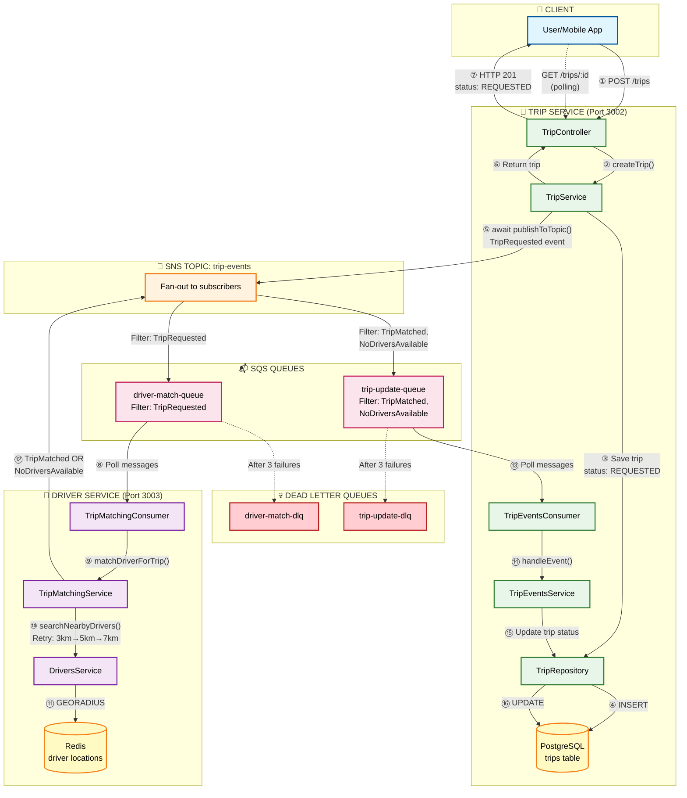
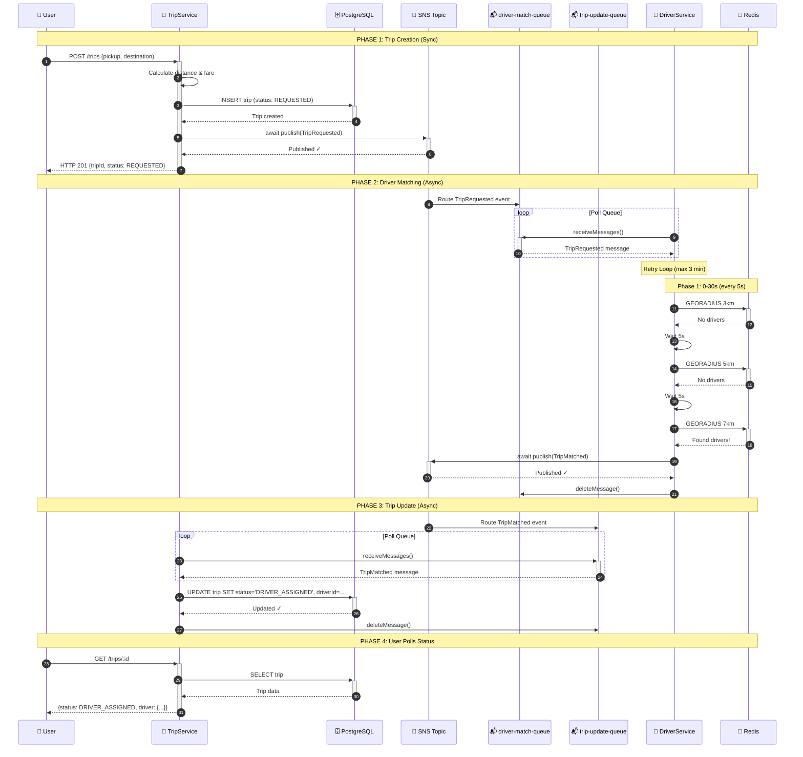
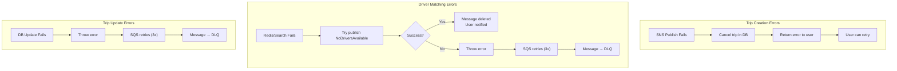
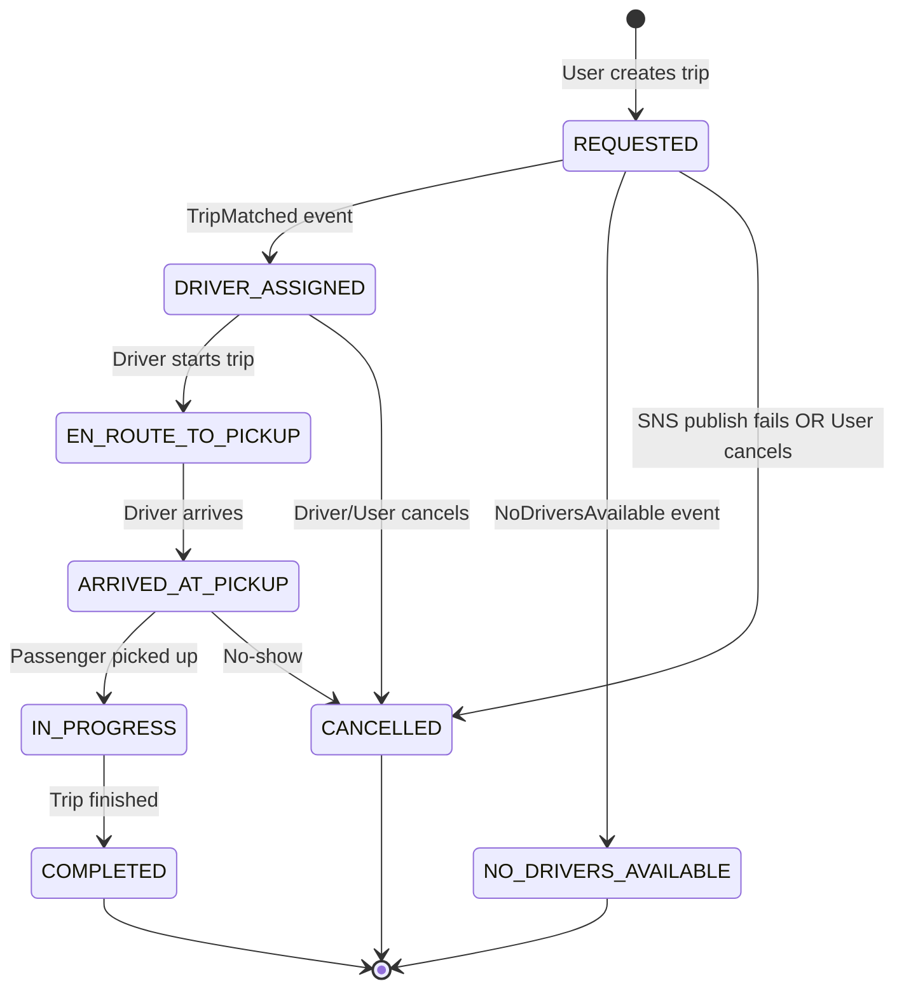

# Async Trip Creation Flow

**Status:** ✅ Implemented  
**Last Updated:** 2025-12-05  
**Module:** A - Scalability (Story 2.1)

---

## Overview

This document explains the complete flow when a user creates a trip request in UIT-GO, including the async driver matching process using SNS/SQS.

---

## Architecture Diagram



---

## Sequence Diagram



---

## Flow Details

### Phase 1: Trip Creation (Synchronous)

| Step | Component | Action | Duration |
|------|-----------|--------|----------|
| ① | User → TripController | `POST /trips` with pickup & destination | - |
| ② | TripController → TripService | `createTrip()` | - |
| ③ | TripService | Calculate distance & estimated fare | ~5ms |
| ④ | TripService → PostgreSQL | Save trip with `status: REQUESTED` | ~20ms |
| ⑤ | TripService → SNS | **await** `publishToTopic(TripRequested)` | ~50-100ms |
| ⑥⑦ | TripService → User | Return trip (HTTP 201) | - |

**Total response time:** ~100-150ms

**Key Point:** We `await` the SNS publish to ensure the message is delivered. If publish fails, trip is cancelled and user sees error.

---

### Phase 2: Driver Matching (Asynchronous)

| Step | Component | Action | Duration |
|------|-----------|--------|----------|
| ⑧ | TripMatchingConsumer | Poll `driver-match-queue` | Long-polling 5s |
| ⑨ | TripMatchingConsumer → TripMatchingService | `matchDriverForTrip()` | - |
| ⑩⑪ | TripMatchingService → DriversService → Redis | Search nearby drivers | ~10-50ms per attempt |
| ⑫ | TripMatchingService → SNS | Publish result event | ~50ms |

**Retry Strategy:**

```
┌─────────────────────────────────────────────────────────────────┐
│  RETRY CONFIGURATION                                            │
├─────────────────────────────────────────────────────────────────┤
│  Total Duration: 3 minutes max                                  │
│                                                                 │
│  Phase 1 (0-30s):                                               │
│    • Interval: every 5 seconds                                  │
│    • Radius: 3km → 5km → 7km (expands every 10s)               │
│                                                                 │
│  Phase 2 (30s-2min):                                            │
│    • Interval: every 10 seconds                                 │
│    • Radius: 7km (max)                                          │
│                                                                 │
│  Phase 3 (2min-3min):                                           │
│    • Interval: every 15 seconds                                 │
│    • Radius: 7km (max)                                          │
│                                                                 │
│  Timeout: Publish NoDriversAvailable event                      │
└─────────────────────────────────────────────────────────────────┘
```

---

### Phase 3: Trip Status Update (Asynchronous)

| Step | Component | Action |
|------|-----------|--------|
| ⑬ | TripEventsConsumer | Poll `trip-update-queue` |
| ⑭ | TripEventsConsumer → TripEventsService | Route by `eventType` |
| ⑮⑯ | TripEventsService → PostgreSQL | Update trip status |

**Event Handling:**

| Event Type | Handler | Trip Status Update |
|------------|---------|-------------------|
| `TripMatched` | `handleTripMatched()` | `REQUESTED` → `DRIVER_ASSIGNED` |
| `NoDriversAvailable` | `handleNoDriversAvailable()` | `REQUESTED` → `NO_DRIVERS_AVAILABLE` |

---

## Event Payloads

### TripRequested Event

```json
{
  "eventType": "TripRequested",
  "tripId": "uuid-xxxx",
  "passengerId": "user-uuid",
  "pickupLatitude": 10.762622,
  "pickupLongitude": 106.660172,
  "pickupAddress": "268 Lý Thường Kiệt, Q.10",
  "destinationLatitude": 10.773167,
  "destinationLongitude": 106.660879,
  "destinationAddress": "KTX Khu B ĐHQG",
  "estimatedFare": 25000,
  "estimatedDistance": 2.5,
  "requestedAt": "2025-12-05T10:30:00.000Z"
}
```

### TripMatched Event

```json
{
  "eventType": "TripMatched",
  "tripId": "uuid-xxxx",
  "driverId": "driver-uuid",
  "passengerId": "user-uuid",
  "driverDistance": 1.2,
  "matchedAt": "2025-12-05T10:30:15.000Z"
}
```

### NoDriversAvailable Event

```json
{
  "eventType": "NoDriversAvailable",
  "tripId": "uuid-xxxx",
  "passengerId": "user-uuid",
  "searchAttempts": 25,
  "searchDurationMs": 180000,
  "maxRadiusKm": 7,
  "failedAt": "2025-12-05T10:33:00.000Z"
}
```

---

## Error Handling

### Error Flow Diagram



### Error Summary Table

| Error Location | Error Type | Handling | User Impact |
|----------------|------------|----------|-------------|
| Trip Creation | SNS publish fails | Cancel trip, return error | Sees error, can retry |
| Driver Matching | Redis unavailable | Publish `NoDriversAvailable` | Sees "no drivers" |
| Driver Matching | SNS publish fails | SQS retry 3x → DLQ | May have delay |
| Trip Update | DB update fails | SQS retry 3x → DLQ | Status update delayed |

---

## Trip Status State Machine



---

## SNS/SQS Configuration

### Topic & Queue Setup

```
┌─────────────────────────────────────────────────────────────────┐
│  SNS TOPIC: trip-events                                         │
│  ARN: arn:aws:sns:us-east-1:000000000000:trip-events           │
└─────────────────────────────────────────────────────────────────┘
                              │
          ┌───────────────────┼───────────────────┐
          │                   │                   │
          ▼                   ▼                   ▼
┌─────────────────┐  ┌─────────────────┐  ┌─────────────────┐
│ driver-match-   │  │ trip-update-    │  │ (Future)        │
│ queue           │  │ queue           │  │ analytics-queue │
├─────────────────┤  ├─────────────────┤  ├─────────────────┤
│ Filter:         │  │ Filter:         │  │ Filter:         │
│ TripRequested   │  │ TripMatched,    │  │ All events      │
│                 │  │ NoDriversAvail. │  │                 │
├─────────────────┤  ├─────────────────┤  └─────────────────┘
│ Consumer:       │  │ Consumer:       │
│ DriverService   │  │ TripService     │
├─────────────────┤  ├─────────────────┤
│ DLQ:            │  │ DLQ:            │
│ driver-match-   │  │ trip-update-    │
│ dlq             │  │ dlq             │
│ maxReceive: 3   │  │ maxReceive: 3   │
└─────────────────┘  └─────────────────┘
```

### Filter Policies

| Queue | Filter Policy | Events Received |
|-------|---------------|-----------------|
| `driver-match-queue` | `{"eventType": ["TripRequested"]}` | TripRequested only |
| `trip-update-queue` | `{"eventType": ["TripMatched", "NoDriversAvailable"]}` | TripMatched, NoDriversAvailable |

---

## Monitoring & Observability

### Key Metrics to Monitor

| Metric | Source | Alert Threshold |
|--------|--------|-----------------|
| Queue depth | SQS `ApproximateNumberOfMessages` | > 100 messages |
| DLQ messages | SQS DLQ count | > 0 |
| Message age | SQS `ApproximateAgeOfOldestMessage` | > 60 seconds |
| Publish latency | Application logs | > 500ms |
| Match success rate | Application logs | < 80% |

### Log Examples

```json
// Trip created
{"level":"log","message":"Trip created, publishing event...","tripId":"xxx","passengerId":"yyy"}

// SNS published
{"level":"log","message":"TripRequested event published successfully","tripId":"xxx","publishDurationMs":45}

// Driver matching started
{"level":"log","message":"🔍 Starting driver matching with retry strategy...","tripId":"xxx","maxDuration":"180s"}

// Retry attempt
{"level":"log","message":"🔄 Attempt #3: Searching within 5km...","tripId":"xxx","elapsed":"15s"}

// Driver found
{"level":"log","message":"✅ Driver matched successfully","tripId":"xxx","driverId":"zzz","attemptCount":5}

// No drivers
{"level":"warn","message":"❌ No drivers found after exhausting all retries","tripId":"xxx","totalAttempts":25}
```

---

## Related Documents

- [ADR-001: Event-Driven Async Communication](../../Deliverables/ADR/ADR-001-async-communication.md)
- [LocalStack Setup Script](../../infrastructure/localstack/init-story-2.1-resources.sh)
- [Trip Matching Service](../../services/driver-service/src/trip-matching/trip-matching.service.ts)
- [Trip Events Consumer](../../services/trip-service/src/trip-events/trip-events.consumer.ts)
