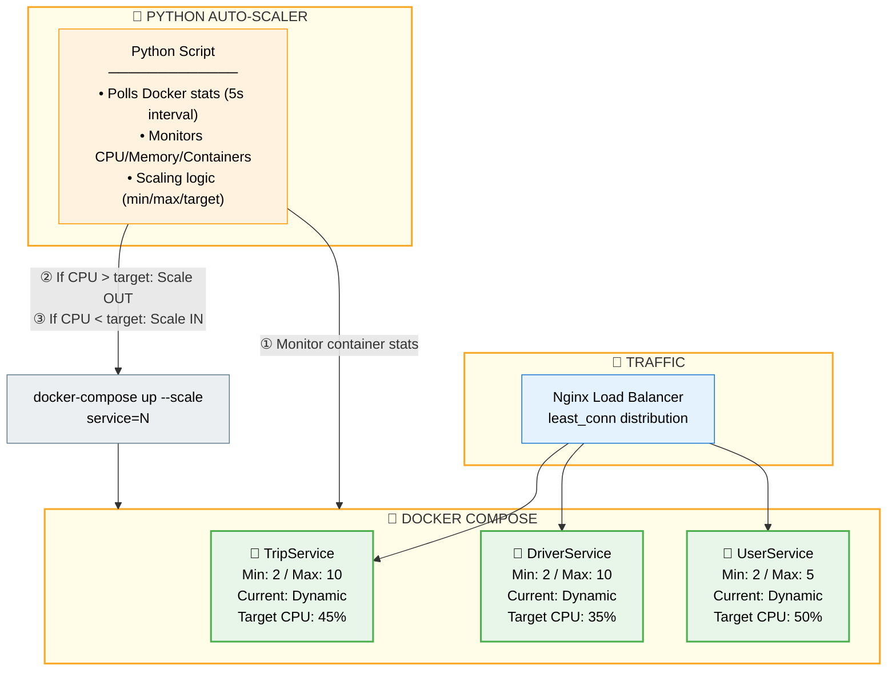
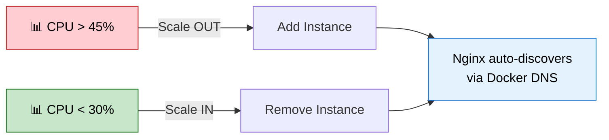

# Auto-Scaler Architecture

**Module A - Scalability** | Last Updated: 2025-12-05

---

## Architecture Overview

---

## Scaling Flow

---

## Configuration

| Service | Min | Max | Scale OUT | Scale IN | Cooldown |
|---------|-----|-----|-----------|----------|----------|
| **TripService** | 2 | 10 | CPU > 45% | CPU < 30% | 30s |
| **DriverService** | 2 | 10 | CPU > 35% | CPU < 20% | 30s |
| **UserService** | 2 | 5 | CPU > 50% | CPU < 35% | 30s |

---

## Why Nginx + Python?

| LocalStack Auto Scaling | Our Solution |
|------------------------|--------------|
| ❌ Mock containers only | ✅ Real Docker containers |
| ❌ Manual target registration | ✅ Auto-discovery via DNS |
| High complexity | Single Python script |
