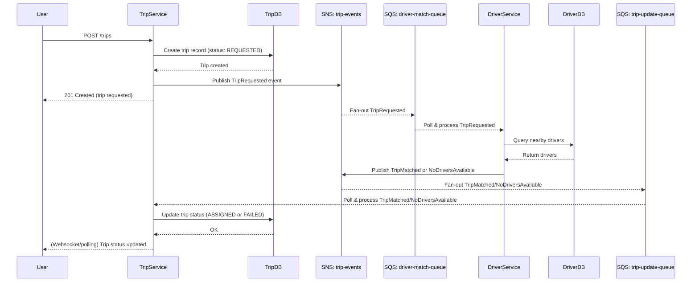

```mermaid
sequenceDiagram
    participant User
    participant TripService
    participant TripDB
    participant SNS as SNS: trip-events
    participant SQSMatch as SQS: driver-match-queue
    participant DriverService
    participant DriverDB
    participant SQSUpdate as SQS: trip-update-queue

    User->>TripService: POST /trips
    TripService->>TripDB: Create trip record (status: REQUESTED)
    TripDB-->>TripService: Trip created
    TripService->>SNS: Publish TripRequested event
    TripService-->>User: 201 Created (trip requested)

    SNS-->>SQSMatch: Fan-out TripRequested
    SQSMatch-->>DriverService: Poll & process TripRequested
    DriverService->>DriverDB: Query nearby drivers
    DriverDB-->>DriverService: Return drivers
    DriverService->>SNS: Publish TripMatched or NoDriversAvailable

    SNS-->>SQSUpdate: Fan-out TripMatched/NoDriversAvailable
    SQSUpdate-->>TripService: Poll & process TripMatched/NoDriversAvailable
    TripService->>TripDB: Update trip status (ASSIGNED or FAILED)
    TripDB-->>TripService: OK
    TripService-->>User: (Websocket/polling) Trip status updated
```