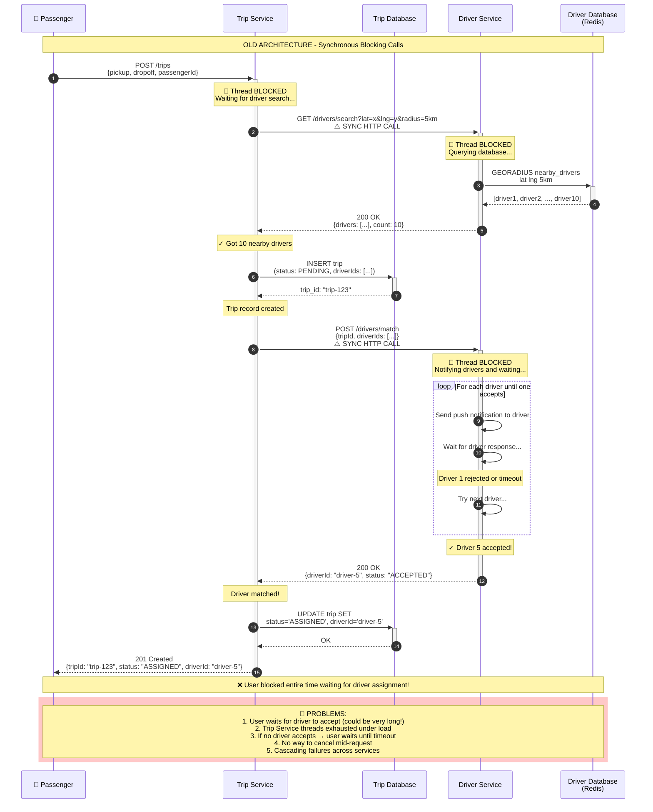

# Old Trip Booking Flow (Synchronous Architecture)

This diagram shows the **BEFORE** state - synchronous HTTP calls that block the user request.

## Problems with this architecture:
1. **Thread Blocking**: Trip Service threads are blocked waiting for Driver Service responses
2. **Poor UX**: User waits for the entire flow to complete before getting a response
3. **Cascading Failures**: If Driver Service is slow/down, Trip Service requests pile up
4. **No Scalability**: Each request holds resources until ALL operations complete
5. **Tight Coupling**: Services are tightly coupled via synchronous HTTP calls

## Sequence Diagram



## Flow Summary

| Step | Operation | Issue |
|------|-----------|-------|
| 1 | Passenger calls POST /trips | Request starts |
| 2 | Trip Service → Driver Service (search) | 🔴 Sync blocking call |
| 3 | Create trip in database | DB write |
| 4 | Trip Service → Driver Service (notify) | 🔴 Sync blocking call with loop |
| 5 | Update trip status | DB write |
| 6 | Return response to passenger | User finally unblocked |

## Why This Fails Under Load

```
High Request Rate + Long Request Duration = Thread Pool Exhaustion

→ All threads blocked waiting for sync calls
→ New requests queue up
→ Latency increases exponentially  
→ Timeouts cascade across services
→ System collapse
```

## The Solution: Event-Driven Architecture

See [async-communication.md](../async-communication.md) for the new architecture using SNS/SQS that:
- Returns to user immediately after trip creation
- Processes driver matching asynchronously via message queue
- Handles failures with retry/DLQ
- Scales horizontally
