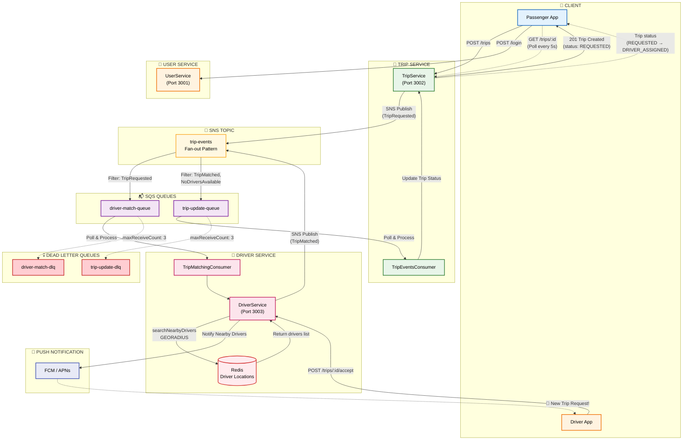
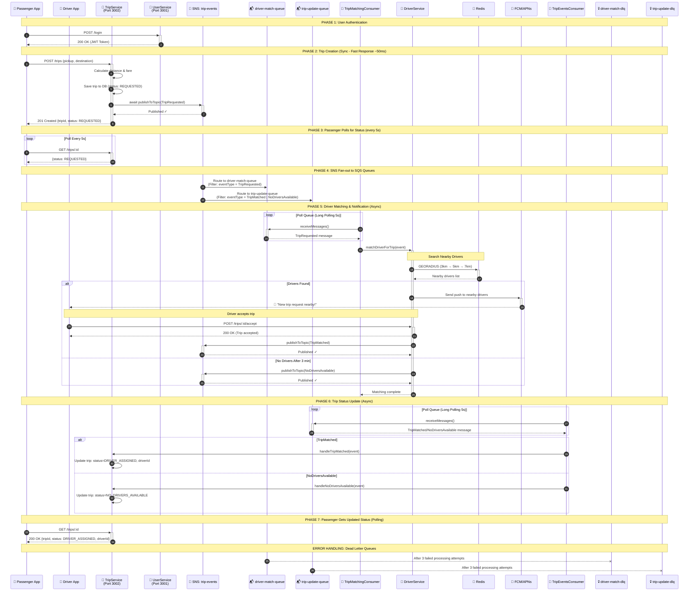

# SNS/SQS Booking Flow Architecture

**Status:** ✅ Implemented  
**Last Updated:** 2025-12-12  
**Module:** A - Scalability (ADR-001: Async Communication)

---

## Architecture Overview Diagram



---

## Component Description

| Component | Port | Description |
|-----------|------|-------------|
| **Passenger App** | - | Mobile app for passengers to create trips and poll status |
| **Driver App** | - | Mobile app for drivers to receive trip notifications and accept |
| **TripService** | 3002 | Handles trip creation, publishes TripRequested events |
| **TripEventsConsumer** | - | Polls trip-update-queue, updates trip status in DB |
| **UserService** | 3001 | Manages authentication and user profiles |
| **DriverService** | 3003 | Manages driver locations, matching, notifications |
| **TripMatchingConsumer** | - | Polls driver-match-queue, triggers driver search |
| **Redis** | 6379 | Stores driver geo-locations (GEORADIUS queries) |
| **FCM/APNs** | - | Push notification services (Firebase/Apple) |
| **trip-events (SNS)** | - | Central pub/sub topic for all trip-related events |
| **driver-match-queue** | - | SQS queue for TripRequested events → Driver matching |
| **trip-update-queue** | - | SQS queue for TripMatched/NoDriversAvailable → Trip updates |
| **Dead Letter Queues** | - | Failed messages after 3 retry attempts |

---

## Event Flow Description

### 1️⃣ Trip Creation Flow (Sync)

```
Passenger → POST /trips → TripService → Save to DB (REQUESTED) → Publish TripRequested to SNS → Return 201
```

### 2️⃣ Passenger Polling (Every 5s)

```
Passenger → GET /trips/:id → TripService → Return current trip status (REQUESTED → DRIVER_ASSIGNED)
```

### 3️⃣ Driver Matching & Notification Flow (Async)

```
SNS (TripRequested) → driver-match-queue → TripMatchingConsumer → DriverService → GEORADIUS Redis → Push Notification to Drivers
```

### 4️⃣ Driver Accept Flow

```
Driver receives push → Driver App → POST /trips/:id/accept → DriverService → Publish TripMatched to SNS
```

### 5️⃣ Trip Status Update Flow (Async)

```
SNS (TripMatched/NoDriversAvailable) → trip-update-queue → TripEventsConsumer → Update trip status in DB
```

---

## Message Flow Sequence Diagram



---

## Event Types

| Event Type | Publisher | Subscribers | Description |
|------------|-----------|-------------|-------------|
| `TripRequested` | TripService | driver-match-queue | New trip created, needs driver matching |
| `TripMatched` | DriverService | trip-update-queue | Driver found and assigned to trip |
| `NoDriversAvailable` | DriverService | trip-update-queue | No drivers found within retry period |
| `TripCancelled` | TripService | (future) | Trip cancelled by user |
| `TripCompleted` | TripService | (future) | Trip completed successfully |

---

## Queue Configuration

### driver-match-queue
```json
{
  "QueueName": "driver-match-queue",
  "VisibilityTimeout": 30,
  "MessageRetentionPeriod": 345600,
  "RedrivePolicy": {
    "deadLetterTargetArn": "arn:aws:sqs:us-east-1:000000000000:driver-match-dlq",
    "maxReceiveCount": 3
  }
}
```

### trip-update-queue
```json
{
  "QueueName": "trip-update-queue",
  "VisibilityTimeout": 30,
  "MessageRetentionPeriod": 345600,
  "RedrivePolicy": {
    "deadLetterTargetArn": "arn:aws:sqs:us-east-1:000000000000:trip-update-dlq",
    "maxReceiveCount": 3
  }
}
```

---

## Benefits of This Architecture

| Benefit | Description |
|---------|-------------|
| ✅ **Non-blocking** | Trip creation returns in ~50ms instead of 2-5s |
| ✅ **Horizontal Scaling** | Services scale independently based on queue depth |
| ✅ **Fault Isolation** | Slow/failed driver searches don't crash TripService |
| ✅ **Automatic Retry** | Failed messages retry with exponential backoff |
| ✅ **Dead Letter Queues** | Poison messages captured for debugging |
| ✅ **Fan-out Pattern** | Single event can trigger multiple subscribers |

---

## Trade-offs

| Trade-off | Impact | Mitigation |
|-----------|--------|------------|
| ⚠️ Eventual Consistency | Trip status updates delayed 100-500ms | Client polling/WebSocket for updates |
| ⚠️ Added Complexity | More infrastructure components | LocalStack for local development |
| ⚠️ Message Ordering | No guaranteed FIFO | Idempotent message handling |
| ⚠️ Debugging Difficulty | Distributed async flow | AWS X-Ray / Correlation IDs |

---

## Related Documents

- [ADR-001: Event-Driven Async Communication](../../adrs/ADR-001-event-driven-async-communication.md)
- [Async Trip Creation Flow](../async-trip-creation-flow.md)
- [Async Communication Architecture](../async-communication.md)
