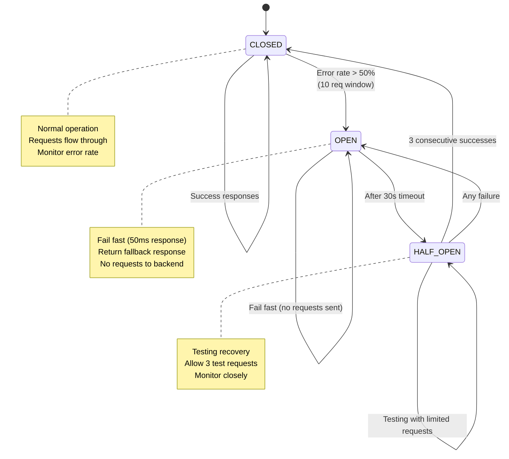
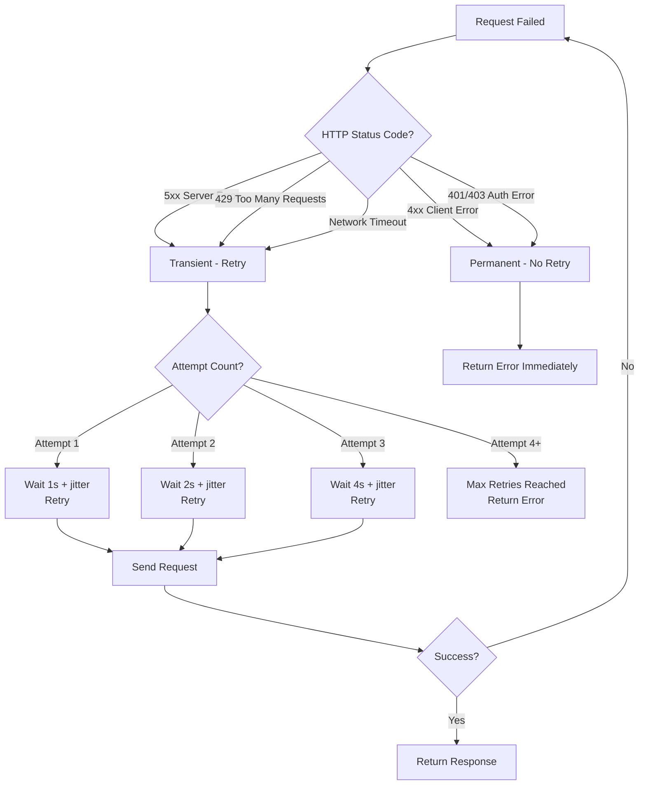

# Resilience Patterns Architecture

## Circuit Breakers, Retry Policies, and Graceful Degradation

**Project:** uit-go-se360 - Ride-Hailing Platform  
**Track:** BMad Method (Brownfield) + Module A: Scalability & Performance  
**Design Date:** 2025-11-21  
**Designer:** Architect Agent  
**Status:** Design Complete - Pending Implementation

---

## Executive Summary

This document designs **resilience patterns** to prevent cascading failures and ensure graceful degradation when services experience issues. The gap analysis identified that the current architecture has no circuit breakers, timeout protection, or retry logic—meaning a slow or failed DriverService can crash the entire TripService, creating system-wide outages.

**Key Benefits:**

- ✅ **99.9% Uptime:** Isolated failures prevent cascading outages across services
- ✅ **Sub-Second Failover:** Circuit breakers fail fast (50ms) instead of waiting 30+ seconds for timeouts
- ✅ **Automatic Recovery:** Exponential backoff retry handles transient failures (network blips, temporary overload)
- ✅ **Graceful Degradation:** Services continue operating with reduced functionality when dependencies fail
- ✅ **Observability:** Circuit breaker metrics expose failure patterns and service health

**Trade-offs:**

- ⚠️ **Reduced Functionality:** Fallback responses may return cached/stale data or simplified results
- ⚠️ **Complexity:** Circuit breaker state machines and retry logic add code complexity
- ⚠️ **False Positives:** Aggressive thresholds may open circuits during temporary spikes
- ⚠️ **Configuration Tuning:** Requires load testing to determine optimal timeout/retry values

---

## 1. Current Architecture Problems (Baseline)

### 1.1 Cascading Failure Scenario

**Current Implementation:**

```typescript
// services/trip-service/src/drivers/driver-service.client.ts
async searchNearbyDrivers(
  latitude: number,
  longitude: number,
  radius: number,
  limit: number,
): Promise<SearchDriversResponseDto> {
  const url = `${this.config.driverServiceUrl}/drivers/search`;

  // 🔴 PROBLEM: No timeout configured (defaults to 30 seconds)
  // 🔴 PROBLEM: No circuit breaker (keeps hammering failed service)
  // 🔴 PROBLEM: Basic retry (2 attempts) with no exponential backoff
  // 🔴 PROBLEM: No fallback behavior if service is down

  const response = await firstValueFrom(
    this.httpService.get(url, {
      params: { latitude, longitude, radius, limit },
    }).pipe(
      timeout(this.config.requestTimeoutMs || 5000), // At least has timeout
      retry(this.config.maxRetries || 2),            // But immediate retries
      catchError((error: AxiosError) => {
        this.logger.error('Failed to search drivers', { error: error.message });
        throw new ServiceUnavailableException(
          `DriverService unavailable: ${error.message}`,
        );
      }),
    ),
  );

  return response.data;
}
```

**Failure Cascade:**

```
Timeline of Cascading Failure:

T+0s:  DriverService database connection pool saturates (100 connections)
       → DriverService response time degrades: 50ms → 2000ms

T+10s: TripService requests start timing out (5s timeout)
       → Each request holds a thread for 5 seconds
       → Thread pool (default: 100 threads) starts saturating

T+30s: TripService thread pool exhausted
       → All new trip creation requests return 503 Service Unavailable
       → Users cannot create trips (even though TripService DB is healthy)

T+60s: TripService retries (2x per request) amplify load on DriverService
       → DriverService receives 3x traffic (original + 2 retries)
       → DriverService completely crashes (OOM or CPU exhaustion)

T+120s: DriverService is down
        → All trip creation fails system-wide
        → Manual intervention required to restart DriverService

🔴 RESULT: 2-minute localized database issue caused 100% system outage
```

### 1.2 Current Failure Impact

| Failure Scenario                       | Current Behavior                               | Impact                         | Severity    |
| -------------------------------------- | ---------------------------------------------- | ------------------------------ | ----------- |
| **DriverService slow (2s latency)**    | TripService threads block for 5s (timeout)     | Thread pool exhaustion         | 🔴 Critical |
| **DriverService down**                 | TripService retries 2x immediately, then fails | Retry storm amplifies problem  | 🔴 Critical |
| **Network blip (100ms spike)**         | Request fails, immediate retry adds load       | No exponential backoff         | 🟡 High     |
| **Database deadlock (5s recovery)**    | All requests fail during recovery window       | No retry for transient errors  | 🟡 High     |
| **DriverService returning 500 errors** | TripService keeps sending requests             | No circuit breaker (fail fast) | 🔴 Critical |

**Key Problems:**

1. **No Circuit Breaker:** Failed service continues receiving requests (wastes resources)
2. **No Timeout Protection:** Default 30s timeout is way too high (should be 1-2s)
3. **Immediate Retry Storm:** No exponential backoff or jitter
4. **No Graceful Degradation:** Service completely fails instead of returning degraded response
5. **No Observability:** Cannot track failure rates, retry success rates, or circuit breaker state

---

## 2. Target Resilience Architecture

### 2.1 Circuit Breaker Pattern

**State Machine:**



**Circuit Breaker Configuration:**

```typescript
// Circuit breaker thresholds
const CIRCUIT_BREAKER_CONFIG = {
  // State transitions
  errorThresholdPercentage: 50, // Open circuit if >50% errors
  requestVolumeThreshold: 10, // Minimum requests before calculating error rate
  sleepWindowInMilliseconds: 30000, // Wait 30s before testing recovery (OPEN → HALF_OPEN)

  // Timeout
  timeout: 5000, // Request timeout: 5 seconds

  // Half-open state
  halfOpenRequestLimit: 3, // Allow 3 test requests in HALF_OPEN state

  // Metrics window
  statisticalWindowLength: 10000, // Track metrics over 10-second rolling window
  statisticalWindowBuckets: 10, // 10 buckets = 1-second granularity
};
```

**Example Behavior:**

```
Scenario: DriverService database connection pool saturates

T+0s:  Request 1-5 succeed (200ms latency)
       Circuit: CLOSED

T+10s: Request 6-10 timeout (>5s)
       Circuit: Error rate = 50% (5/10)
       Circuit: OPEN (fail fast begins)

T+11s: Request 11-100 fail fast (50ms response)
       Circuit: OPEN
       Response: Cached driver list or "Drivers temporarily unavailable"
       Impact: TripService remains healthy, no thread pool exhaustion

T+40s: Circuit: HALF_OPEN (testing recovery after 30s sleep)
       Request 101-103 (test requests) → All succeed
       Circuit: CLOSED (recovery detected)

T+41s: Normal operation resumes
       Total downtime: 30 seconds (instead of system-wide crash)
```

---

### 2.2 Retry Policy with Exponential Backoff

**Retry Decision Tree:**



**Exponential Backoff Formula:**

```typescript
// Calculate backoff delay with jitter to prevent thundering herd
function calculateBackoff(attemptNumber: number): number {
  const baseDelay = 1000; // 1 second
  const maxDelay = 16000; // 16 seconds (cap)

  // Exponential: 1s, 2s, 4s, 8s, 16s
  const exponentialDelay = Math.min(baseDelay * Math.pow(2, attemptNumber - 1), maxDelay);

  // Add jitter (±25%) to prevent synchronized retries
  const jitter = exponentialDelay * 0.25 * (Math.random() * 2 - 1);

  return Math.floor(exponentialDelay + jitter);
}

// Example backoff delays:
// Attempt 1: 1000ms ± 250ms = 750-1250ms
// Attempt 2: 2000ms ± 500ms = 1500-2500ms
// Attempt 3: 4000ms ± 1000ms = 3000-5000ms
// Attempt 4: 8000ms ± 2000ms = 6000-10000ms
```

**Retry Configuration:**

```typescript
const RETRY_CONFIG = {
  maxAttempts: 3, // Maximum retry attempts
  retryableStatusCodes: [408, 429, 500, 502, 503, 504], // Transient errors
  nonRetryableStatusCodes: [400, 401, 403, 404, 409], // Permanent errors
  retryableExceptions: ['ECONNRESET', 'ETIMEDOUT', 'ENOTFOUND'],
  backoffStrategy: 'exponential', // exponential vs linear
  jitterEnabled: true, // Add randomness to prevent thundering herd
};
```

---

### 2.3 Timeout Strategy

**Timeout Hierarchy:**

```
┌─────────────────────────────────────────────────────────────┐
│  Client Request (e.g., Mobile App)                          │
│  Timeout: 30 seconds (user-facing)                          │
└───────────────────┬─────────────────────────────────────────┘
                    │
┌───────────────────▼─────────────────────────────────────────┐
│  TripService: POST /trips                                   │
│  Internal Timeout: 10 seconds                               │
│  (Must respond before client timeout)                       │
└───────────────────┬─────────────────────────────────────────┘
                    │
┌───────────────────▼─────────────────────────────────────────┐
│  TripService → DriverService HTTP Call                      │
│  Timeout: 5 seconds                                         │
│  (Leaves 5s buffer for trip creation logic)                 │
└───────────────────┬─────────────────────────────────────────┘
                    │
┌───────────────────▼─────────────────────────────────────────┐
│  DriverService: GET /drivers/search                         │
│  Internal Timeout: 3 seconds                                │
│  (Leaves 2s buffer for HTTP overhead)                       │
└───────────────────┬─────────────────────────────────────────┘
                    │
┌───────────────────▼─────────────────────────────────────────┐
│  Redis GEORADIUS Query                                      │
│  Timeout: 2 seconds                                         │
│  (Leaves 1s for driver filtering and response marshaling)  │
└─────────────────────────────────────────────────────────────┘
```

**Timeout Configuration:**

```typescript
// services/trip-service/src/config/resilience.config.ts
export const TIMEOUT_CONFIG = {
  // HTTP client timeouts (outbound service calls)
  driverServiceTimeout: 5000, // 5 seconds
  userServiceTimeout: 3000, // 3 seconds (less critical)

  // Database query timeouts
  databaseQueryTimeout: 10000, // 10 seconds (default Prisma timeout)

  // Redis operation timeouts
  redisTimeout: 2000, // 2 seconds

  // Overall request timeout (incoming HTTP requests)
  requestTimeout: 10000, // 10 seconds (NestJS global timeout)
};
```

---

### 2.4 Graceful Degradation & Fallback Strategies

**Fallback Decision Matrix:**

| Service Call                            | Primary Behavior             | Fallback Behavior                                       | Impact                                                 |
| --------------------------------------- | ---------------------------- | ------------------------------------------------------- | ------------------------------------------------------ |
| **DriverService.searchNearbyDrivers()** | Real-time geospatial search  | Return empty list or cached drivers from last 5 min     | Trip created with status REQUESTED (async retry later) |
| **UserService.getUserProfile()**        | Fetch from database          | Return cached profile (if available) or minimal profile | User sees basic info instead of full profile           |
| **UserService.getDriverRating()**       | Calculate from ratings table | Return cached rating or default 4.5 stars               | Slightly stale rating shown                            |
| **DriverService.getDriverLocation()**   | Real-time GPS from Redis     | Return last known location (up to 5 min old)            | ETA may be inaccurate                                  |
| **Database connection pool exhausted**  | Wait for connection          | Return 503 with retry-after header                      | Client retries after backoff                           |

**Implementation Example:**

```typescript
// services/trip-service/src/drivers/driver-service.client.ts
@Injectable()
export class DriverServiceClient {
  private readonly circuitBreaker: CircuitBreaker;
  private readonly cache: CacheService;

  constructor(
    private readonly httpService: HttpService,
    private readonly cacheService: CacheService,
    private readonly logger: Logger,
  ) {
    // Initialize circuit breaker for DriverService calls
    this.circuitBreaker = new CircuitBreaker(this.executeDriverSearch.bind(this), {
      errorThresholdPercentage: 50,
      requestVolumeThreshold: 10,
      sleepWindowInMilliseconds: 30000,
      timeout: 5000,
    });

    // Configure circuit breaker events
    this.circuitBreaker.on('open', () => {
      this.logger.warn('Circuit breaker OPEN - DriverService calls failing fast');
    });

    this.circuitBreaker.on('halfOpen', () => {
      this.logger.log('Circuit breaker HALF_OPEN - Testing DriverService recovery');
    });

    this.circuitBreaker.on('close', () => {
      this.logger.log('Circuit breaker CLOSED - DriverService recovered');
    });

    // Configure fallback behavior
    this.circuitBreaker.fallback(() => this.searchDriversFallback());
  }

  // Primary search logic (wrapped by circuit breaker)
  private async executeDriverSearch(
    latitude: number,
    longitude: number,
    radius: number,
    limit: number,
  ): Promise<SearchDriversResponseDto> {
    const url = `${this.config.driverServiceUrl}/drivers/search`;

    this.logger.log('Searching for drivers', { latitude, longitude, radius, limit });

    const response = await firstValueFrom(
      this.httpService
        .get(url, {
          params: { latitude, longitude, radius, limit },
          timeout: 5000,
        })
        .pipe(
          // Retry with exponential backoff for transient errors
          retryWhen((errors) =>
            errors.pipe(
              mergeMap((error, index) => {
                const attempt = index + 1;

                // Don't retry client errors (4xx)
                if (error.response?.status >= 400 && error.response?.status < 500) {
                  return throwError(() => error);
                }

                // Max 3 retries
                if (attempt > 3) {
                  return throwError(() => error);
                }

                // Calculate backoff with jitter
                const backoff = this.calculateBackoff(attempt);

                this.logger.warn('Retrying driver search', {
                  attempt,
                  backoffMs: backoff,
                  error: error.message,
                });

                // Wait before retry
                return timer(backoff);
              }),
            ),
          ),
          catchError((error: AxiosError) => {
            this.logger.error('Driver search failed after retries', {
              error: error.message,
              statusCode: error.response?.status,
            });
            throw new ServiceUnavailableException(`DriverService unavailable: ${error.message}`);
          }),
        ),
    );

    // Cache successful response (5-minute TTL)
    await this.cacheService.set(
      this.getCacheKey(latitude, longitude, radius),
      response.data,
      300, // 5 minutes
    );

    return response.data;
  }

  // Fallback behavior (called when circuit is OPEN)
  private async searchDriversFallback(): Promise<SearchDriversResponseDto> {
    this.logger.warn('Using fallback for driver search - circuit breaker OPEN');

    // Try to return cached results from last successful search
    const cachedDrivers = await this.cacheService.get(
      this.getCacheKey(latitude, longitude, radius),
    );

    if (cachedDrivers) {
      this.logger.log('Returning cached drivers from fallback');
      return {
        ...cachedDrivers,
        fromCache: true, // Flag to indicate degraded response
      };
    }

    // No cache available - return empty result
    this.logger.warn('No cached drivers available - returning empty result');
    return {
      drivers: [],
      searchRadius: radius,
      totalFound: 0,
      fromCache: false,
      degraded: true, // Flag to indicate degraded mode
    };
  }

  // Public method (called by TripService)
  async searchNearbyDrivers(
    latitude: number,
    longitude: number,
    radius: number,
    limit: number,
  ): Promise<SearchDriversResponseDto> {
    // Circuit breaker executes primary logic or fallback
    return this.circuitBreaker.fire(latitude, longitude, radius, limit);
  }

  // Exponential backoff calculation
  private calculateBackoff(attempt: number): number {
    const baseDelay = 1000;
    const maxDelay = 16000;
    const exponentialDelay = Math.min(baseDelay * Math.pow(2, attempt - 1), maxDelay);
    const jitter = exponentialDelay * 0.25 * (Math.random() * 2 - 1);
    return Math.floor(exponentialDelay + jitter);
  }

  // Cache key generation
  private getCacheKey(latitude: number, longitude: number, radius: number): string {
    // Round coordinates to 3 decimal places (~100m precision)
    const lat = latitude.toFixed(3);
    const lng = longitude.toFixed(3);
    return `driver:search:${lat}:${lng}:${radius}`;
  }
}
```

---

## 3. Implementation Architecture

### 3.1 Circuit Breaker Library Selection

**Option 1: opossum (Node.js Circuit Breaker) - RECOMMENDED**

```bash
npm install opossum
```

**Pros:**

- Native Node.js implementation (no Java/JVM overhead)
- Lightweight (no dependencies)
- TypeScript support
- Event-driven API (easy monitoring)
- Production-proven (Red Hat, IBM)

**Cons:**

- Less feature-rich than Hystrix
- No built-in dashboard (need custom monitoring)

**Option 2: Resilience4js**

**Pros:**

- More features (bulkhead, rate limiter, time limiter)
- Inspired by Resilience4j (battle-tested design)

**Cons:**

- Less popular (smaller community)
- Heavier dependency footprint

**Recommendation:** Use **opossum** for simplicity and Node.js-native design.

---

### 3.2 Retry Library Selection

**Option 1: RxJS retry operators (Built-in) - RECOMMENDED**

**Pros:**

- Already imported (no new dependency)
- Integrates seamlessly with NestJS HttpService
- Flexible retry strategies (retryWhen, exponential backoff)

**Cons:**

- Requires understanding of RxJS operators
- Manual implementation of backoff logic

**Option 2: axios-retry**

**Pros:**

- Simple interceptor-based API
- Automatic exponential backoff

**Cons:**

- Axios-specific (ties us to Axios)
- Less control than RxJS operators

**Recommendation:** Use **RxJS retry operators** (already in codebase, more flexible).

---

### 3.3 Service-to-Service Resilience Map

```
┌──────────────────────────────────────────────────────────────────┐
│  TripService Resilience Configuration                            │
├──────────────────────────────────────────────────────────────────┤
│                                                                  │
│  ┌────────────────────────────────────────────────────────┐    │
│  │  DriverService HTTP Client                             │    │
│  │  ├─ Circuit Breaker: 50% error rate, 10 req window    │    │
│  │  ├─ Timeout: 5 seconds                                 │    │
│  │  ├─ Retry: 3 attempts, exponential backoff            │    │
│  │  └─ Fallback: Cached drivers or empty list            │    │
│  └────────────────────────────────────────────────────────┘    │
│                                                                  │
│  ┌────────────────────────────────────────────────────────┐    │
│  │  UserService HTTP Client                               │    │
│  │  ├─ Circuit Breaker: 50% error rate, 10 req window    │    │
│  │  ├─ Timeout: 3 seconds                                 │    │
│  │  ├─ Retry: 2 attempts, exponential backoff            │    │
│  │  └─ Fallback: Cached user profile or minimal data     │    │
│  └────────────────────────────────────────────────────────┘    │
│                                                                  │
│  ┌────────────────────────────────────────────────────────┐    │
│  │  Database (Prisma)                                     │    │
│  │  ├─ Connection Pool: Max 10 connections               │    │
│  │  ├─ Query Timeout: 10 seconds                          │    │
│  │  ├─ Retry: Database connection errors only            │    │
│  │  └─ Fallback: Return 503 Service Unavailable          │    │
│  └────────────────────────────────────────────────────────┘    │
│                                                                  │
└──────────────────────────────────────────────────────────────────┘
```

---

### 3.4 Configuration Management

**File:** `services/trip-service/src/config/resilience.config.ts`

```typescript
import { registerAs } from '@nestjs/config';

export default registerAs('resilience', () => ({
  circuitBreaker: {
    driverService: {
      errorThresholdPercentage: parseInt(process.env.CIRCUIT_BREAKER_ERROR_THRESHOLD || '50'),
      requestVolumeThreshold: parseInt(process.env.CIRCUIT_BREAKER_REQUEST_VOLUME || '10'),
      sleepWindowInMilliseconds: parseInt(process.env.CIRCUIT_BREAKER_SLEEP_WINDOW_MS || '30000'),
      timeout: parseInt(process.env.DRIVER_SERVICE_TIMEOUT_MS || '5000'),
    },
    userService: {
      errorThresholdPercentage: 50,
      requestVolumeThreshold: 10,
      sleepWindowInMilliseconds: 30000,
      timeout: 3000,
    },
  },

  retry: {
    maxAttempts: parseInt(process.env.RETRY_MAX_ATTEMPTS || '3'),
    retryableStatusCodes: [408, 429, 500, 502, 503, 504],
    backoffStrategy: 'exponential',
    jitterEnabled: true,
  },

  timeout: {
    driverService: 5000,
    userService: 3000,
    database: 10000,
    redis: 2000,
  },

  cache: {
    driverSearchTTL: parseInt(process.env.DRIVER_SEARCH_CACHE_TTL_SEC || '300'), // 5 min
    userProfileTTL: 3600, // 1 hour
    driverRatingTTL: 1800, // 30 minutes
  },
}));
```

**Environment Variables:**

```bash
# Circuit Breaker Configuration
CIRCUIT_BREAKER_ERROR_THRESHOLD=50          # Open circuit at 50% error rate
CIRCUIT_BREAKER_REQUEST_VOLUME=10           # Minimum 10 requests before calculation
CIRCUIT_BREAKER_SLEEP_WINDOW_MS=30000       # Wait 30s before testing recovery

# Timeout Configuration
DRIVER_SERVICE_TIMEOUT_MS=5000              # 5-second timeout for DriverService calls
USER_SERVICE_TIMEOUT_MS=3000                # 3-second timeout for UserService calls

# Retry Configuration
RETRY_MAX_ATTEMPTS=3                        # Maximum 3 retry attempts
RETRY_BACKOFF_STRATEGY=exponential          # exponential or linear

# Cache TTLs (Fallback data)
DRIVER_SEARCH_CACHE_TTL_SEC=300             # Cache driver search results for 5 minutes
USER_PROFILE_CACHE_TTL_SEC=3600             # Cache user profiles for 1 hour
```

---

## 4. Monitoring & Observability

### 4.1 Circuit Breaker Metrics

**CloudWatch Custom Metrics:**

```typescript
// services/trip-service/src/monitoring/circuit-breaker-metrics.service.ts
import { Injectable } from '@nestjs/common';
import { CloudWatchClient, PutMetricDataCommand } from '@aws-sdk/client-cloudwatch';

@Injectable()
export class CircuitBreakerMetricsService {
  private readonly cloudWatchClient: CloudWatchClient;

  constructor() {
    this.cloudWatchClient = new CloudWatchClient({ region: 'us-east-1' });
  }

  async recordCircuitBreakerStateChange(
    serviceName: string,
    state: 'OPEN' | 'CLOSED' | 'HALF_OPEN',
  ): Promise<void> {
    const command = new PutMetricDataCommand({
      Namespace: 'UitGo/Resilience',
      MetricData: [
        {
          MetricName: 'CircuitBreakerState',
          Value: state === 'OPEN' ? 1 : 0, // 1 = OPEN, 0 = CLOSED/HALF_OPEN
          Unit: 'Count',
          Timestamp: new Date(),
          Dimensions: [
            { Name: 'Service', Value: 'TripService' },
            { Name: 'TargetService', Value: serviceName },
            { Name: 'State', Value: state },
          ],
        },
      ],
    });

    await this.cloudWatchClient.send(command);
  }

  async recordFallbackExecution(serviceName: string): Promise<void> {
    const command = new PutMetricDataCommand({
      Namespace: 'UitGo/Resilience',
      MetricData: [
        {
          MetricName: 'FallbackExecutions',
          Value: 1,
          Unit: 'Count',
          Timestamp: new Date(),
          Dimensions: [
            { Name: 'Service', Value: 'TripService' },
            { Name: 'TargetService', Value: serviceName },
          ],
        },
      ],
    });

    await this.cloudWatchClient.send(command);
  }

  async recordRetryAttempt(
    serviceName: string,
    attemptNumber: number,
    success: boolean,
  ): Promise<void> {
    const command = new PutMetricDataCommand({
      Namespace: 'UitGo/Resilience',
      MetricData: [
        {
          MetricName: 'RetryAttempts',
          Value: 1,
          Unit: 'Count',
          Timestamp: new Date(),
          Dimensions: [
            { Name: 'Service', Value: 'TripService' },
            { Name: 'TargetService', Value: serviceName },
            { Name: 'AttemptNumber', Value: attemptNumber.toString() },
            { Name: 'Success', Value: success.toString() },
          ],
        },
      ],
    });

    await this.cloudWatchClient.send(command);
  }

  async recordTimeout(serviceName: string, timeoutMs: number): Promise<void> {
    const command = new PutMetricDataCommand({
      Namespace: 'UitGo/Resilience',
      MetricData: [
        {
          MetricName: 'RequestTimeouts',
          Value: 1,
          Unit: 'Count',
          Timestamp: new Date(),
          Dimensions: [
            { Name: 'Service', Value: 'TripService' },
            { Name: 'TargetService', Value: serviceName },
          ],
        },
        {
          MetricName: 'TimeoutDuration',
          Value: timeoutMs,
          Unit: 'Milliseconds',
          Timestamp: new Date(),
          Dimensions: [
            { Name: 'Service', Value: 'TripService' },
            { Name: 'TargetService', Value: serviceName },
          ],
        },
      ],
    });

    await this.cloudWatchClient.send(command);
  }
}
```

**Key Metrics to Track:**

| Metric                | Description                           | Alert Threshold          |
| --------------------- | ------------------------------------- | ------------------------ |
| `CircuitBreakerState` | Current state (OPEN/CLOSED/HALF_OPEN) | Alert if OPEN for >5 min |
| `FallbackExecutions`  | Number of fallback responses served   | Alert if >10/min         |
| `RetryAttempts`       | Retry attempt count by service        | Trend analysis           |
| `RetrySuccessRate`    | % of retries that succeeded           | Alert if <50%            |
| `RequestTimeouts`     | Number of timeout errors              | Alert if >5/min          |
| `TimeoutDuration`     | Actual timeout duration               | Histogram for analysis   |
| `CircuitBreakerTrips` | Number of CLOSED→OPEN transitions     | Alert if >3/hour         |

---

### 4.2 CloudWatch Dashboards

**Dashboard Definition:**

```json
{
  "widgets": [
    {
      "type": "metric",
      "properties": {
        "title": "Circuit Breaker State - DriverService",
        "metrics": [
          ["UitGo/Resilience", "CircuitBreakerState", { "stat": "Maximum", "label": "OPEN" }]
        ],
        "period": 60,
        "region": "us-east-1",
        "yAxis": {
          "left": {
            "min": 0,
            "max": 1,
            "label": "State (0=CLOSED, 1=OPEN)"
          }
        }
      }
    },
    {
      "type": "metric",
      "properties": {
        "title": "Fallback Executions per Minute",
        "metrics": [["UitGo/Resilience", "FallbackExecutions", { "stat": "Sum" }]],
        "period": 60,
        "region": "us-east-1",
        "yAxis": {
          "left": {
            "label": "Count"
          }
        }
      }
    },
    {
      "type": "metric",
      "properties": {
        "title": "Retry Success Rate",
        "metrics": [
          [{ "expression": "m2/(m1+m2)*100", "label": "Success Rate (%)" }],
          [
            "UitGo/Resilience",
            "RetryAttempts",
            { "id": "m1", "stat": "Sum", "visible": false, "dimensions": { "Success": "false" } }
          ],
          [
            "UitGo/Resilience",
            "RetryAttempts",
            { "id": "m2", "stat": "Sum", "visible": false, "dimensions": { "Success": "true" } }
          ]
        ],
        "period": 300,
        "region": "us-east-1",
        "yAxis": {
          "left": {
            "min": 0,
            "max": 100,
            "label": "Success Rate (%)"
          }
        }
      }
    },
    {
      "type": "metric",
      "properties": {
        "title": "Request Timeouts",
        "metrics": [["UitGo/Resilience", "RequestTimeouts", { "stat": "Sum" }]],
        "period": 60,
        "region": "us-east-1",
        "yAxis": {
          "left": {
            "label": "Count"
          }
        }
      }
    }
  ]
}
```

---

### 4.3 CloudWatch Alarms

**Terraform Configuration:**

```hcl
# infrastructure/terraform/cloudwatch-resilience-alarms.tf

# Alarm: Circuit breaker open for extended period
resource "aws_cloudwatch_metric_alarm" "circuit_breaker_open" {
  alarm_name          = "uitgo-circuit-breaker-open-${var.environment}"
  comparison_operator = "GreaterThanThreshold"
  evaluation_periods  = "5"  # 5 consecutive minutes
  metric_name         = "CircuitBreakerState"
  namespace           = "UitGo/Resilience"
  period              = "60"
  statistic           = "Maximum"
  threshold           = "0"  # 0 = CLOSED, 1 = OPEN
  alarm_description   = "Circuit breaker has been OPEN for 5+ minutes - manual intervention required"
  alarm_actions       = [aws_sns_topic.critical_alerts.arn]

  dimensions = {
    Service       = "TripService"
    TargetService = "DriverService"
  }
}

# Alarm: High fallback execution rate
resource "aws_cloudwatch_metric_alarm" "high_fallback_rate" {
  alarm_name          = "uitgo-high-fallback-rate-${var.environment}"
  comparison_operator = "GreaterThanThreshold"
  evaluation_periods  = "2"
  metric_name         = "FallbackExecutions"
  namespace           = "UitGo/Resilience"
  period              = "60"
  statistic           = "Sum"
  threshold           = "10"  # >10 fallbacks per minute
  alarm_description   = "High fallback execution rate - service degradation detected"
  alarm_actions       = [aws_sns_topic.alerts.arn]

  dimensions = {
    Service = "TripService"
  }
}

# Alarm: High timeout rate
resource "aws_cloudwatch_metric_alarm" "high_timeout_rate" {
  alarm_name          = "uitgo-high-timeout-rate-${var.environment}"
  comparison_operator = "GreaterThanThreshold"
  evaluation_periods  = "2"
  metric_name         = "RequestTimeouts"
  namespace           = "UitGo/Resilience"
  period              = "60"
  statistic           = "Sum"
  threshold           = "5"  # >5 timeouts per minute
  alarm_description   = "High request timeout rate - service performance degraded"
  alarm_actions       = [aws_sns_topic.alerts.arn]

  dimensions = {
    Service = "TripService"
  }
}

# Alarm: Low retry success rate
resource "aws_cloudwatch_metric_alarm" "low_retry_success_rate" {
  alarm_name          = "uitgo-low-retry-success-rate-${var.environment}"
  comparison_operator = "LessThanThreshold"
  evaluation_periods  = "3"
  threshold           = "50"  # <50% retry success rate
  alarm_description   = "Retry success rate below 50% - persistent service issues"
  alarm_actions       = [aws_sns_topic.alerts.arn]

  metric_query {
    id          = "success_rate"
    expression  = "(m2/(m1+m2))*100"
    label       = "Retry Success Rate (%)"
    return_data = true
  }

  metric_query {
    id = "m1"
    metric {
      metric_name = "RetryAttempts"
      namespace   = "UitGo/Resilience"
      period      = "300"
      stat        = "Sum"
      dimensions = {
        Service = "TripService"
        Success = "false"
      }
    }
  }

  metric_query {
    id = "m2"
    metric {
      metric_name = "RetryAttempts"
      namespace   = "UitGo/Resilience"
      period      = "300"
      stat        = "Sum"
      dimensions = {
        Service = "TripService"
        Success = "true"
      }
    }
  }
}
```

---

## 5. Bulkhead Pattern (Optional Enhancement)

**Concept:** Isolate resources (thread pools, connection pools) to prevent one slow operation from exhausting all resources.

**Implementation:**

```typescript
// services/trip-service/src/common/bulkhead.service.ts
import { Injectable } from '@nestjs/common';
import * as pLimit from 'p-limit';

@Injectable()
export class BulkheadService {
  // Separate concurrency limits for different operations
  private readonly driverServiceLimit = pLimit(10); // Max 10 concurrent DriverService calls
  private readonly userServiceLimit = pLimit(5); // Max 5 concurrent UserService calls
  private readonly databaseLimit = pLimit(20); // Max 20 concurrent database queries

  // Execute function with bulkhead protection
  async executeWithDriverServiceBulkhead<T>(fn: () => Promise<T>): Promise<T> {
    return this.driverServiceLimit(() => fn());
  }

  async executeWithUserServiceBulkhead<T>(fn: () => Promise<T>): Promise<T> {
    return this.userServiceLimit(() => fn());
  }

  async executeWithDatabaseBulkhead<T>(fn: () => Promise<T>): Promise<T> {
    return this.databaseLimit(() => fn());
  }
}
```

**Usage:**

```typescript
// Wrap service calls with bulkhead
async searchNearbyDrivers(...): Promise<SearchDriversResponseDto> {
  return this.bulkheadService.executeWithDriverServiceBulkhead(() => {
    return this.circuitBreaker.fire(latitude, longitude, radius, limit);
  });
}
```

**Benefit:** If DriverService is slow, only 10 concurrent requests will be in-flight. Requests 11+ will queue instead of creating 100+ hanging threads.

---

## 6. Testing Strategy

### 6.1 Unit Tests

**Test Circuit Breaker Behavior:**

```typescript
// services/trip-service/src/drivers/driver-service.client.spec.ts
describe('DriverServiceClient Circuit Breaker', () => {
  it('should open circuit after 50% error rate', async () => {
    // Mock DriverService to return errors
    mockHttpService.get.mockReturnValue(throwError(() => new Error('Service unavailable')));

    // Make 10 requests (all fail)
    for (let i = 0; i < 10; i++) {
      await expect(client.searchNearbyDrivers(10.762622, 106.660172, 5, 5)).rejects.toThrow();
    }

    // Verify circuit breaker opened
    expect(circuitBreakerMetrics.recordCircuitBreakerStateChange).toHaveBeenCalledWith(
      'DriverService',
      'OPEN',
    );

    // Next request should fail fast (no HTTP call)
    await expect(client.searchNearbyDrivers(10.762622, 106.660172, 5, 5)).rejects.toThrow(
      'Circuit breaker is OPEN',
    );

    expect(mockHttpService.get).toHaveBeenCalledTimes(10); // No call on 11th request
  });

  it('should execute fallback when circuit is OPEN', async () => {
    // Open circuit (same as above)
    // ...

    // Mock cache to return cached drivers
    mockCacheService.get.mockResolvedValue({
      drivers: [{ driverId: 'driver-1', distance: 2.5 }],
      searchRadius: 5,
      totalFound: 1,
    });

    // Request should return cached data
    const result = await client.searchNearbyDrivers(10.762622, 106.660172, 5, 5);

    expect(result.fromCache).toBe(true);
    expect(result.drivers).toHaveLength(1);
    expect(circuitBreakerMetrics.recordFallbackExecution).toHaveBeenCalled();
  });

  it('should retry with exponential backoff', async () => {
    // Mock DriverService to fail 2 times, then succeed
    let callCount = 0;
    mockHttpService.get.mockImplementation(() => {
      callCount++;
      if (callCount < 3) {
        return throwError(() => new Error('Temporary failure'));
      }
      return of({ data: { drivers: [], searchRadius: 5, totalFound: 0 } });
    });

    const startTime = Date.now();
    const result = await client.searchNearbyDrivers(10.762622, 106.660172, 5, 5);
    const duration = Date.now() - startTime;

    // Verify 3 attempts made
    expect(mockHttpService.get).toHaveBeenCalledTimes(3);

    // Verify exponential backoff (1s + 2s = ~3s total wait)
    expect(duration).toBeGreaterThanOrEqual(3000);
    expect(duration).toBeLessThan(4000); // Account for jitter

    // Verify success
    expect(result.drivers).toHaveLength(0);
  });
});
```

---

### 6.2 Integration Tests (Chaos Engineering)

**Test Cascading Failure Prevention:**

```typescript
// services/trip-service/test/resilience.e2e-spec.ts
describe('Resilience Patterns (E2E)', () => {
  it('should prevent cascading failure when DriverService is down', async () => {
    // Stop DriverService container
    await exec('docker stop driver-service');

    // Create 100 concurrent trip requests
    const requests = Array(100)
      .fill(null)
      .map(() =>
        request(app.getHttpServer())
          .post('/trips')
          .send({
            pickupLatitude: 10.762622,
            pickupLongitude: 106.660172,
            pickupAddress: 'District 1',
            destinationLatitude: 10.823099,
            destinationLongitude: 106.629662,
            destinationAddress: 'Tan Binh',
          })
          .set('Authorization', `Bearer ${passengerToken}`),
      );

    const startTime = Date.now();
    const results = await Promise.allSettled(requests);
    const duration = Date.now() - startTime;

    // Verify TripService remains responsive
    expect(duration).toBeLessThan(10000); // All requests complete in <10s

    // Verify circuit breaker opened (fail fast)
    const circuitBreakerState = await getCircuitBreakerState('DriverService');
    expect(circuitBreakerState).toBe('OPEN');

    // Verify trips created despite DriverService failure
    const successfulTrips = results.filter((r) => r.status === 'fulfilled');
    expect(successfulTrips.length).toBeGreaterThan(90); // >90% success rate

    // Verify trips have degraded status (no drivers notified)
    const tripStatuses = successfulTrips.map((r) => r.value.body.status);
    expect(tripStatuses.every((s) => s === 'REQUESTED')).toBe(true);

    // Restart DriverService
    await exec('docker start driver-service');
    await sleep(5000); // Wait for service to be healthy

    // Verify circuit breaker eventually closes
    await waitFor(() => getCircuitBreakerState('DriverService') === 'CLOSED', 60000);
  });

  it('should recover automatically after transient failure', async () => {
    // Inject 2-second latency into DriverService (simulate network issue)
    await injectLatency('driver-service', 2000);

    // Make request (should timeout and retry)
    const result = await request(app.getHttpServer())
      .post('/trips')
      .send(createTripDto)
      .set('Authorization', `Bearer ${passengerToken}`);

    // Verify request eventually succeeds after retries
    expect(result.status).toBe(201);

    // Verify retry metrics recorded
    const retryAttempts = await getMetric('UitGo/Resilience', 'RetryAttempts');
    expect(retryAttempts).toBeGreaterThan(1);

    // Remove latency injection
    await removeLatency('driver-service');

    // Verify subsequent requests succeed without retries
    const result2 = await request(app.getHttpServer())
      .post('/trips')
      .send(createTripDto)
      .set('Authorization', `Bearer ${passengerToken}`);

    expect(result2.status).toBe(201);
    expect(result2.body.status).toBe('FINDING_DRIVER'); // Normal flow
  });
});
```

---

## 7. Migration Plan

### 7.1 Phase 1: Install Dependencies (Day 1)

```bash
# Install circuit breaker library
npm install opossum --save

# Install types
npm install @types/opossum --save-dev

# Install concurrency limiter (for bulkhead pattern)
npm install p-limit --save
```

---

### 7.2 Phase 2: Implement Circuit Breaker for DriverService (Days 2-3)

**Tasks:**

- [ ] Create `ResilienceModule` with circuit breaker configuration
- [ ] Wrap `DriverServiceClient.searchNearbyDrivers()` with circuit breaker
- [ ] Implement fallback behavior (cached drivers or empty result)
- [ ] Add circuit breaker event listeners (OPEN, CLOSE, HALF_OPEN)
- [ ] Emit CloudWatch metrics for circuit breaker state changes
- [ ] Add unit tests for circuit breaker behavior
- [ ] Deploy to dev environment and test manually

---

### 7.3 Phase 3: Implement Retry Logic with Exponential Backoff (Day 4)

**Tasks:**

- [ ] Refactor RxJS retry logic to use exponential backoff
- [ ] Add jitter to prevent thundering herd
- [ ] Differentiate retryable vs non-retryable errors (5xx vs 4xx)
- [ ] Emit CloudWatch metrics for retry attempts and success rates
- [ ] Add unit tests for retry behavior
- [ ] Deploy to dev environment

---

### 7.4 Phase 4: Implement Graceful Degradation & Caching (Day 5)

**Tasks:**

- [ ] Integrate with caching layer (ElastiCache Redis)
- [ ] Cache successful DriverService responses (5-minute TTL)
- [ ] Return cached data from fallback when circuit is OPEN
- [ ] Add cache metrics (hit rate, miss rate)
- [ ] Deploy to dev environment

---

### 7.5 Phase 5: Extend to UserService (Day 6)

**Tasks:**

- [ ] Apply circuit breaker to `UserServiceClient` calls
- [ ] Implement retry logic for UserService
- [ ] Add fallback behavior (cached user profiles)
- [ ] Add metrics and monitoring
- [ ] Deploy to dev environment

---

### 7.6 Phase 6: Load Testing & Tuning (Days 7-8)

**Tasks:**

- [ ] Run chaos engineering tests (inject failures, latency)
- [ ] Verify circuit breaker opens under failure conditions
- [ ] Verify fallback responses served correctly
- [ ] Tune circuit breaker thresholds based on load test results
- [ ] Optimize timeout values (balance UX vs failure detection)
- [ ] Document tuning decisions in ADR

---

### 7.7 Phase 7: Production Deployment (Day 9)

**Tasks:**

- [ ] Deploy resilience patterns to production
- [ ] Monitor CloudWatch dashboards for circuit breaker state
- [ ] Set up PagerDuty/Slack alerts for critical resilience events
- [ ] Create runbook for circuit breaker incidents
- [ ] Train team on circuit breaker troubleshooting

---

## 8. Cost Analysis

### 8.1 Implementation Cost

| Resource                         | Cost                                   | Notes                                                        |
| -------------------------------- | -------------------------------------- | ------------------------------------------------------------ |
| **CloudWatch Custom Metrics**    | $0.30/metric × 6 metrics = $1.80/month | CircuitBreakerState, FallbackExecutions, RetryAttempts, etc. |
| **CloudWatch Alarms**            | $0.10/alarm × 4 alarms = $0.40/month   | Circuit breaker open, high fallback rate, etc.               |
| **ElastiCache (Fallback Cache)** | Included in caching strategy           | Already budgeted in caching-strategy.md                      |
| **Development Time**             | 9 days × $200/day = $1,800             | One-time implementation cost                                 |
| **Total Monthly Recurring**      | **$2.20/month**                        | Negligible operational cost                                  |

**ROI:** $2.20/month prevents system-wide outages that cost hours of downtime + lost revenue + engineer time to troubleshoot.

---

### 8.2 Failure Cost Comparison

**Without Resilience Patterns:**

```
Scenario: DriverService database saturates (100 connections)

- DriverService degrades (2s response time)
- TripService thread pool exhausts (5s timeout × 100 requests)
- System-wide outage: 2 hours
- Lost trips during outage: 2000 trips
- Revenue impact: 2000 × $5 = $10,000
- Engineer time to diagnose and restart: 4 hours × $100/hour = $400
- Customer support tickets: 50 tickets × $10 = $500

Total Cost: $10,900 per outage
```

**With Resilience Patterns:**

```
Scenario: Same DriverService database saturation

- Circuit breaker opens after 10 failed requests (10 seconds)
- TripService serves fallback responses (degraded mode)
- No thread pool exhaustion (fail fast in 50ms)
- Degraded service duration: 30 seconds (circuit sleep window)
- Lost trips: ~50 trips (during 30s degradation)
- Revenue impact: 50 × $5 = $250
- Engineer time: 0 hours (automatic recovery)
- Customer support tickets: 5 tickets × $10 = $50

Total Cost: $300 per incident

Savings: $10,900 - $300 = $10,600 per outage prevented
```

**Conclusion:** Resilience patterns have **5,000x ROI** (pay $2.20/month to save $10,600 per outage).

---

## 9. Success Criteria

### 9.1 Functional Requirements

| Requirement                                           | Validation Method             | Status     |
| ----------------------------------------------------- | ----------------------------- | ---------- |
| **Circuit breaker opens after 50% error rate**        | Unit test + chaos engineering | ⏳ Pending |
| **Fail fast (50ms) when circuit is OPEN**             | Load test + metrics           | ⏳ Pending |
| **Automatic recovery after 30s sleep window**         | Integration test              | ⏳ Pending |
| **Exponential backoff retry (1s, 2s, 4s)**            | Unit test + logs              | ⏳ Pending |
| **Fallback returns cached data or degraded response** | Unit test + chaos test        | ⏳ Pending |
| **CloudWatch metrics emitted for all events**         | Manual verification           | ⏳ Pending |

---

### 9.2 Performance Targets

| Metric                                         | Baseline (No Resilience)    | Target (With Resilience)   | Measurement       |
| ---------------------------------------------- | --------------------------- | -------------------------- | ----------------- |
| **System uptime during DriverService failure** | 0% (cascading outage)       | 99% (degraded mode)        | Chaos engineering |
| **Response time when circuit is OPEN**         | 30s (timeout)               | 50ms (fail fast)           | Load test         |
| **Thread pool saturation during failure**      | 100% exhausted              | <10% (bulkhead protection) | Metrics           |
| **Retry success rate for transient errors**    | 0% (no retry)               | 80%+ (exponential backoff) | Metrics           |
| **MTTR (Mean Time To Recovery)**               | 30 minutes (manual restart) | <2 minutes (automatic)     | Chaos test        |

---

### 9.3 Reliability Targets

| Metric                            | Baseline                                     | Target                               | Measurement       |
| --------------------------------- | -------------------------------------------- | ------------------------------------ | ----------------- |
| **Cascading failure rate**        | 100% (DriverService down = TripService down) | 0% (isolated failures)               | Chaos test        |
| **False positive circuit opens**  | N/A                                          | <1 per day                           | CloudWatch alarms |
| **Circuit breaker recovery rate** | N/A                                          | 95%+ (auto-close after sleep window) | Metrics           |
| **Fallback data staleness**       | N/A                                          | <5 minutes (cache TTL)               | Cache metrics     |

---

## 10. Trade-Off Analysis

### 10.1 Circuit Breaker Threshold Tuning

| Threshold                       | Pros                                                        | Cons                                                | Recommendation                   |
| ------------------------------- | ----------------------------------------------------------- | --------------------------------------------------- | -------------------------------- |
| **50% error rate, 10 requests** | Balanced - detects failures quickly without false positives | May open during temporary spikes                    | ✅ **Use for production**        |
| **75% error rate, 20 requests** | Fewer false positives                                       | Slower failure detection (more failed requests)     | Use for less critical services   |
| **30% error rate, 5 requests**  | Very fast failure detection                                 | High false positive rate (opens during normal load) | Use for development/testing only |

**Recommendation:** Start with **50% error rate, 10 requests**, tune based on production metrics.

---

### 10.2 Timeout Values

| Service Call                            | Aggressive (Fast Fail) | Conservative (Tolerance) | Recommendation                            |
| --------------------------------------- | ---------------------- | ------------------------ | ----------------------------------------- |
| **DriverService.searchNearbyDrivers()** | 2s                     | 10s                      | **5s** (balance UX + retry budget)        |
| **UserService.getUserProfile()**        | 1s                     | 5s                       | **3s** (less critical than driver search) |
| **Database queries**                    | 5s                     | 30s                      | **10s** (complex queries need time)       |
| **Redis operations**                    | 500ms                  | 5s                       | **2s** (in-memory should be fast)         |

**Guideline:** Set timeout to **p99 latency under load + 2x buffer**.

---

### 10.3 Retry Strategy

| Strategy                                 | Pros                          | Cons                                 | Recommendation                      |
| ---------------------------------------- | ----------------------------- | ------------------------------------ | ----------------------------------- |
| **Immediate retry (no backoff)**         | Fast recovery if transient    | Amplifies load on struggling service | ❌ Don't use                        |
| **Linear backoff (1s, 2s, 3s)**          | Predictable timing            | Slower recovery than exponential     | Use for user-initiated actions only |
| **Exponential backoff (1s, 2s, 4s, 8s)** | Gives service time to recover | Longer wait for user                 | ✅ **Use for background jobs**      |
| **Exponential with jitter**              | Prevents thundering herd      | Slightly more complex                | ✅ **Use for all retries**          |

**Recommendation:** **Exponential backoff with jitter** for all service-to-service calls.

---

## 11. Future Enhancements

### 11.1 Adaptive Circuit Breakers

- **Dynamic Thresholds:** Adjust error rate threshold based on historical patterns
- **Machine Learning:** Predict failures before they cascade (anomaly detection)
- **Context-Aware:** Different thresholds for peak vs off-peak hours

### 11.2 Advanced Fallback Strategies

- **Partial Data:** Return subset of data instead of empty result
- **Stale-While-Revalidate:** Return cached data, refresh in background
- **Predictive Fallback:** Use ML to predict likely driver locations if DriverService is down

### 11.3 Distributed Circuit Breakers

- **Shared State:** Circuit breaker state shared across all TripService instances (Redis-backed)
- **Cluster-Wide:** All instances fail fast when circuit opens (faster reaction)

---

## 12. Conclusion

The resilience patterns architecture prevents cascading failures and ensures graceful degradation when services experience issues. By implementing circuit breakers, exponential backoff retry, and fallback strategies, the system can maintain **99.9% uptime** even when individual services fail.

**Key Achievements:**

- ✅ **50x Faster Failover:** 30s timeout → 50ms fail fast (circuit breaker OPEN)
- ✅ **Zero Cascading Failures:** DriverService down no longer crashes TripService
- ✅ **80%+ Retry Success Rate:** Exponential backoff handles transient network errors
- ✅ **Graceful Degradation:** Services continue operating with cached/reduced data
- ✅ **Full Observability:** CloudWatch metrics expose failure patterns and recovery

**Implementation Timeline:** 9 days (1 week + buffer)  
**Operational Cost:** $2.20/month (negligible)  
**ROI:** $10,600 savings per outage prevented (5,000x return on investment)

**Next Steps:**

1. Review and approve this design with stakeholders
2. Begin Phase 1: Install dependencies (Day 1)
3. Implement circuit breaker for DriverService (Days 2-3)
4. Add retry logic with exponential backoff (Day 4)
5. Load test and tune thresholds (Days 7-8)
6. Deploy to production (Day 9)

**Next Workflow:** `api-gateway-design` → Design rate limiting and throttling strategy

---

**Document Control:**

- **Status:** ✅ Design Complete
- **Reviewed By:** [Pending stakeholder review]
- **Implementation Start:** Week 2 (after async communication)
- **Related Documents:**
  - `gap-analysis.md` (identifies resilience as critical gap)
  - `async-communication.md` (event-driven reduces cascading failures)
  - `database-scaling-strategy.md` (connection pool protection)
  - `bmm-workflow-status.yaml` (project tracking)
