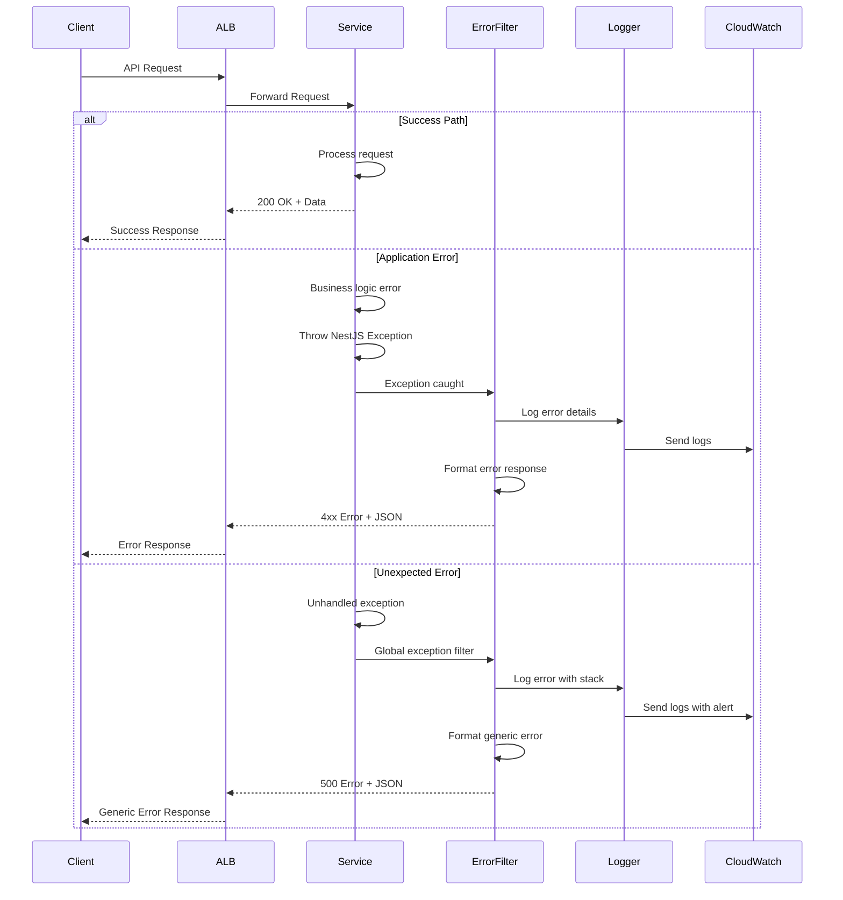

# **SECTION 16: ERROR HANDLING STRATEGY**

Defining unified error handling across all microservices.

## **16.1 Error Flow**



---

## **16.2 Error Response Format**

**Standardized Error Structure:**

```typescript
interface ApiError {
  error: {
    code: string; // Machine-readable error code
    message: string; // Human-readable message
    details?: Record<string, any>; // Additional context
    timestamp: string; // ISO 8601 timestamp
    requestId: string; // Request correlation ID
    path?: string; // API endpoint path
  };
}
```

**Example Error Responses:**

```json
// Validation Error (400)
{
  "error": {
    "code": "VALIDATION_ERROR",
    "message": "Input validation failed",
    "details": {
      "pickupLatitude": "must be between -90 and 90",
      "pickupAddress": "must not be empty"
    },
    "timestamp": "2025-10-20T10:30:00.000Z",
    "requestId": "abc123-def456-ghi789",
    "path": "/trips"
  }
}

// Authentication Error (401)
{
  "error": {
    "code": "INVALID_TOKEN",
    "message": "JWT token is invalid or expired",
    "timestamp": "2025-10-20T10:30:00.000Z",
    "requestId": "abc123-def456-ghi789",
    "path": "/users/me"
  }
}

// Authorization Error (403)
{
  "error": {
    "code": "INSUFFICIENT_PERMISSIONS",
    "message": "Only passengers can create trip requests",
    "details": {
      "requiredRole": "PASSENGER",
      "userRole": "DRIVER"
    },
    "timestamp": "2025-10-20T10:30:00.000Z",
    "requestId": "abc123-def456-ghi789",
    "path": "/trips"
  }
}

// Not Found Error (404)
{
  "error": {
    "code": "RESOURCE_NOT_FOUND",
    "message": "Trip with ID abc123 not found",
    "details": {
      "resource": "Trip",
      "id": "abc123"
    },
    "timestamp": "2025-10-20T10:30:00.000Z",
    "requestId": "abc123-def456-ghi789",
    "path": "/trips/abc123"
  }
}

// Conflict Error (409)
{
  "error": {
    "code": "TRIP_ALREADY_ASSIGNED",
    "message": "Trip has already been assigned to another driver",
    "details": {
      "tripId": "trip-123",
      "status": "DRIVER_ASSIGNED"
    },
    "timestamp": "2025-10-20T10:30:00.000Z",
    "requestId": "abc123-def456-ghi789",
    "path": "/trips/trip-123/accept"
  }
}

// Internal Server Error (500)
{
  "error": {
    "code": "INTERNAL_SERVER_ERROR",
    "message": "An unexpected error occurred. Please try again later.",
    "timestamp": "2025-10-20T10:30:00.000Z",
    "requestId": "abc123-def456-ghi789"
  }
}
```

---

## **16.3 Frontend Error Handling**

**Note:** This project is backend-only, but documenting for completeness if frontend is added later.

**N/A** - No frontend implementation required per PRD.

---

## **16.4 Backend Error Handling**

**Global Exception Filter:**

```typescript
// common/filters/http-exception.filter.ts
import {
  ExceptionFilter,
  Catch,
  ArgumentsHost,
  HttpException,
  HttpStatus,
  Logger,
} from '@nestjs/common';
import { Request, Response } from 'express';
import { v4 as uuidv4 } from 'uuid';

@Catch()
export class GlobalExceptionFilter implements ExceptionFilter {
  private readonly logger = new Logger(GlobalExceptionFilter.name);

  catch(exception: unknown, host: ArgumentsHost) {
    const ctx = host.switchToHttp();
    const response = ctx.getResponse<Response>();
    const request = ctx.getRequest<Request>();
    const requestId = (request.headers['x-request-id'] as string) || uuidv4();

    let status = HttpStatus.INTERNAL_SERVER_ERROR;
    let errorCode = 'INTERNAL_SERVER_ERROR';
    let message = 'An unexpected error occurred';
    let details: Record<string, any> | undefined;

    // Handle NestJS HTTP exceptions
    if (exception instanceof HttpException) {
      status = exception.getStatus();
      const exceptionResponse = exception.getResponse();

      if (typeof exceptionResponse === 'object') {
        const response = exceptionResponse as any;
        errorCode = response.error || response.code || exception.name;
        message = response.message || exception.message;
        details = response.details;
      } else {
        message = exceptionResponse as string;
        errorCode = exception.name;
      }
    }
    // Handle Prisma errors
    else if (this.isPrismaError(exception)) {
      const prismaError = exception as any;

      switch (prismaError.code) {
        case 'P2002': // Unique constraint violation
          status = HttpStatus.CONFLICT;
          errorCode = 'DUPLICATE_RESOURCE';
          message = 'Resource already exists';
          details = { field: prismaError.meta?.target };
          break;
        case 'P2025': // Record not found
          status = HttpStatus.NOT_FOUND;
          errorCode = 'RESOURCE_NOT_FOUND';
          message = 'Resource not found';
          break;
        default:
          status = HttpStatus.INTERNAL_SERVER_ERROR;
          errorCode = 'DATABASE_ERROR';
          message = 'Database operation failed';
      }
    }
    // Handle validation errors
    else if (this.isValidationError(exception)) {
      status = HttpStatus.BAD_REQUEST;
      errorCode = 'VALIDATION_ERROR';
      message = 'Input validation failed';
      details = (exception as any).errors;
    }

    // Log error with context
    const errorLog = {
      requestId,
      method: request.method,
      path: request.url,
      statusCode: status,
      errorCode,
      message,
      userId: (request as any).user?.id,
      timestamp: new Date().toISOString(),
    };

    if (status >= 500) {
      // Log internal errors with stack trace
      this.logger.error('Internal server error', {
        ...errorLog,
        stack: exception instanceof Error ? exception.stack : undefined,
        exception: exception instanceof Error ? exception.message : exception,
      });
    } else {
      // Log client errors without stack trace
      this.logger.warn('Client error', errorLog);
    }

    // Send error response
    const errorResponse = {
      error: {
        code: errorCode,
        message,
        ...(details && { details }),
        timestamp: new Date().toISOString(),
        requestId,
        ...(status < 500 && { path: request.url }),
      },
    };

    // Don't expose internal details in production
    if (status >= 500 && process.env.NODE_ENV === 'production') {
      errorResponse.error.message = 'An unexpected error occurred. Please try again later.';
      delete errorResponse.error.details;
    }

    response.status(status).json(errorResponse);
  }

  private isPrismaError(exception: unknown): boolean {
    return exception instanceof Error && exception.constructor.name.includes('Prisma');
  }

  private isValidationError(exception: unknown): boolean {
    return exception instanceof Error && 'errors' in exception;
  }
}
```

**Custom Business Exception:**

```typescript
// common/exceptions/business.exception.ts
import { HttpException, HttpStatus } from '@nestjs/common';

export class BusinessException extends HttpException {
  constructor(
    code: string,
    message: string,
    details?: Record<string, any>,
    status: HttpStatus = HttpStatus.BAD_REQUEST,
  ) {
    super(
      {
        code,
        message,
        ...(details && { details }),
      },
      status,
    );
  }
}

// Usage examples
throw new BusinessException(
  'TRIP_INVALID_STATE',
  'Cannot accept trip in COMPLETED state',
  { currentState: 'COMPLETED', allowedStates: ['REQUESTED'] },
  HttpStatus.BAD_REQUEST,
);

throw new BusinessException(
  'DRIVER_NOT_APPROVED',
  'Driver profile must be approved before accepting trips',
  { approvalStatus: 'PENDING' },
  HttpStatus.FORBIDDEN,
);
```

**Error Codes Enum:**

```typescript
// common/errors/error-codes.ts
export enum ErrorCode {
  // Authentication & Authorization
  INVALID_CREDENTIALS = 'INVALID_CREDENTIALS',
  INVALID_TOKEN = 'INVALID_TOKEN',
  TOKEN_EXPIRED = 'TOKEN_EXPIRED',
  INSUFFICIENT_PERMISSIONS = 'INSUFFICIENT_PERMISSIONS',

  // User Management
  EMAIL_ALREADY_EXISTS = 'EMAIL_ALREADY_EXISTS',
  USER_NOT_FOUND = 'USER_NOT_FOUND',
  DRIVER_PROFILE_ALREADY_EXISTS = 'DRIVER_PROFILE_ALREADY_EXISTS',
  DRIVER_NOT_APPROVED = 'DRIVER_NOT_APPROVED',

  // Trip Management
  TRIP_NOT_FOUND = 'TRIP_NOT_FOUND',
  TRIP_INVALID_STATE = 'TRIP_INVALID_STATE',
  TRIP_ALREADY_ASSIGNED = 'TRIP_ALREADY_ASSIGNED',
  TRIP_ALREADY_RATED = 'TRIP_ALREADY_RATED',
  TRIP_NOT_COMPLETED = 'TRIP_NOT_COMPLETED',

  // Driver Location
  INVALID_COORDINATES = 'INVALID_COORDINATES',
  DRIVER_NOT_ONLINE = 'DRIVER_NOT_ONLINE',
  NO_NEARBY_DRIVERS = 'NO_NEARBY_DRIVERS',

  // Generic
  VALIDATION_ERROR = 'VALIDATION_ERROR',
  RESOURCE_NOT_FOUND = 'RESOURCE_NOT_FOUND',
  DUPLICATE_RESOURCE = 'DUPLICATE_RESOURCE',
  DATABASE_ERROR = 'DATABASE_ERROR',
  INTERNAL_SERVER_ERROR = 'INTERNAL_SERVER_ERROR',
}
```

**Service-Level Error Handling:**

```typescript
// Example: TripService with proper error handling
@Injectable()
export class TripsService {
  private readonly logger = new Logger(TripsService.name);

  constructor(
    private readonly tripsRepository: TripsRepository,
    private readonly tripStateMachine: TripStateMachine,
  ) {}

  async acceptTrip(tripId: string, driverId: string): Promise<TripDto> {
    try {
      // Fetch trip with pessimistic lock
      const trip = await this.tripsRepository.findByIdForUpdate(tripId);

      // Not found
      if (!trip) {
        throw new NotFoundException({
          code: ErrorCode.TRIP_NOT_FOUND,
          message: `Trip with ID ${tripId} not found`,
          details: { tripId },
        });
      }

      // Already assigned
      if (trip.driverId) {
        throw new ConflictException({
          code: ErrorCode.TRIP_ALREADY_ASSIGNED,
          message: 'Trip has already been assigned to another driver',
          details: { tripId, status: trip.status },
        });
      }

      // Invalid state
      if (!this.tripStateMachine.canTransition(trip.status, TripStatus.DRIVER_ASSIGNED)) {
        throw new BadRequestException({
          code: ErrorCode.TRIP_INVALID_STATE,
          message: `Cannot accept trip in ${trip.status} state`,
          details: {
            currentState: trip.status,
            allowedStates: this.tripStateMachine.getAllowedStates(trip.status),
          },
        });
      }

      // Update trip
      const updatedTrip = await this.tripsRepository.update(tripId, {
        driverId,
        status: TripStatus.DRIVER_ASSIGNED,
        driverAssignedAt: new Date(),
      });

      this.logger.log(`Trip ${tripId} accepted by driver ${driverId}`);

      return this.mapToDto(updatedTrip);
    } catch (error) {
      // Re-throw known errors
      if (error instanceof HttpException) {
        throw error;
      }

      // Log and wrap unexpected errors
      this.logger.error('Failed to accept trip', {
        tripId,
        driverId,
        error: error.message,
        stack: error.stack,
      });

      throw new InternalServerErrorException({
        code: ErrorCode.INTERNAL_SERVER_ERROR,
        message: 'Failed to accept trip',
      });
    }
  }
}
```

**Validation Error Handling:**

```typescript
// Automatically handled by class-validator
// Example validation error response:

// Request:
POST /trips
{
  "pickupLatitude": 100,  // Invalid: > 90
  "pickupLongitude": 106.660172,
  "pickupAddress": "",    // Invalid: empty
  "destinationLatitude": 10.823099,
  "destinationLongitude": 106.629662,
  "destinationAddress": "Tan Binh"
}

// Response: 400 Bad Request
{
  "error": {
    "code": "VALIDATION_ERROR",
    "message": "Input validation failed",
    "details": {
      "pickupLatitude": "pickupLatitude must not be greater than 90",
      "pickupAddress": "pickupAddress should not be empty"
    },
    "timestamp": "2025-10-20T10:30:00.000Z",
    "requestId": "abc123",
    "path": "/trips"
  }
}
```

---

## **16.5 Monitoring and Observability**

**CloudWatch Error Monitoring:**

```typescript
// Send custom metrics for error tracking
import { CloudWatchClient, PutMetricDataCommand } from '@aws-sdk/client-cloudwatch';

@Injectable()
export class ErrorMetricsService {
  private cloudwatch: CloudWatchClient;

  constructor() {
    this.cloudwatch = new CloudWatchClient({ region: 'us-east-1' });
  }

  async trackError(errorCode: string, service: string) {
    try {
      await this.cloudwatch.send(
        new PutMetricDataCommand({
          Namespace: 'UIT-Go/Errors',
          MetricData: [
            {
              MetricName: 'ErrorCount',
              Value: 1,
              Unit: 'Count',
              Dimensions: [
                { Name: 'Service', Value: service },
                { Name: 'ErrorCode', Value: errorCode },
              ],
              Timestamp: new Date(),
            },
          ],
        }),
      );
    } catch (error) {
      // Don't fail request if metrics fail
      console.error('Failed to send error metrics', error);
    }
  }
}
```

**Error Rate Alerts (Terraform):**

```hcl
resource "aws_cloudwatch_metric_alarm" "high_error_rate" {
  alarm_name          = "uitgo-high-error-rate-${var.environment}"
  comparison_operator = "GreaterThanThreshold"
  evaluation_periods  = "2"
  metric_name         = "5XXError"
  namespace           = "AWS/ApplicationELB"
  period              = "300"
  statistic           = "Sum"
  threshold           = "10"
  alarm_description   = "Alert when 5XX error count exceeds 10 in 5 minutes"
  alarm_actions       = [aws_sns_topic.alerts.arn]

  dimensions = {
    LoadBalancer = aws_lb.main.arn_suffix
  }
}
```

---

## **Detailed Rationale:**

**Error Handling Design Decisions:**

1. **Consistent Error Format:**
   - **Why:** Client can parse errors reliably
   - **Why:** Easier debugging with requestId correlation
   - **Pattern:** Same structure across all services

2. **Error Codes over HTTP Status:**
   - **Why:** HTTP status codes are limited (only ~10 useful codes)
   - **Why:** Error codes provide machine-readable specificity
   - **Example:** Both "user not found" and "trip not found" are 404, but different error codes

3. **Request ID Correlation:**
   - **Why:** Track requests across multiple services
   - **How:** Generated by ALB or first service, propagated in headers
   - **Benefit:** Full request trace in CloudWatch Logs

4. **Production Error Sanitization:**
   - **Why:** Don't expose internal error details (security)
   - **Pattern:** Generic message for 5XX errors in production
   - **Development:** Full error details for debugging

5. **Global Exception Filter:**
   - **Why:** Single place to handle all errors
   - **Why:** Consistent logging and formatting
   - **Alternative:** Per-controller error handling (scattered, inconsistent)

6. **Prisma Error Mapping:**
   - **Why:** Prisma error codes are cryptic (e.g., P2002)
   - **Pattern:** Map to human-readable error codes
   - **Example:** P2002 → DUPLICATE_RESOURCE

7. **Validation Errors:**
   - **Why:** class-validator automatically formats validation errors
   - **Pattern:** Caught by global filter, formatted consistently
   - **Benefit:** No manual validation error handling needed

8. **Error Logging Levels:**
   - 4XX errors: WARN level (client fault)
   - 5XX errors: ERROR level (server fault)
   - **Why:** Reduce noise from client errors in logs

9. **Stack Traces:**
   - Included for 5XX errors (debugging)
   - Excluded for 4XX errors (not useful)
   - Never sent to client in production

10. **Error Monitoring:**
    - CloudWatch custom metrics for error tracking
    - Alarms for high error rates
    - **Phase 2:** Add X-Ray for distributed tracing

---

**Select 1-9 or just type your question/feedback:**

1. **Proceed to next section** (Monitoring and Observability)
2. **Expand or Contract for Audience** - Adjust error handling detail
3. **Explain Reasoning (CoT Step-by-Step)** - Deeper dive into error strategy
4. **Critique and Refine** - Challenge error handling approach
5. **Analyze Logical Flow and Dependencies** - Review error flow coherence
6. **Assess Alignment with Overall Goals** - Verify error handling coverage
7. **Identify Potential Risks and Unforeseen Issues** - Error handling risks?
8. **Challenge from Critical Perspective** - Devil's advocate on error format
9. **Tree of Thoughts Deep Dive** - Explore alternative error strategies

dieuxuanhien: 1

GitHub Copilot: Perfect! Moving to the final section - Monitoring and Observability.

---
