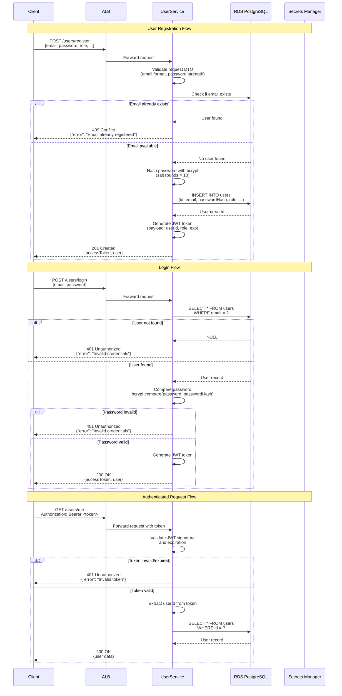
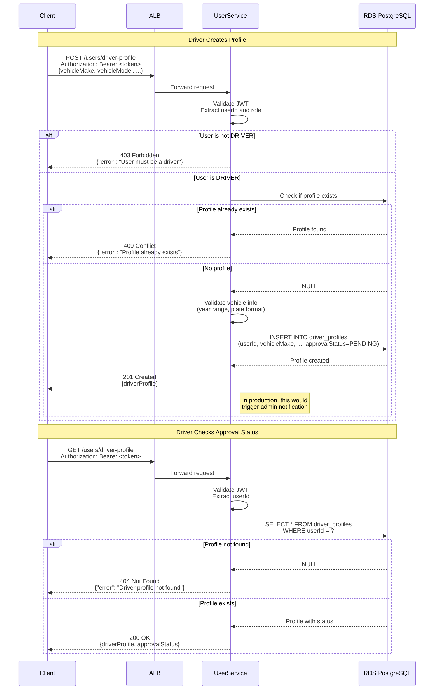
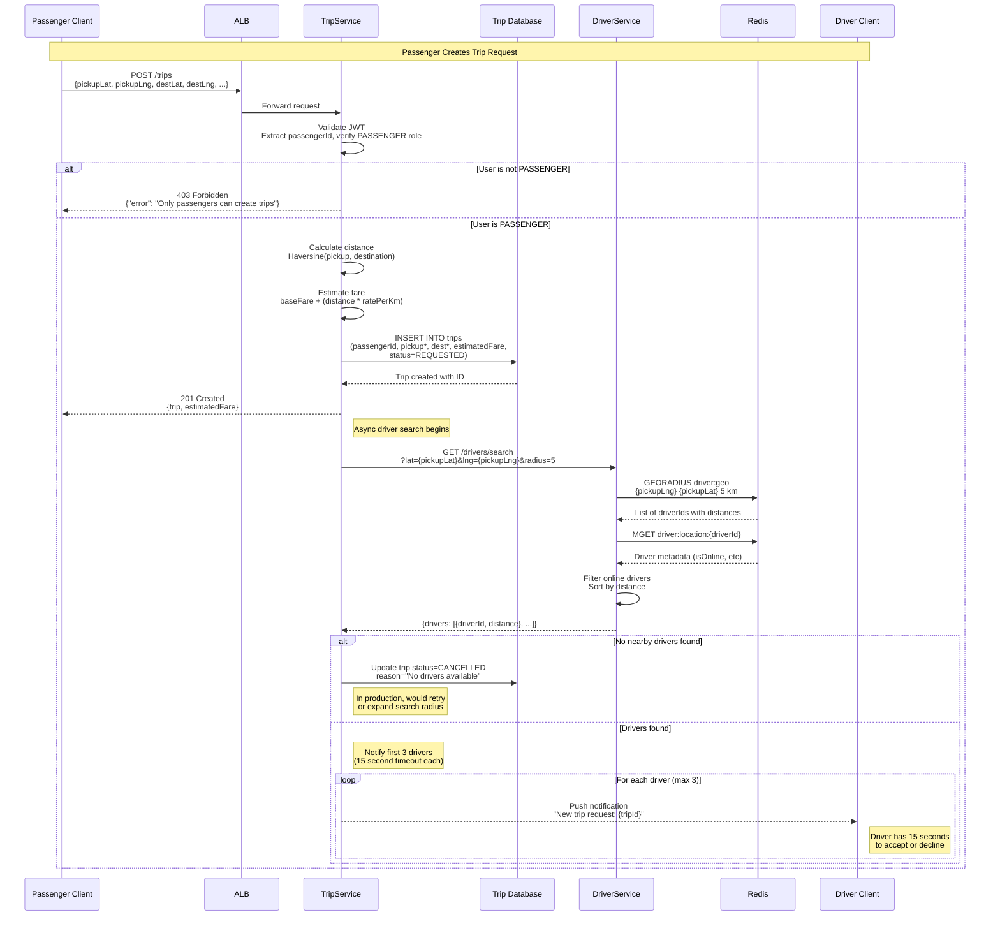
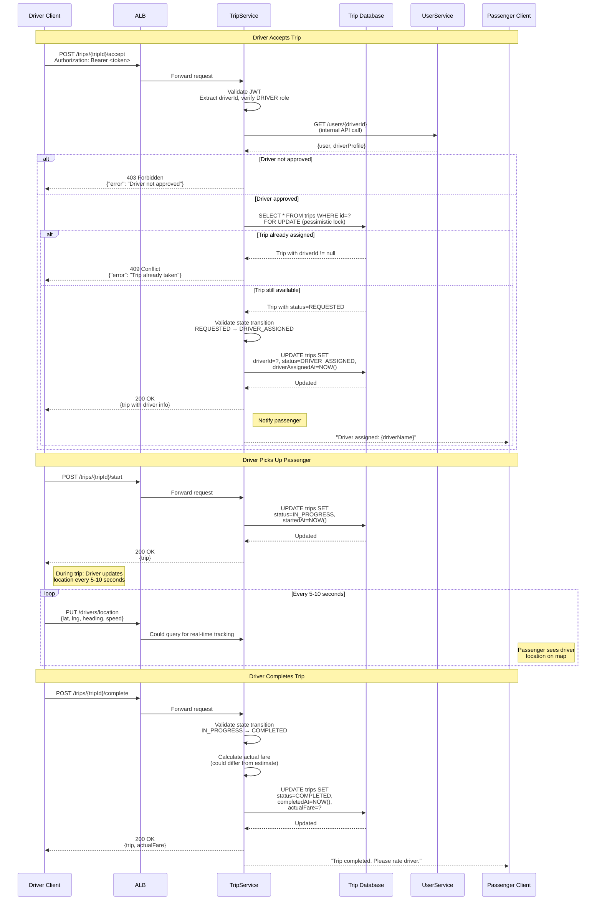
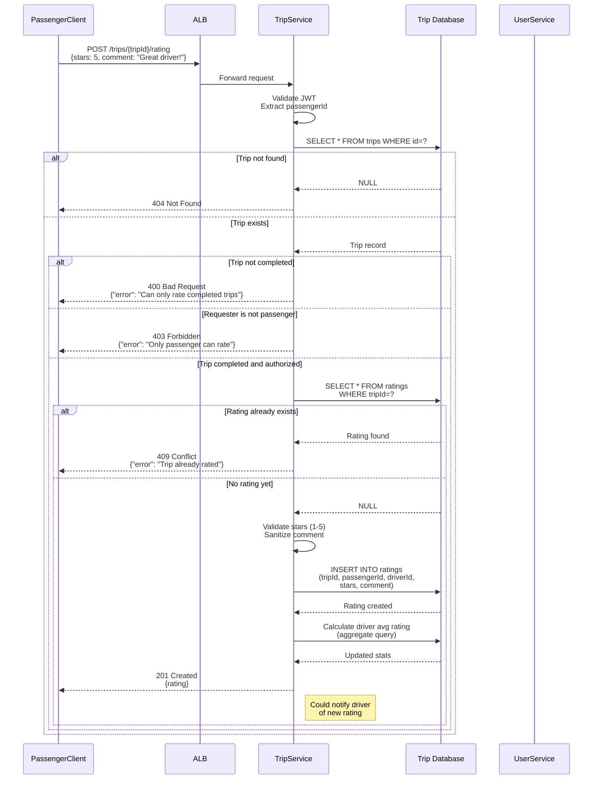
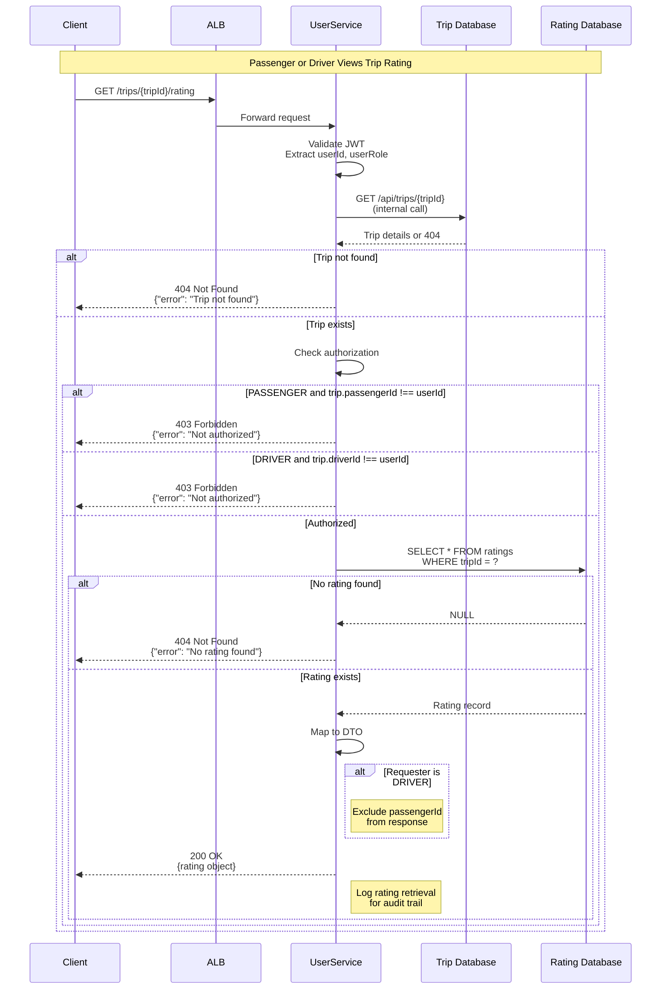
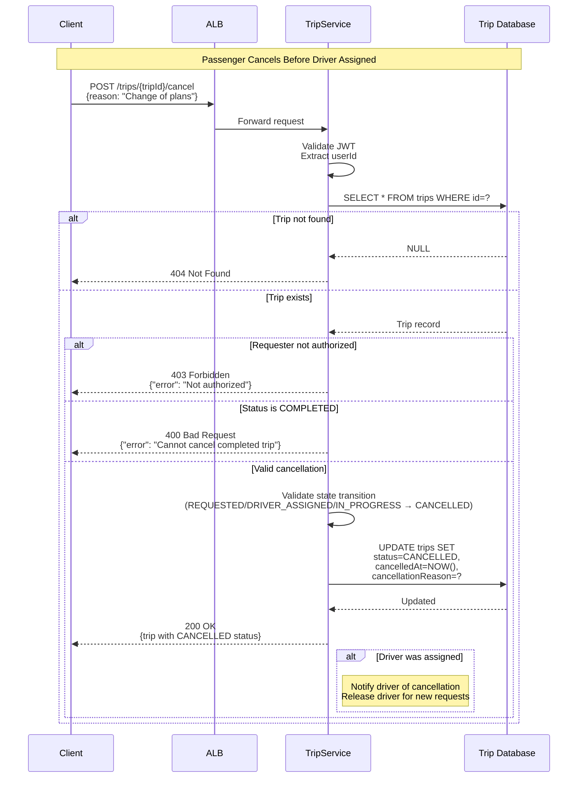
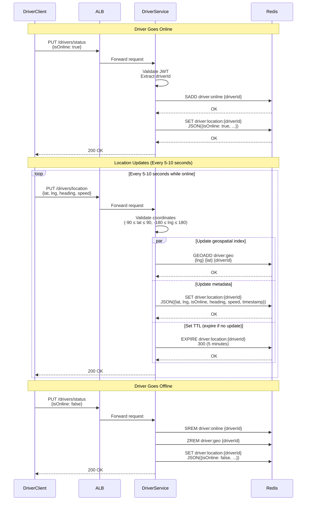

# **SECTION 8: CORE WORKFLOWS**

Illustrating key system workflows using sequence diagrams to show component interactions, error handling, and async operations.

## **8.1 User Registration and Authentication Flow**

---

## **8.2 Driver Registration and Approval Flow**

---

## **8.3 Trip Request and Driver Matching Flow**

---

## **8.4 Driver Accepts Trip and Completes Journey**

---

## **8.5 Passenger Rates Driver**

---

## **8.5 Rating Retrieval Flow (GET /trips/{tripId}/rating)**

---

## **8.6 Trip Cancellation Flow (Error Handling)**

---

## **8.7 Driver Location Update Flow (High Frequency)**

---

## **Detailed Rationale:**

**Workflow Design Decisions:**

1. **JWT in Authorization Header:**
   - Standard OAuth 2.0 Bearer token pattern
   - Stateless authentication (no session storage)
   - Token contains userId and role for authorization

2. **Pessimistic Locking for Trip Assignment:**
   - `SELECT ... FOR UPDATE` prevents race condition
   - Multiple drivers accepting same trip simultaneously
   - PostgreSQL row-level lock ensures atomicity

3. **State Machine Validation:**
   - Each transition validates current state
   - Returns 400 Bad Request for invalid transitions
   - Prevents data corruption from out-of-order requests

4. **Async Driver Notification:**
   - Trip creation returns immediately after DB insert
   - Driver search happens asynchronously (non-blocking)
   - Real implementation would use WebSockets or FCM push notifications

5. **Redis TTL for Driver Locations:**
   - 5-minute expiration prevents stale data
   - Drivers automatically removed if app crashes
   - Can increase TTL in Phase 2 for reliability

6. **Error Handling Pattern:**
   - Consistent error response format across all services
   - HTTP status codes follow REST conventions
   - Detailed error messages for debugging

7. **Rate Limiting (Not Shown):**
   - Should implement in Phase 2 Security module
   - Prevent abuse of location update endpoint
   - AWS WAF or application-level rate limiting

8. **Idempotency (Future Enhancement):**
   - Trip acceptance should be idempotent
   - Use idempotency keys for critical operations
   - Phase 2 Reliability module consideration

---

**Select 1-9 or just type your question/feedback:**

1. **Proceed to next section** (Database Schema)
2. **Expand or Contract for Audience** - Adjust workflow detail
3. **Explain Reasoning (CoT Step-by-Step)** - Deeper dive into workflow design
4. **Critique and Refine** - Challenge these workflows
5. **Analyze Logical Flow and Dependencies** - Review sequence logic
6. **Assess Alignment with Overall Goals** - Verify user story coverage
7. **Identify Potential Risks and Unforeseen Issues** - Workflow risks?
8. **Challenge from Critical Perspective** - Devil's advocate on flow design
9. **Tree of Thoughts Deep Dive** - Explore alternative workflow patterns

dieuxuanhien: 1

GitHub Copilot: Perfect! Moving to Database Schema section.

---
